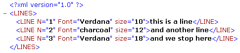

<!--REF #_command_.DOM Count XML attributes.Syntax-->**DOM Count XML attributes** ( *refElemento* ) : Integer<!-- END REF-->
<!--REF #_command_.DOM Count XML attributes.Params-->
| Parâmetro | Tipo |  | Descrição |
| --- | --- | --- | --- |
| refElemento | Text | &#8594;  | Referência de elemento XML |
| Resultado | Integer | &#8592; | Número de atributos |

<!-- END REF-->

#### Descrição 

<!--REF #_command_.DOM Count XML attributes.Summary-->O comando DOM Count XML attributes devolve o número dos atributos XML presentes no elemento XML determinado por *refElemento*.<!-- END REF--> Para maior informação sobre os atributos XML, consulte a seção *Visão Geral dos comandos XML DOM* .

#### Exemplo 

Antes de recuperar os valores dos elementos em um array, caso você queira conhecer o número de atributos no elemento abaixo: 



```4d
 var minhaVarBlob : Blob
 var $ref_xml_Pai;$ref_xml_filho : Text
 var meuResultado : Text
 var $numAtributos : Integer
 
 $ref_xml_Pai:=DOM Parse XML variable(miVarBlob)
 $ref_xml_filho:=DOM Get first child XML element($ref_xml_Pai)
 
 $numAtributos:=DOM Count XML attributes($ref_xml_filho)
 ARRAY TEXT(tAtrib;$numAtributos)
 ARRAY TEXT(tValAtrib;$numAtributos)
 For($i;1;$numAtributos)
    DOM GET XML ATTRIBUTE BY INDEX($ref_xml_filho;$i;tAtrib{$i};tValAtrib{$i})
 End for
```

No exemplo anterior, $numAtributos é igual a 3, tAtrib{1} contém “Font,” tAtrib{2} contém “N” e tAtrib{3} contém “size” e tValAtrib contém "Verdana", "1" e "10".

**Nota:** O número de índice não corresponde à localização do atributo no arquivo XML mostrado na forma de texto. Em XML, o índice de um atributo indica sua posição entre os atributos classificados por ordem alfabética (dependendo de seu nome).

#### Variáveis e conjuntos do sistema 

Se o comando tiver sido executado corretamente, a variável sistema OK assume o valor 1\. Se ocorre um erro, assume o valor 0.

#### Ver também 

[DOM Count XML elements](dom-count-xml-elements.md)  