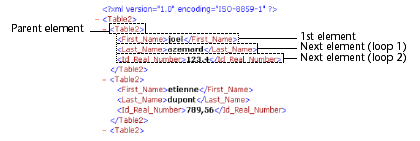

<!--REF #_command_.DOM Get next sibling XML element.Syntax-->**DOM Get next sibling XML element** ( *refElemento* {; *nomeElemIrmao* {; *valorElemIrmao*}} ) : Text<!-- END REF-->
<!--REF #_command_.DOM Get next sibling XML element.Params-->
| Parâmetro | Tipo |  | Descrição |
| --- | --- | --- | --- |
| refElemento | Text | &#8594;  | Referência de elemento XML |
| nomeElemIrmao | Text | &#8592; | Nome do elemento XML irmão |
| valorElemIrmao | Text | &#8592; | Valor do elemento XML irmão |
| Resultado | Text | &#8592; | Elemento de referência XML irmão |

<!-- END REF-->

#### Descrição 

<!--REF #_command_.DOM Get next sibling XML element.Summary-->O comando DOM Get next sibling XML element retorna uma referência ao próximo “irmão” do elemento XML passado como referência.<!-- END REF--> Esta referência pode ser utilizada com outros comandos de análise XML.  

Os parâmetros *nomElemIrmao* e *valorElemIrmao*, se for passada, recebem respectivamente o nome e o valor do elemento “irmão”.  
  
Este comando é utilizado para navegar entre os “filhos” de um elemento XML.  
  
Depois do último “irmão,” a variável sistema OK assume o valor 0.

#### Exemplo 1 

Recuperação da referência do elemento XML irmão seguido pelo elemento passado como parâmetro: 

```4d
 var $xml_Pai_Ref;$seguinte_XML_Ref : Text
 $seguinte_XML_Ref:=DOM Get next sibling XML element($xml_Pai_Ref)
```


#### Exemplo 2 

Recuperação em um loop das referências de todos os elementos XML filhos do elemento pai passado como parâmetro, começando com o primeiro filho: 

```4d
 var $xml_Pai_Ref;$primeiro_XML_Ref;$seguinte_XML_Ref : Text
 
 $primeiro_XML_Ref:=DOM Get first child XML element($xml_Pai_Ref)
 $seguinte_XML_Ref:=$primer_XML_Ref
 While(OK=1)
    $seguinte_XML_Ref:=DOM Get next sibling XML element($seguinte_XML_Ref)
 End while
```



#### Variáveis e conjuntos do sistema 

Se o comando tiver sido executado corretamente e se o elemento analisado não for o último “irmão” do elemento referenciado, a variável sistema OK assume o valor 1\. Se ocorrer um erro ou se o elemento analisado for o último “irmão” do elemento referenciado, assume o valor 0.

#### Ver também 

[DOM Get first child XML element](dom-get-first-child-xml-element.md)  

#### Propriedades

|  |  |
| --- | --- |
| Número do comando | 724 |
| Thread-seguro | &check; |
| Modificar variáveis | OK |


