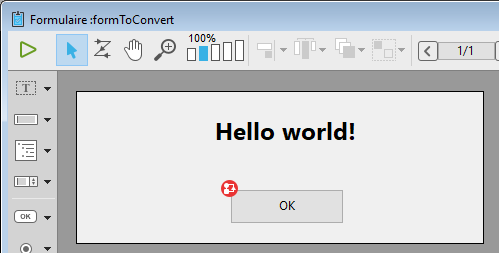

<!--REF #_command_.FORM Convert to dynamic.Syntax-->**FORM Convert to dynamic** ( {*Tabela* ;} *nomeForm* ) : Object<!-- END REF-->
<!--REF #_command_.FORM Convert to dynamic.Params-->
| Parâmetro | Tipo |  | Descrição |
| --- | --- | --- | --- |
| Table | Table | &#8594;  | Tabela formulário |
| nomeForm | Text | &#8594;  | Nome do formulário "clássico" projeto ou tabela |
| Resultado | Object | &#8592; | nomeForm é convertido a um formulário dinâmico |

<!-- END REF-->

*Esse comando não é seguro para thread e não pode ser usado em código adequado.*


#### Descrição 

<!--REF #_command_.FORM Convert to dynamic.Summary-->O comando **FORM Convert to dynamic** converte o *nomeFormulario* (formulário clássico) a um formulário dinâmico e o devolve em um objeto.<!-- END REF-->

Os *formulários clássicos* são formulários 4D armazenados dentro do arquivo de estrutura em formato binário. Os *formulários dinâmicos* são formulários cujas estruturas são definidas em um objeto 4D (ou um arquivo .json). Para saber mais, consulte *Formulários Dinâmicos* .

Se quiser converter um formulário de tabela, passe a tabela de formulário no parâmetro *tabela* e depois passe seu nome como uma string em *nomFormulario*. Para um formulário de projeto, passe o nome do formulário diretamente em *nomeFormulario*.

Para poder executar o formulário diretamente passando o objeto resultante ao comando [DIALOG](dialog.md), **FORM Convert to dynamic** aplica regras específicas ao converter o formulário:

* As referências ao método de formulário e aos métodos de objeto de formulário são ignoradas. Deve associar os nomes dos métodos de projeto para chamar a cada evento de formulário gerenciado.
* As referências a listas são exportadas por nome ao invés de um ponteiro JSON que faz referência ao arquivo lists.json.
* As referências aos filtros com nome e aos formatos de visualização com nome (utilizando o caractere prefixo '|') são exportados por valor ao invés de um ponteiro JSON que faz referência ao arquivo filters.json.
* Dado que as imagens da biblioteca de imagens não são exportadas pelo comando, os objetos que fazem referência a uma imagem da biblioteca de imagens ainda fazem referência à biblioteca depois da conversão. Em sua propriedade "icon", utilizam uma url "pictlib: xx" especial, onde *xx* é o ID na biblioteca.  
As imagens estáticas são convertidas como propriedades objeto tipo imagem.
* Objetos obsoletos são ignorados. Veja o parágrafo para ver a lista de objetos ou propriedades que não são compatíveis com formulários dinâmicos.

**Nota:** as referências ao método de formulário e os métodos objeto de formulário são exportadas com identificadores internos, que serão válidos apenas no banco de dados atual enquanto que os métodos *nomeFormulario* não são modificados. Se quiser utilizar o formulário exportado em outro contexto, deve atribuir nomes de método de projeto à propriedade "método" do formulário ou objeto de formulário (ver exemplo).

#### Exemplo 

Se quiser converter um formulário clássico, modificá-lo e mostrá-lo.

O formulário original:

  

```4d
 var $dynForm : Object
 $dynForm:=FORM Convert to dynamic("FormToConvert")
 $dynForm.pages[1].objects.TitleArea.stroke:="red"
 $dynForm.pages[1].objects.bOK.method:="myMethod" //associa a um método de projeto
 DIALOG($dynForm)
```

  
Se executar o código:


#### Ver também 

[DIALOG](dialog.md)  
[Export structure file](export-structure-file.md)  