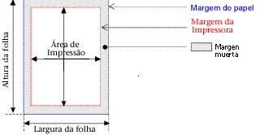

<!--REF #_command_.GET PRINTABLE MARGIN.Syntax-->**GET PRINTABLE MARGIN** ( *esquerda* ; *superior* ; *direita* ; *inferior* )<!-- END REF-->
<!--REF #_command_.GET PRINTABLE MARGIN.Params-->
| Parâmetro | Tipo |  | Descrição |
| --- | --- | --- | --- |
| esquerda | Integer | &#8592; | Margem esquerda |
| superior | Integer | &#8592; | Margem superior |
| direita | Integer | &#8592; | Margem direita |
| inferior | Integer | &#8592; | Margem inferior |

<!-- END REF-->

#### Descrição 

<!--REF #_command_.GET PRINTABLE MARGIN.Summary-->O comando GET PRINTABLE MARGIN devolve os valores atuais das diferentes margens definidas utilizando o comando [Print form](print-form.md) [PRINT SELECTION](print-selection.md) e [PRINT RECORD](print-record.md).<!-- END REF-->. 

Os valores são devolvidos em píxels com respeito a borda do papel. 

É possível obter o tamanho do papel como também calcular a área de impressão utilizando a função [GET PRINTABLE AREA](get-printable-area.md)

##### Manutenção de Margens de Impressão 

Por padrão, em 4D o cálculo das impressões é realizada baseada nas “margens da impressora”. A vantagem deste sistema é que os formulários se adaptam automaticamente às novas impressoras (já que estão situados na área de impressão). Por outra parte, no caso dos formulários impressos, não era possível posicionar os elementos a imprimir de maneira precisa porque uma mudança de impressora poderia modificar as margens da impressora.

É possível basear a impressão dos formulários efetuados utilizando os comandos [Print form](print-form.md), [PRINT SELECTION](print-selection.md) e [PRINT RECORD](print-record.md) sobre uma margem fixa que é idêntica em cada impressora: as margens do papel, ou seja, os limites físicos da folha. Para fazer isto, simplesmente utilize os comandos [GET PRINTABLE MARGIN](get-printable-margin.md), [SET PRINTABLE MARGIN](set-printable-margin.md) e [GET PRINTABLE AREA](get-printable-area.md).

#### Terminologia de Impressão 

* **Margem do papel**: a margem do papel corresponde aos limites físicos da folha.
* **Margem de impress**ão: a margem de impressão é a margem mais além da qual a impressora não pode imprimir (por razões físicas: rolos de impressão, final do percurso do cabeçalho de impressão...). Varia de uma impressora a outra e de um formato a outro.
* **Margem morta:** esta é a área situada entre a margem do papel e a margem da impressora.

#### Ver também 

[GET PRINTABLE AREA](get-printable-area.md)  
[Print form](print-form.md)  
[SET PRINTABLE MARGIN](set-printable-margin.md)  

#### Propriedades
|  |  |
| --- | --- |
| Número do comando | 711 |
| Thread-seguro | &check; |
| Proibido no servidor ||

