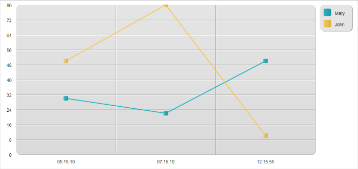
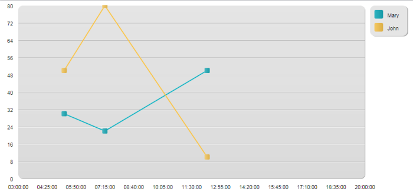
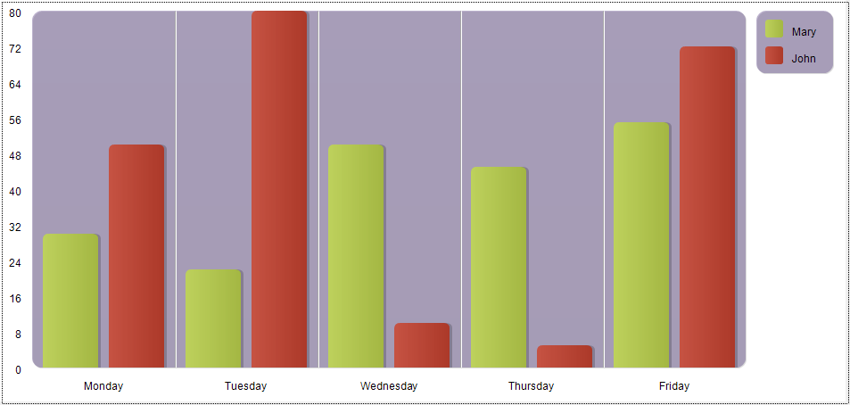

<!--REF #_command_.GRAPH.Syntax-->**GRAPH** ( *grafArea* ; *grafNum* ; *xCategorias* {; *yValores*} {; *yValores2* ; ... ; *yValoresN*} )<!-- END REF-->
<!--REF #_command_.GRAPH.Params-->
| Parâmetro | Tipo |  | Descrição |
| --- | --- | --- | --- |
| grafArea | Picture | &#8594;  | Area do gráfico ou variável da imagem |
| grafNum | Integer, Object | &#8594;  | Número do tipo do gráfico |
| xCategorias | Array | &#8594;  | Rótulos para o eixo x |
| yValores | Array | &#8594;  | Dados para gráfico (até oito permitido) |

<!-- END REF-->

#### Descrição 

<!--REF #_command_.GRAPH.Summary-->O comando **GRAPH** cria um gráfico em uma área de gráfico ou uma variável imagem localizada em um formulário a partir dos valores provenientes dos arrays.<!-- END REF-->

Os gráficos gerados por este comando podem ser criados utilizando o o motor de renderização SVG integrado. Eles gostam de as funções de interface associadas com variáveis imagens: menu de contexto no modo Aplicação (inclusive permitindo a escolha do formato de exibição), barras de rolagem, etc. Os IDs são automaticamente atribuídos a elementos específicos no gráfico gerado, que pode manipular (ver próximo parágrafo).

**Nota:** SVG (Scalable Vector Graphics) é um formato de arquivo gráfico vetorial (extensão .svg). Baseado em XML, este formato é estendido e pode ser mostrado mais particularmente em navegadores Web. Para maior informação, consulte a seguinte direção: [http://www.w3.org.Graphics/SVG](http://www.w3.org.graphics/SVG/)/. O comando [SVG EXPORT TO PICTURE](svg-export-to-picture.md) também pode ser utilizado para aproveitar o motor SVG integrado.

No parâmetro *grafImagem*, passe o nome da variável imagem que mostra o gráfico no formulário.

O segundo parâmetro define o tipo de gráfico a utilizar. Há duas possibilidades:

* passar um parâmetro *grafNum* de tipo *Inteiro longo* (todas as versões de 4D): neste caso, deve passar um número entre 1 e 8\. Os diferentes tipos de gráficos são descrtos no exemplo abaixo. Depois de desenhar um gráfico, pode mudar o tipo modificando o valor de *grafNum* e executando novamente o comando **GRAPH**. Depois pode modificar certas características do gráfico chamando ao comando [GRAPH SETTINGS](graph-settings.md). Ver o exemplo 1.
* passar um parâmetro *grafParams* de tipo [Objeto](# "Estruturas de dados como objetos 4D nativos") (versões 4D de 64 bits somente , exceto 4D Server Windows 64 bits): neste caso, deve passar um objeto que contenha as diversas propriedades do gráfico a definir. Para isso, poede utilizar as constantes que são encontradas no tema "*Parâmetros de Gráficos*" (ver mais adiante). Esta sintaxe permite definir o tipo de gráfico junto com seus parâmetros específicos (legenda, xmin, etc.) em uma única chamada. Isto permite aos usuários salvar os gráficos gerados como imagens SVG regulares e faz com que seja possível visualizar os gráficos usando um navegador padrão como Firefox, Chrome, IE ou Safari (os gráficos gerados cumprem com a norma SVG implementada nos navegadores). Além disso, esta sintaxe lhe permite acessar a varios ajustes adicionais, que lhe permitem personalizar, por exemplo, o espaciado entre as barras, as margens, cores da barra, etc. Ver os exemplos 2, 3 y 4\. **Advertência**: se utilizar esta sintaxe, o comando [GRAPH SETTINGS](graph-settings.md) NÃO deve ser chamado.

  
O parâmetro *xCategorias* define as etiquetas que serão utilizadas pelo eixo x. (a parte inferior do gráfico). Este dado pode ser de tipo alfa, hora, data ou numérico. Deve haver o mesmo número de elementos de array em *xCategorias* que em cada *yValores*.

Os dados especificados por *yValores* são os dados a graficar. Os dados devem ser de tipo numérico. Podem ser graficados até oito conjuntos de dados. Os gráficos por setores só representam os primeiros *yValores*.

##### IDs automáticos 

Os IDs específicos agora são asignados automaticamente aos elementos presentes no gráfico SVG:

| **IDs**                                      | **Descrição**                                            |
| -------------------------------------------- | -------------------------------------------------------- |
| ID\_graph\_1 to ID\_graph\_8                 | Colunas, linhas, áreas...                                |
| ID\_graph\_shadow\_1 to ID\_graph\_shadow\_8 | Sombras das colunas, linhas, áreas...                    |
| ID\_bullet\_1 to ID\_bullet\_8               | Pontos (*gráficos de linhas e pontos somente*)           |
| ID\_pie\_label\_1 to ID\_pie\_label\_8       | Rótulos dos gráficos de pizza (apenas gráficos de pizza) |
| ID\_legend                                   | Legendas                                                 |
| ID\_legend\_1 to ID\_legend\_8               | Títulos das legendas                                     |
| ID\_legend\_border                           | Bordas das lendas                                        |
| ID\_legend\_border\_shadow                   | Sombras das bordas das legendas                          |
| ID\_x\_values                                | Valores eixo X                                           |
| ID\_y\_values                                | Valores do eixo Y                                        |
| ID\_y0\_axis                                 | Valores do eixo Z                                        |
| ID\_background                               | Fundo                                                    |
| ID\_background\_shadow                       | Sombra do Fundo                                          |
| ID\_x\_grid                                  | Grade no eixo X                                          |
| ID\_x\_grid\_shadow                          | Sombra da grade no eixo X                                |
| ID\_y\_grid                                  | Grade no eixo Y                                          |
| ID\_y\_grid\_shadow                          | Sombra da grade no eixo Y                                |

##### atributos grafParams 

Quando utilizar o parâmetro *grafParams*, deve passar um objeto que contenha as diferentes propriedades do gráfico a definir. Pode utilizar as seguintes constantes, que se encontram no tema de constantes "*Parâmetros de Gráficos*":

| Constante                         | Tipo   | Valor                      | Comentário                                                                                                                                                                                                                                                                                                                                                                                                                                                                                                                                                                                                                                                                                                                                                                                            |
| --------------------------------- | ------ | -------------------------- | ----------------------------------------------------------------------------------------------------------------------------------------------------------------------------------------------------------------------------------------------------------------------------------------------------------------------------------------------------------------------------------------------------------------------------------------------------------------------------------------------------------------------------------------------------------------------------------------------------------------------------------------------------------------------------------------------------------------------------------------------------------------------------------------------------- |
| Graph background color            | Cadeia | graphBackgroundColor       | **Valores possíveis**: expressão de cor compatível comn SVG (texto), por exemplo "#7F8E00", "Pink", ou "#0a1414"                                                                                                                                                                                                                                                                                                                                                                                                                                                                                                                                                                                                                                                                                      |
| Graph background opacity          | Cadeia | graphBackgroundOpacity     | **Valores possíveis**:inteiros, faixa de 0-100<br/> **Valor normal**: 100                                                                                                                                                                                                                                                                                                                                                                                                                                                                                                                                                                                                                                                                                                                     |
| Graph background shadow color     | Cadeia | graphBackgroundShadowColor | **Valores possiveis**: expressão de cor compatível com SVG (texto), por exemplo "#7F8E00", "Pink", ou "#0a1414"                                                                                                                                                                                                                                                                                                                                                                                                                                                                                                                                                                                                                                                                                       |
| Graph bottom margin               | Cadeia | bottomMargin               | **Valores** **possíveis**: números reais<br/>**Valor pré-determinado**: 12                                                                                                                                                                                                                                                                                                                                                                                                                                                                                                                                                                                                                                                                                                                    |
| Graph colors                      | Cadeia | colors                     | **Valores possíveis**: array texto. As cores para cada série de gráfico.<br/> **Valores pré-determinados**: Blue-green (#19BAC9), Yellow (#FFC338), Purple (#573E82), Green (#4FA839), Orange (#D95700), Blue (#1D9DF2), Yellow-green (#B5CF32), Red (#D43A26)                                                                                                                                                                                                                                                                                                                                                                                                                                                                                                                                |
| Graph column gap                  | Cadeia | columnGap                  | **Valores possíveis**:inteiros longos<br/>**Valor normal**: 12<br/>Define o espaço entre as barras                                                                                                                                                                                                                                                                                                                                                                                                                                                                                                                                                                                                                                                                                    |
| Graph column width max            | Cadeia | columnWidthMax             | **Valores** **possíveis**: números reais<br/>**Valor pré-determinado**: 200                                                                                                                                                                                                                                                                                                                                                                                                                                                                                                                                                                                                                                                                                                                   |
| Graph column width min            | Cadeia | columnWidthMin             | **Valores** **possíveis**: números reais<br/>**Valor pré-determinado**: 10                                                                                                                                                                                                                                                                                                                                                                                                                                                                                                                                                                                                                                                                                                                    |
| Graph default height              | Cadeia | defaultHeight              | **Valores possíveis**: números reais<br/>**Valor** **possíveis**: 400\. Se graphType=7 (Torta), depois valor normal = 600                                                                                                                                                                                                                                                                                                                                                                                                                                                                                                                                                                                                                                                                     |
| Graph default width               | Cadeia | defaultWidth               | **Valores possíveis**: números reais<br/>**Valor** **possíveis**: 600\. Se graphType=7 (Torta), depois valor normal = 800                                                                                                                                                                                                                                                                                                                                                                                                                                                                                                                                                                                                                                                                     |
| Graph display legend              | Cadeia | displayLegend              | **Valores possíveis**: Booleano<br/>**Valor normal**: True                                                                                                                                                                                                                                                                                                                                                                                                                                                                                                                                                                                                                                                                                                                                    |
| Graph document background color   | Cadeia | documentBackgroundColor    | **Valores posíveis**: expressão cor SVG (texto), por exemplo "#7F8E00", "Pink", ou "#0a1414". Quando um gráfico salvo como imagem SVG se abre em outro lugar, a cor de fundo do documento só é mostrada se o motor de renderizado suporta a norma *SVG Tiny 1.2* (suportado por IE, Firefox, mas não em Chrome).                                                                                                                                                                                                                                                                                                                                                                                                                                                                                      |
| Graph document background opacity | Cadeia | documentBackgroundOpacity  | **Valores possíveis**: inteiro, faixa 0-100 (valor normal: 100). Quando um gráfico salvo como imagem SVG é aberto em outro lugar, a cor de fundo do documento só é mostrada se o motor de renderizado suportar a norma *SVG Tiny 1.2* (suportado por IE, Firefox, mas não em Chrome).<br/>                                                                                                                                                                                                                                                                                                                                                                                                                                                                                                    |
| Graph font color                  | Cadeia | fontColor                  | **Valores possíveis:** expressão cor SVG (texto), por exemplo "#7F8E00", "Pink", ou "#0a1414"                                                                                                                                                                                                                                                                                                                                                                                                                                                                                                                                                                                                                                                                                                         |
| Graph font family                 | Cadeia | fontFamily                 | **Valores possíveis**: Nome da familia de fontes<br/>**Valor padrão**: "Arial"                                                                                                                                                                                                                                                                                                                                                                                                                                                                                                                                                                                                                                                                                                                |
| Graph font size                   | Cadeia | fontSize                   | **Valores possíveis**: inteiros longos<br/>**Valor como padrão**: 12\. Se graphType=7 (Pie), ver Graph pie font size                                                                                                                                                                                                                                                                                                                                                                                                                                                                                                                                                                                                                                                                          |
| Graph left margin                 | Cadeia | leftMargin                 | **Valores** **possíveis**: números reais<br/>**Valor pré-determinado**: 12                                                                                                                                                                                                                                                                                                                                                                                                                                                                                                                                                                                                                                                                                                                    |
| Graph legend font color           | Cadeia | legendFontColor            | **Valores possíveis**: expressão de cor compatível com SVG (texto), por exemplo "#7F8E00", "Pink", ou "#0a1414"                                                                                                                                                                                                                                                                                                                                                                                                                                                                                                                                                                                                                                                                                       |
| Graph legend icon gap             | Cadeia | legendIconGap              | **Valores possíveis**: números reais<br/>**Valor como padrão**: Graph legend icon height/2                                                                                                                                                                                                                                                                                                                                                                                                                                                                                                                                                                                                                                                                                                    |
| Graph legend icon height          | Cadeia | legendIconHeight           | **Valores** **possíveis**: números reais<br/>**Valor pré-determinado**: 20                                                                                                                                                                                                                                                                                                                                                                                                                                                                                                                                                                                                                                                                                                                    |
| Graph legend icon width           | Cadeia | legendIconWidth            | **Valores** **possíveis**: números reais<br/>**Valor pré-determinado**: 20                                                                                                                                                                                                                                                                                                                                                                                                                                                                                                                                                                                                                                                                                                                    |
| Graph legend labels               | Cadeia | legendLabels               | **Valores possíveis:** array texto. Se faltar, 4D mostra ícones sem texto.                                                                                                                                                                                                                                                                                                                                                                                                                                                                                                                                                                                                                                                                                                                            |
| Graph line width                  | Cadeia | lineWidth                  | **Valores** **possíveis**: números reais<br/>**Valor pré-determinado**: 2                                                                                                                                                                                                                                                                                                                                                                                                                                                                                                                                                                                                                                                                                                                     |
| Graph number format               | Cadeia | numberFormat               | **Valores possíveis**: string de formato de número, por exemplo: "###,###,##0"<br/>**Valor padrão**: "" (sem formato).                                                                                                                                                                                                                                                                                                                                                                                                                                                                                                                                                                                                                                                                        |
| Graph pie direction               | Cadeia | pieDirection               | **Valores possíveis**: 1 ou -1<br/>**Valor padrão**: 1<br/>1 indica a direção dos ponteiros do relógio, -1 indica a direção anti-horária                                                                                                                                                                                                                                                                                                                                                                                                                                                                                                                                                                                                                                              |
| Graph pie font size               | Cadeia | pieFontSize                | **Valores** **possíveis**: números reais<br/>**Valor pré-determinado**: 16                                                                                                                                                                                                                                                                                                                                                                                                                                                                                                                                                                                                                                                                                                                    |
| Graph pie shift                   | Cadeia | pieShift                   | **Valores** **possíveis**: números reais<br/>**Valor pré-determinado**: 8<br/>                                                                                                                                                                                                                                                                                                                                                                                                                                                                                                                                                                                                                                                                                                        |
| Graph pie start angle             | Cadeia | pieStartAngle              | **Valores possíveis**: números reais (positivos ou negativos)<br/>**Valor como padrão**: 0, que representa um ângulo de início de 0° (posição para cima)<br/>Um valor positivo representa um ângulo relativo à direção atual da pizza. Um valor negativo representa um ângulo relativo a direção oposta à pizza                                                                                                                                                                                                                                                                                                                                                                                                                                                                       |
| Graph plot height                 | Cadeia | plotHeight                 | **Valores** **possíveis**: números reais<br/>**Valor pré-determinado**: 12                                                                                                                                                                                                                                                                                                                                                                                                                                                                                                                                                                                                                                                                                                                    |
| Graph plot radius                 | Cadeia | plotRadius                 | **Valores** **possíveis**: números reais<br/>**Valor pré-determinado**: 12                                                                                                                                                                                                                                                                                                                                                                                                                                                                                                                                                                                                                                                                                                                    |
| Graph plot width                  | Cadeia | plotWidth                  | **Valores** **possíveis**: números reais<br/>**Valor pré-determinado**: 12                                                                                                                                                                                                                                                                                                                                                                                                                                                                                                                                                                                                                                                                                                                    |
| Graph right margin                | Cadeia | rightMargin                | **Valores** **possíveis**: números reais<br/>**Valor pré-determinado**: 2                                                                                                                                                                                                                                                                                                                                                                                                                                                                                                                                                                                                                                                                                                                     |
| Graph top margin                  | Cadeia | topMargin                  | **Valores** **possíveis**: números reais<br/>**Valor pré-determinado**: 2                                                                                                                                                                                                                                                                                                                                                                                                                                                                                                                                                                                                                                                                                                                     |
| Graph type                        | Cadeia | graphType                  | **Valores** **possíveis**: inteiros longos \[1 a 8\], onde 1 = barras, 2 = proporcional, 3 = empilhados, 4 = linhas, 5 = superfícies, 6 = pontos, 7 = torta, 8 = imagens.**<br/>** **Valor normal**: 1<br/><br/>Se for nulo, o gráfico não é desenhado e não se mostra nenhuma mensagem de erro. Se estiver fora da faixa, o gráfico não é desenhado e se mostra uma mensagem de erro.<br/><br/>Para os gráficos tipo de imagem (valor = 8), as imagens utilizadas devem ser armazenadas na seguinte pasta: 4D/Resources/GraphTemplates/Graph\_8\_Pictures/. <br/>Não há um padrão de nomes de imagens; 4D ordena os arquivos contidos na pasta e lhe atribui o primeiro arquivo ao primeiro gráfico. Estes arquivos podem ser do tipo SVG ou imagem. |
| Graph xGrid                       | Cadeia | xGrid                      | **Valores** **possíveis**: Booleano<br/>**Valor normal**: True. <br/>Só se utiliza com os tipos proporcionais 4 e 6.                                                                                                                                                                                                                                                                                                                                                                                                                                                                                                                                                                                                                                                                  |
| Graph xMax                        | Cadeia | xMax                       | **Valores possíveis**: número, data, hora (mesmo tipo que o parâmetro *xLabels*). <br/>Só os valores mais altos que xMax se mostram no gráfico. xMax se utiliza somente para os tipos de gráficos 4, 5 ou 6 se xProp = true e se o tipo *xLabels* for um número, data ou hora. Se faltar ou se xMin>xMax, 4D calcula automaticamente o valor xMax.                                                                                                                                                                                                                                                                                                                                                                                                                                            |
| Graph xMin                        | Cadeia | xMin                       | **Valores** **possíveis**: número, data, hora (mesmo tipo que o parâmetro *xLabels*). <br/>Só os valores mais altos que xMin se mostram no gráfico. xMin se utiliza somente para os tipos de gráficos 4, 5 ou 6 se xProp = true e se o tipo *xLabels* for um número, data ou hora. Se faltar ou se xMin>xMax, 4D calcula automaticamente o valor xMin.                                                                                                                                                                                                                                                                                                                                                                                                                                        |
| Graph xProp                       | Cadeia | xProp                      | **Valores** **possíveis**: Booleano<br/>**Valor normal:**True<br/>True para eixoe x proporcional; False para eixo x normal. xProp se utiliza unicamente para os tipos de gráficos 4, 5 ou 6                                                                                                                                                                                                                                                                                                                                                                                                                                                                                                                                                                                           |
| Graph yGrid                       | Cadeia | yGrid                      | **Valores** **possíveis**: Booleano<br/>**Valor normal**: True                                                                                                                                                                                                                                                                                                                                                                                                                                                                                                                                                                                                                                                                                                                                |
| Graph yMax                        | Cadeia | yMax                       | **Valores** ****possíveis**: números<br/> Se faltar, 4D calcula automaticamente o valor yMax.                                                                                                                                                                                                                                                                                                                                                                                                                                                                                                                                                                                                                                                                                                 |
| Graph yMin                        | Cadeia | yMin                       | **Valores possíveis**: números<br/> Se faltar, 4D calcula automaticamente o valor yMin.                                                                                                                                                                                                                                                                                                                                                                                                                                                                                                                                                                                                                                                                                                       |

#### Exemplo 1 

Sintaxe com *grafNumber*: o seguinte exemplo mostra os diferentes tipos de gráficos que pode obter. O código deve ser inserido em um método formulário ou método objeto do formulário que contenha a variável imagem. Os dados representados são constantes, geralmente este não é o caso:

O exemplo a seguir mostra os diferentes tipos de gráficos que você pode obter. O código deve ser inserido em um método formulário ou método objeto que contém a variável imagem. Os dados representados são constantes, geralmente este não é o caso:

```4d
 var vGraph : Picture //Variável do gráfico
 ARRAY TEXT(4;X;2) //Criação de um array para o eixo X
 X{1}:="1995" //X Label #1
 X{2}:="1996" //X Label #2
 ARRAY REAL(A;2) //Criação de um array para o eixo Y
 A{1}:=30 //Inserção de dados
 A{2}:=40
 ARRAY REAL(B;2) //Criação de um array para o eixo Y
 B{1}:=50 //Inserção de dados
 B{2}:=80
 vType:=1 //Inicializar tipo de gráfico
 GRAPH(vGraph;vType;X;A;B) //Desenhar o gráfico
 GRAPH SETTINGS(vGraph;0;0;0;0;False;False;True;"France";"USA") //Definição das lendas para o gráfico
```
  
  
As seguinte imagens mostram o gráfico resultante. 
* Com *vType* igual a 1, obtém um gráfico em **Colunas**:  

* Com *vType* igual a 2, obtém um gráfico em **Colunas proporcionais**:  

* Com *vType* igual a 3, obtém um gráfico em **Colunas empilhadas**:  

* Com *vType* igual a 4, obtém um gráfico em **Linhas**:  

* Com *vType* igual a 5, obtém um gráfico em Áreas:  

* Com *vType* igual a 6, obtém um gráfico em **Pontos**:  

* Com *vType* igual a 7, obtém um gráfico em **Setores**:  

* Com *vType* igual a 8, obtém um gráfico em **Imagens**:  


#### Exemplo 2 

Sintaxe utilizando *grafParams*: no seguinte exemplo, um gráfico de linha simples é desenhado baseado nos valores de tempos:

```4d
 var vGraph : Picture //Variável gráfico
 ARRAY TIME(X;3) //Criar array para os eixos x
 X{1}:=?05:15:10? //Etiqueta X #1
 X{2}:=?07:15:10? //Etiqueta X #2
 X{3}:=?12:15:55? //Etiqueta X #3
 
 ARRAY REAL(A;3) //Criar array para eixo y
 A{1}:=30 //Inserir alguns dados
 A{2}:=22
 A{3}:=50
 
 ARRAY REAL(B;3) //Criar outro array para eixo y
 B{1}:=50 //Inserir alguns dados
 B{2}:=80
 B{3}:=10
 
 var vSettings : Object //Inicializar parâmetros de gráficos
 
 OB SET(vSettings;Graph type;4) //Tipo de linha
 
 ARRAY TEXT(aLabels;2) //Definir legendas para o gráfico
 aLabels{1}:="Mary"
 aLabels{2}:="John"
 OB SET ARRAY(vSettings;Graph legend labels;aLabels)
 
 GRAPH(vGraph;vSettings;X;A;B) //Draw graph
```



#### Exemplo 3 

Com os mesmos valores, pode agregar uma configuração personalizada para obter uma vista diferente:

```4d
 var vGraph : Picture //Variável gráfico
 ARRAY TIME(X;3) //Criar um array para o eixo x
 X{1}:=?05:15:10? //Etiqueta X #1
 X{2}:=?07:15:10? //Etiqueta X #2
 X{3}:=?12:15:55? //Etiqueta X #3
 
 ARRAY REAL(A;3) //Cria um array para o eixo y
 A{1}:=30 //Insere alguns dados
 A{2}:=22
 A{3}:=50
 
 ARRAY REAL(B;3) //Cria outro array para o eixo y
 B{1}:=50 //Insere alguns dados
 B{2}:=80
 B{3}:=10
 
 var vSettings : Object //inicialização dos parâmetros do gráfico
 
 OB SET(vSettings;Graph type;4)/Tipo de linhas
 
 ARRAY TEXT(aLabels;2) //definir as legendas do gráfico
 aLabels{1}:="Mary"
 aLabels{2}:="John"
 OB SET ARRAY(vSettings;Graph legend labels;aLabels)
 
  //opções
 OB SET(vSettings;Graph xProp;True) //definir proporcional
 OB SET(vSettings;Graph xGrid;False) //eliminar a grade vertical
 OB SET(vSettings;Graph xMin;?03:00:00?) //definir límites
 OB SET(vSettings;Graph xMax;?20:00:00?)
 
 GRAPH(vGraph;vSettings;X;A;B) //Desenha o gráfico
```



#### Exemplo 4 

Neste exemplo, personalizamos alguns parâmetros:

```4d
 var vGraph : Picture //Variavel do gráfico
 ARRAY TEXT(X;5) //Criação  de um array para o eixo x
 X{1}:="Monday" //#1 Etiqueta X
 X{2}:="Tuesday" //#2 Etiqueta X
 X{3}:="Wednesday" //#3 Etiqueta X
 X{4}:="Thursday" //#4 Etiqueta X
 X{5}:="Friday" //#5 Etiqueta X
 
 ARRAY LONGINT(A;5) //Criar um array para o eixo y
 A{1}:=30 //Inserir alguns dados
 A{2}:=22
 A{3}:=50
 A{4}:=45
 A{5}:=55
 
 ARRAY LONGINT(B;5) //Criar outro array para o eixo y
 B{1}:=50 //Inserir alguns dados
 B{2}:=80
 B{3}:=10
 B{4}:=5
 B{5}:=72
 
 var vSettings : Object //inicialização de parâmetros do gráfico
 
 OB SET(vSettings;Graph type;1) //tipo Barras
 
 ARRAY TEXT(aLabels;2) //Definir as legendas para o gráfico
 aLabels{1}:="Mary"
 aLabels{2}:="John"
 OB SET ARRAY(vSettings;Graph legend labels;aLabels)
 
  //opções
 OB SET(vSettings;Graph yGrid;False) //eliminar a grade vertical
 OB SET(vSettings;Graph background color;"#573E82") //definir uma cor de fundo
 OB SET(vSettings;Graph background opacity;40)
 ARRAY TEXT($aTcols;2) //definir as cores para o gráfico
 $aTcols{1}:="#B5CF32"
 $aTcols{2}:="#D43A26"
 OB SET ARRAY(vSettings;Graph colors;$aTcols)
 GRAPH(vGraph;vSettings;X;A;B) //Desenhar o gráfico
```



#### Ver também 

  
[GRAPH SETTINGS](graph-settings.md)  
*Parâmetros de Gráficos*  
[SVG EXPORT TO PICTURE](svg-export-to-picture.md)  