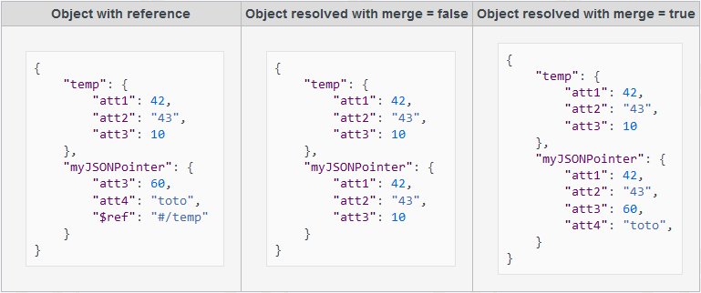

<!--REF #_command_.JSON Resolve pointers.Syntax-->**JSON Resolve pointers** ( *objeto* {; *opções*} ) : Object<!-- END REF-->
<!--REF #_command_.JSON Resolve pointers.Params-->
| Parâmetro | Tipo |  | Descrição |
| --- | --- | --- | --- |
| objeto | Object | &#8594;  | Objeto que contém os ponteiros JSON a resolver |
| &#8592; | Objeto com os ponteiros JSON resolvidos (apenas se o resultado for um objeto) |
| opções | Object | &#8594;  | Opções para resolução de ponteiro |
| Resultado | Object | &#8592; | Objeto contendo o resultado do processamento |

<!-- END REF-->

#### Descrição 

<!--REF #_command_.JSON Resolve pointers.Summary-->O comando **JSON Resolve pointers** resolve todos os ponteiros JSON encontrados no objeto, com respeito à configuração de opções (se existir).<!-- END REF-->

Os ponteiros JSON são particularmente úteis para:

* aninhar parte de um documento JSON externo ou reutilizar uma parte de um documento JSON em outros lugares no mesmo documento JSON, com o fim de fatorizar a informação,
* expressam uma estrutura cíclica em JSON,
* definir um objeto de planilha que contém as propriedades predeterminadas armazenadas em JSON.

Passe no parâmetro *objeto* um objeto que contém ponteiros JSON que devem ser resolvidos (para mais informação sobre a sintaxe do ponteiro JSON, consulte o parágrafo *Definir Ponteiros JSON* abaixo). 

**Nota:** o *objeto* fonte será atualizado com o resultado da resolução do ponteiro depois de ser executado o comando (exceto se o resultado não for um objeto, consulte abaixo). Se desejar conservar uma versão original do objeto, pode considerar utilizar previamente [OB Copy](ob-copy.md). 

Opcionalmente, pode passar em *opções* um objeto que contenha propriedades específicas que serão utilizadas ao resolver ponteiros. São suportadas as seguintes propriedades:

| **Propriedade** | **Tipo de valor** | **Descrição**                                                                                                                                                                     |
| --------------- | ----------------- | --------------------------------------------------------------------------------------------------------------------------------------------------------------------------------- |
| rootFolder      | Text            | Rota absoluta (utilizando a sintaxe 4D padrão) a pasta que se utilizará para resolver ponteiros relativos no objeto. O valor predeterminado é a pasta Recursos do banco de dados. |
| merge           | Booleano          | Fusiona objetos com objetos ponteiro (true) ao invés de substituí-los (false). O valor predeterminado é false                        |

Depois de executar o comando:

* se o resultado da resolução de ponteiro for um objeto, o *objeto* se atualiza e contém o objeto resultante.
* se o resultado da resolução de ponteiro for um valor escalar (ou seja, um texto, um número...), o objeto é deixado intacto e o valor resultante se devolve na propriedade "valor" do resultado da função.

Em todos os casos, o comando devolve um objeto que contém as seguintes propriedades:

| **Propriedad**e         | **Tipo de valor** | **Descrição**                                                                                                  |
| ----------------------- | ----------------- | -------------------------------------------------------------------------------------------------------------- |
| value                   | Qualquer          | Resultado do processamento do comando em *objeto*. Se o resultado for um objeto, é igual ao *objeto* de saída. |
| success                 | Booleano          | true se todos os ponteiros tiverem sido resolvidos corretamente                                                |
| errors                  | Coleção           | Coleção de erros se os houver                                                                                  |
| errors\[\].code         | Número            | código do erro                                                                                                 |
| errors\[\].message      | Text            | mensagem de erro                                                                                               |
| errors\[\].pointerURI   | Text            | valor do ponteiro                                                                                              |
| errors\[\].referredPath | Text            | rota completa de documento                                                                                     |

#### Definir Ponteiros JSON 

JSON Pointer é um padrão que define uma sintaxe de string que pode ser utilizada para acessar a um campo ou a um valor chave particular no documento JSON todo. O padrão foi descrito em [RFC 6901](https://tools.ietf.org/html/rfc6901). 

Um ponteiro JSON é, estritamente falando, uma string composta de partes separadas por '/'. Um ponteiro JSON normalmente é encontrado em uma URL que especifica o documento no qual se resolverá o ponteiro. O caractere de fragmento "#" é utilizado na URI para especificar o ponteiro JSON Por convenção, pode encontrar uma URI que contenha um ponteiro JSON em uma propriedade de objeto JSON que deve ser chamada de "$ ref".

```json
{
   "$ref":<path>#<json_pointer>
}
```

**Nota**: 4D não é compatível com o caractere "-" como referência a elementos de array inexistentes.

##### Recursividade e resolução de rota 

Os ponteiros JSOn são resolvidos recursivamente, o que significa que se um ponteiro resolvido também contiver ponteiros, serão resolvidos recursivamente e assim por diante, até que sejam resolvidos todos os ponteiros. Nesse contexto, todas as rotas de arquivo encontradas nas URLs de ponteiro JSOn podem ser relativas ou absolutas. Devem usar '/' como delimitador de rota e são resolvidas da maneira abaixo:

* Uma rota relativa não deve começar com '/'. Se resolve relativamente ao documento JSON onde foi encontrada a string de rota de acesso,
* Uma rota absoluta começa com '/'. Só as [rotas filesystem](https://developer.4d.com/docs/Concepts/paths/#filesystem-pathnames) são aceitas como rotas absolutas.Por exemplo "/RESOURCES/templates/myfile.json" aponta ao arquivo "myfile.json" que se encontra na pasta de recursos do banco de dados atual.

**Notas:**

* A resolução do nome distingue entre maiúsculas e minúsculas.
* 4D não resolve uma rota a um arquivo json localizado na rede (que comece por "http/https").

#### Exemplo 1 

Este exemplo básico ilustra como um ponteiro JSON pode ser definido e substituído em um objeto:

```4d
  // criar um objeto com algúm valor
 var $o : Object
 $o:=New object("value";42)
 
  // criar o objeto ponteiro JSON
 var $ref : Object
 $ref:=New object("$ref";"#/value")
 
  // adicionar o objeto ponteiro JSON como propriedade
 $o.myJSONPointer:=$ref
 
  // resolver tudo e verificar que o ponteiro tenha sido resolvido
 var $result : Object
 $options:=New object("rootFolder";Get 4D folder(Current resources folder);"merge";True)
 $result:=JSON Resolve pointers($o;$options)
 If($result.success)
    ALERT(JSON Stringify($result.value))
  //{"value":42,"myJSONPointer":42}
 Else
    ALERT(JSON Stringify($result.errors))
 End if
```

#### Exemplo 2 

Se quiser reutilizar "billingAddress" como "shippingAddress" no objeto JSON abaixo (chamado $oMyConfig):

```json
{
    "lastname": "Doe",
    "firstname": "John",
    "billingAddress": { 
        "street": "95 S. Market Street",
        "city": "San Jose",
        "state": "California" 
    },
    "shippingAddress": { "$ref": "#/billingAddress" }
}
```

Depois de executar este código:

```4d
 $oResult:=JSON Resolve pointers($oMyConfig)
```

... o objeto abaixo é devolvido:

```json
{
    "success": true,
    "value": {
        "lastname": "Doe",
        "firstname": "John",
        "billingAddress": {
            "street": "95 S. Market Street",
            "city": "San Jose",
            "state": "California" 
        },
        "shippingAddress": {
            "street": "95 S. Market Street",
            "city": "San Jose",
            "state": "California" 
        }
    }
}
```

#### Exemplo 3 

Este exemplo ilustra o efeito da opção "fusionar". Se quiser editar os direitos de um usuário baseando-se em um arquivo pré-determinado.

```json
{
    "rights": { 
        "$ref": "defaultSettings.json#/defaultRights",
        "delete": true,
        "id": 456
    }
}
```

O arquivo *defaultSettings.json* contém:

```json
{
    "defaultRights":
    {
        "edit": true,
        "add": false,
        "delete": false
    }
}
```

Se executar:

```4d
 var $options : Object
 $options:=New object("merge";False) //substituir conteúdos
 $oResult:=JSON Resolve pointers($oMyConfig;$options)
```

o valor resultante é exatamente o conteúdo do arquivo *defaultSettings.json*:

```json
{
    "success": true,
    "value": {
        "rights": {
            "edit": true,
            "add": false,
            "delete": false
        }
    }
}
```

Se executar:

```4d
 var $options : Object
 $options:=New object("merge";True) //fusionar ambos os conteúdos
 $oResult:=JSON Resolve pointers($oMyConfig;$options)
```

...o valor resultante é uma versão modificada do objeto original:

```json
{
    "success": true,
    "value": {
        "rights": {
            "edit": true,
            "add": false,
            "delete": true,
            "id": 456
        }
    }
}
```

#### Ver também 

  

#### Propriedades
|  |  |
| --- | --- |
| Número do comando | 1478 |
| Thread-seguro | &check; |
| Proibido no servidor ||


