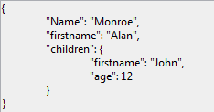

<!--REF #_command_.JSON Stringify.Syntax-->**JSON Stringify** ( *valor* {; *} ) : Text<!-- END REF-->
<!--REF #_command_.JSON Stringify.Params-->
| Parâmetro | Tipo |  | Descrição |
| --- | --- | --- | --- |
| valor | Object, any | &#8594;  | Dados a converter em cadeia JSON |
| * | Operador | &#8594;  | Melhorar o formato |
| Resultado | Text | &#8592; | Cadeia que contém o texto JSON serializado |

<!-- END REF-->

#### Descrição 

<!--REF #_command_.JSON Stringify.Summary-->O comando **JSON Stringify** converte o parâmetro *valor* em uma cadeia JSON.<!-- END REF--> Este comando serializa os dados em JSON, realiza a ação inversa do comando [JSON Parse](json-parse.md).  
  
Passe os dados a serializar em *valor*. Se podem expressar em forma escalar (cadeia, número, data ou hora) ou por meio de um objeto 4D ou coleção.

Nota: datas 4D são convertidas em formatos "aaaa-mm-dd" ou "AAAA-MM-DDThh:mm:sssZ" de acordo com a configuração atual de data do banco de dados (ver a opção "Use date type instead of ISO date format in objects" em *Página Compatibilidade*).

No caso de um objeto, que pode incluir todo tipo de valores (ver o parágrafo *Tipos de dados JSON*). O formato JSON deve respeitar as seguintes regras:

* Os valores de tipo cadeia devem ir entre aspas. Todos os caracteres Unicode podem ser usados exceto os caracteres especiais que devem ser precedidos por uma barra oblíqua invertida.
* Números: intervalo ±10.421e±10
* Booleano: cadeias "true " ou " false"
* Data: tipo de texto em formato "aaaa-mm-dd" ou "\\"AAAA-MM-DDTHH:mm:ssZ"\\" de acordo com a configuração atual de data no banco de dados (ver acima).
* Hora: tipo real (por padrão número de segundos)

**Notas:** 

* Atributos de Imagem são convertidos à string: "\[object Picture\]".
* Ponteiros ao campo, variável ou array são avaliados quando stringfied
Pode passar o parâmetro opcional *\** com o propósito de incluir caracteres com formato na cadeia resultante. Esta opção melhora a apresentação dos dados JSON (conhecida como pretty formatting).

#### Exemplo 1 

Conversão de valores escalares:

```4d
 $vc:=JSON Stringify("Eureka!") // "Eureka!"
 $vel:=JSON Stringify(120) // "120"
 
 $vh:=JSON Stringify(?20:00:00?) // "72000" segundos desde a meia noite
 SET DATABASE PARAMETER(Times inside objects;Times in milliseconds)
 $vhms:=JSON Stringify(?20:00:00?) // "72000000" millissegundos desde a meia noite
 
 $vd:=JSON Stringify(!28/08/2013!) // "2013-08-27T22:00:00.000Z" (Paris timezone)
 SET DATABASE PARAMETER(Dates inside objects;String type without time zone)
 $vdd:=JSON Stringify(!28/08/2013!) // "2013-08-28T00:00:00.000Z"
```

#### Exemplo 2 

Conversão de uma cadeia que contém caracteres especiais:

```4d
 $s:=JSON Stringify("{\"name\":\"john\"}")
  // $s="{\\"name\\":\\"john\\"}"
 $p:=JSON Parse($s)
  // $p={"name":"john"}
```

#### Exemplo 3 

Exemplos de serialização de um objeto 4D com e sem o parâmetro *\**:

```4d
 var $MyContact : Text
 var $MyPContact : Text
 var $Contact;$Children : Object
 OB SET($Contact;"lastname";"Monroe";"firstname";"Alan")
 OB SET($Children;"firstname";"Jim";"age";"12")
 OB SET($Contact;"children";$Children)
 $MyContact:=JSON Stringify($Contact)
 $MyPContact:=JSON Stringify($Contact;*)
  //$MyContact= {"lastname":"Monroe","firstname":"Alan","children":{"firstname":"John","age":"12"}}
  //$MyPContact= {\n\t"lastname": "Monroe",\n\t"firstname": "Alan",\n\t"children": {\n\t\t"firstname": "John",\n\t\t"age": "12"\n\t}\n}
```

A vantagem deste formato é clara quando o JSON se mostra em uma área web:

* Formato comum:  

* Formato melhorado:  


#### Exemplo 4 

Exemplo utilizando um ponteiro em uma variável:

```4d
 var $MyTestVar : Object
 var $name ;$jsonstring  : Text
 OB SET($MyTestVar;"name";->$name) // definição do objeto
  // $MyTestVar= {"name":"->$name"}
 
 $jsonstring :=JSON Stringify($MyTestVar)
  // $jsonstring ="{"name":""}"
  //...
 
 $name:="Smith"
 $jsonstring :=JSON Stringify($MyTestVar)
  //$jsonstring = "{"name" : "Smith"}"
```

#### Exemplo 5 

Serialização de um objeto 4D:

```4d
 var $varjsonTextserialized : Text
 var $Contact : Object
 OB SET($Contact;"firstname";"Alan")
 OB SET($Contact;"lastname";"Monroe")
 OB SET($Contact;"age";40)
 OB SET($Contact;"phone";"[555-0100,555-0120]")
 
 $varjsonTextserialized:=JSON Stringify($Contact)
 
  // $varjsonTextserialized = "{"lastname":"Monroe","phone":"[555-0100,
  // 555-0120]","age":40,"firstname":"Alan"}"
```

#### Exemplo 6 

Serialização de um objeto 4D contendo um valor de data (fuso horário de Paris). A string resultante depende das configurações atuais de data do banco de dados.

```4d
 var $varjsonTextserialized : Text
 var $Contact : Object
 OB SET($Contact;"name";"Smith";"birthday";!22/10/1975!)
 $varjsonTextserialized:=JSON Stringify($Contact)
```

* Se a opção "Use date type instead of ISO date format in objects" não estiver marcada:  
```json  
"name":"Smith","birthday":"1975-10-21T22:00:00.000Z"  
```
* Se a opção "Use date type instead of ISO date format in objects" estiver marcada :  
```json  
"name":"Smith","birthday":"1975-10-22"  
```

**Note:** Para saber mais, veja *Página Compatibilidade*.

#### Exemplo 7 

Conversão de uma coleção (fuso horário de Paris). A string resultante depende das configurações atuais de data no banco de dados.

```4d
 var $myCol : Collection
 var $myTxtCol : Text
 $myCol:=New collection(33;"mike";!28/08/2017!;False)
 $myTxtCol:=JSON Stringify($myCol)
```

* Se a opção "Use date type instead of ISO date format in objects" não estiver marcada:  
```json  
$myTxtCol="[33,"mike","2017-08-27T22:00:00.000Z",false]"  
```
* Se a opção "Use date type instead of ISO date format in objects" estiver marcada:  
```json  
$myTxtCol="[33,"mike","2017-08-28",false]"  
```

**Nota:** Para saber mais sobre essa opção, veja *Página Compatibilidade*.

#### Ver também 

[JSON Parse](json-parse.md)  
[JSON Stringify array](json-stringify-array.md)  

#### Propriedades
|  |  |
| --- | --- |
| Número do comando | 1217 |
| Thread-seguro | &check; |
| Proibido no servidor ||


