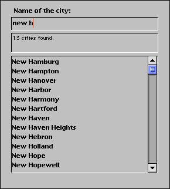

<!--REF #_command_.Keystroke.Syntax-->**Keystroke**  : Text<!-- END REF-->
<!--REF #_command_.Keystroke.Params-->
| Parâmetro | Tipo |  | Descrição |
| --- | --- | --- | --- |
| Resultado | Text | &#8592; | Caracter introduzido pelo usuário |

<!-- END REF-->

#### Descrição 

<!--REF #_command_.Keystroke.Summary-->Keystroke retorna o caractere introduzido pelo usuário em um campo o em uma área editável.<!-- END REF--> 

Geralmente, Keystroke é chamada em um método de formulário ou de objeto durante a gestão do evento de formulário On Before Keystroke. Para detectar eventos de teclado, utilize o comando [Form event](form-event.md "Form event"). 

Para substituir o caractere introduzido pelo usuário com outro caractere, utilizando o comando [FILTER KEYSTROKE](filter-keystroke.md "FILTER KEYSTROKE").

**Nota:**a função Keystroke não funciona em subformulários.

**IMPORTANTE:** se deseja realizar algumas operações “on the fly” dependendo do valor atual da área de entrada que está sendo editada, assim como do novo caráctere a ser introduzido, lembre que o texto que vê na tela NÂO É ainda o valor do campo ou da variável fonte. O valor do campo ou da variável fonte de dados se atribui depois de que se confirma a entrada de dados para a área (tabulação em outra área, clique em um botão, etc). Portanto depende de você colocar os dados introduzidos em uma variável e depois trabalhar com o valor da variável . Deve fazer isto se necessita saber o valor atual do texto para efetuar ações especiais. Igualmente pode utilizar a função [Get edited text](get-edited-text.md "Get edited text").

Pode utilizar o comando Keystroke para:

* efetuar um filtro personalizado de caracteres
* criar um filtro de entrada não disponível automaticamente, por exemplo nos filtros de entrada
* implementar áreas dinâmicas de pesquisa ou de auto completar

#### Exemplo 1 

Consulte os exemplos do comando [FILTER KEYSTROKE](filter-keystroke.md "FILTER KEYSTROKE").

#### Exemplo 2 

Quando processa um evento On Before Keystroke, você está administrando a edição da área de texto atual (onde se encontra o cursor), não o “valor futuro” da fonte de dados (campo ou variável) de esta área. O método de projeto Handle keystroke permite colocar em uma segunda variável os dados introduzidos em uma área de texto, de mode que você possa utilizar esta variável para realizar diferentes ações enquanto introduz caracteres na área. Você passa como primeiro parâmetro um ponteiro até a fonte de dados da área, e como segundo parâmetro um ponteiro até a segunda variável. O método retorna o novo valor da área de texto na segunda variável, e retorna [True](true.md "True") se este valor é diferente do valor antes da entrada do último caractere. 

```4d
  // Método de projeto Manejar teclagem Handle Keystroke
  // Manejar teclagem ( Ponteiro ; Ponteiro ) -> Booleano
  // Manejar teclagem ( -> srcArea ; -> curValor ) -> É um novo valor
 
 var $1;$2 : Pointer
 var $vtNovoValor : Text
 
  // Obter o texto selecionado na área editável
 GET HIGHLIGHT($1->;$vlInicio;$vlFim)
  // Começar a trabalhar com o valor atual
 $vtNovoValor:=$2->
  // Dependendo da tecla pressionada ou do caractere introduzido,
  // Realizar as ações apropriadas
 Case of
 
  // A tecla Retrocesso foi pressionada
    :(Character code(Keystroke)=Backspace)
  // Eliminar os caracteres selecionados ou o caractere a esquerda do cursor
       $vtNovoValor:=Substring($vtNovoValor;1;$vlInicio-1-Num($vlInicio=$vlFim))
       +Substring($vtNovoValor;$vlFim)
 
  // Um caractere aceitável foi introduzido
    :(Position(Keystroke;"abcdefghjiklmnopqrstuvwxyz -0123456789")>0)
       If($vlInicio#$vlFim)
  // Um ou vários caracteres são selecionados, o keystroke vai apagá-los
          $vtNovoValor:=Substring($vtNovoValor;1;$vlInicio-1)
          +Keystroke+Substring($vtNovoValor;$vlFim)
       Else
  // A seleção de texto é o cursor
          Case of
  // O cursor está atualmente ao começo do texto
             :($vlInicio<=1)
  // Inserção do caractere ao principio do texto
                $vtNovoValor:=Keystroke+$vtNovoValor
  // O cursor está atualmente ao final do texto
             :($vlInicio>=Length($vtNovoValor))
  // Adicionar o
```

```4d
 caractere
```

```4d
 ao final do texto
 $vtNovoValor:=$vtNovoValor+Keystroke
Else
  // O cursor se encontra no texto, inserir o novo caractere
 $vtNovoValor:=Substring($vtNovoValor;1;$vlInicio-1)+Keystroke
 +Substring($vtNovoValor;$vlInicio)
End case
End if
 
  // Uma tecla flecha foi pressionada
  // Não faça nada, só aceite o caractere teclado
:(Character code(Keystroke)=Left arrow key)
:(Character code(Keystroke)=Right arrow key)
:(Character code(Keystroke)=Up arrow key)
:(Character code(Keystroke)=Down arrow key)
  `
Else
  // Não aceite caracteres diferentes de letras, dígitos, espaços e hífens
FILTER KEYSTROKE("")
End case
  // O valor é diferente agora?
$0:=($vtNovoValor#$2->)
  // Devolver o valor para a gestão do próximo keystroke
$2->:=$vtNovoValor
```

Uma vez este método de projeto é adicionada à sua aplicação, pode ser utilizado da seguinte forma: 

```4d
  // Método de objeto da área de entrada MeuObjeto
 Case of
    :(FORM Event=On Load)
       MeuObjeto:=""
       MeuObjetoCachê:=""
    :(FORM Event=On Before Keystroke)
       If(Manejo teclagem(->MeuObjeto;->MeuObjetoCachê))
  // Efetuar as ações apropriadas utilizando o valor armazenado em MeuObjetoCachê
       End if
 End case
```

Examinemos por exemplo o seguinte formulário:


Esta composto dos seguintes objetos: uma área editável *vsProcura*, uma área não editável *vsMensaje*, e uma área de rolagem *asProcura*. Durante a entrada de caracteres em *vsProcura*, o método para esse objeto realiza uma pesquisa na tabela \[Códigos postais\], permitindo ao usuário encontrar cidades apenas pressionando os primeiros caracteres dos nomes da cidades. 

Este é o método de objeto *vsProcura*:

```4d
  // Método de objeto da área de entrada vsProcura
 Case of
    :(FORM Event=On Load)
       vsProcura:=""
       vsResult:=""
       vsMensaje:="Introduza os primeiros caracteres da cidade que busca."
       CLEAR VARIABLE(asBusqueda)
    :(FORM Event=On Before Keystroke)
       If(Manejo teclagem(->vsBusqueda;->vsResult))
          If(vsResult#"")
             QUERY([Codigos postais];[Codigos postais]Cidade=vsResult+"@")
             MESSAGES OFF
             DISTINCT VALUES([Codigos postais]Cidade;asPesquisa)
             MESSAGES ON
             $vlResult:=Size of array(asPesquisa)
             Case of
                :($vlResult=0)
                   vsMensagem:="Não se encontrou nenhuma cidade."
                :($vlResult=1)
                   vsMensaje:="Se encontrou uma cidade."
                Else
                   vsMensaje:=String($vlResult)+" cidades encontradas."
             End case
          Else
             DELETE FROM ARRAY(asPesquisa;1;Size of array(asPesquisa))
             vsMensaje:="Introduza os primeiros caracteres da cidade que está pesquisando."
          End if
       End if
 End case
```

Este é o formulário em execução:



Utilizando as habilidades da comunicação interprocesso de 4D, pode construir interfaces de usuário nas quais as características de pesquisa são oferecidas em janelas ventanas flutantes que se comuniquen com processos nas quais os registros são listados ou editados. 

#### Ver também 

[FILTER KEYSTROKE](filter-keystroke.md)  
[Form event code](../commands/form-event-code.md)"  
[Get edited text](get-edited-text.md)  

#### Propriedades

|  |  |
| --- | --- |
| Número do comando | 390 |
| Thread-seguro | &cross; |


