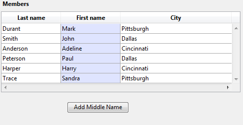

<!--REF #_command_.LISTBOX DUPLICATE COLUMN.Syntax-->**LISTBOX DUPLICATE COLUMN** ( {* ;} *objeto* ; *posCol* ; *nomCol* ; *varCol* ; *nomCabe* ; *varCabe* {; *nomRodape* ; *varRodape*} )<!-- END REF-->
<!--REF #_command_.LISTBOX DUPLICATE COLUMN.Params-->
| Parâmetro | Tipo |  | Descrição |
| --- | --- | --- | --- |
| * | Operador | &#8594;  | Se especificado, objeto é um nome de objeto (cadeia) Se omitido, objeto é um campo ou uma variável |
| objeto | any | &#8594;  | Nome de objeto (se * for especificado) ou<br/>Campo ou variável (se * for omitido) |
| posCol | Integer | &#8594;  | Localização da nova coluna duplicada |
| nomCol | Text | &#8594;  | Nome da nova coluna |
| varCol | Array, Field, Variable, Pointer | &#8594;  | Nome da variável array da coluna ou campo ou variável |
| nomCabe | Text | &#8594;  | Nome do objeto do cabeçalho da coluna |
| varCabe | Integer, Pointer | &#8594;  | Variável do cabeçalho da coluna |
| nomRodape | Text | &#8594;  | Nome do objeto do rodapé da coluna |
| varRodape | Variable, Pointer | &#8594;  | Variável do rodapé da coluna |

<!-- END REF-->

#### Descrição 

<!--REF #_command_.LISTBOX DUPLICATE COLUMN.Summary-->O comando **LISTBOX DUPLICATE COLUMN** duplica a coluna definida pelos parâmetros *objeto* e *\** por programação no contexto do formulário executado (Modo Aplicação).<!-- END REF--> O formulário original, gerado em modo Desenho não se modifica. 

**Nota:** esta funcionalidade já se encontra em 4D, em modo Desenho unicamente, com o comando **Duplicar Coluna** do menu contextual do editor de formulários.  
  
De forma pré determinada, todas as opções de estilo (tamanho, cor, formatos, etc) definidos para a coluna fonte por meio da lista de propriedades ou mediante os comandos de gestão de objetos (*\_o\_OBJECT SET COLOR*, etc.) se aplicam a cópia. O método objeto e a configuração dos eventos formulário também se duplicam.  
No entanto, a fonte de dados (array ou seleção, em função do tipo de fonte definido para o list box), assim como os arrays de estilo e de cores não se duplicam. É sua responsabilidade definir eles para cada nova coluna depois da duplicação.  
  
Os parâmetros *objeto* e *\** designam a coluna a duplicar. Se passar o parâmetro opcional *\** indica que o parâmetro *objeto* é um nome de coluna (cadeia). Se não passar este parâmetro, indica que o parâmetro *objeto* é uma variável de coluna. Neste caso, passou uma referência de variável no lugar de uma cadeia.

**Nota:** este comando não faz nada quando se aplica a primeira coluna de um list box que se mostra no modo hierárquico.  
  
A nova coluna duplicada aparece justo antes da coluna designada pelo parâmetro *posCol*. Se o parâmetro *posCol* é maior que o número total de colunas, a continuação, a coluna duplicada se coloca depois da última coluna.  
  
Nos parâmetros *nomCol* e *varCol*, passe o nome do objeto e da variável da nova coluna duplicada.  
* Para list boxes de tipo array, o nome da variável corresponde ao nome do array cujo conteúdo é mostrado na coluna.  
Pode passar um ponteiro Nil (->\[\]) em um contexto dinâmico (ver abaixo).
* Para list boxes de tipo seleção, pode passar um campo ou uma variável no parâmetro *varCol*. Assim que o conteúdo da coluna será o valor do campo ou da variável, avaliada para cada registro da seleção associada ao list box. Este tipo de conteúdo só pode utilizado quando a propriedade "Fonte de dados" do list box é Seleção atual ou Seleção temporal.
* List boxes do tipo Coleção ou Seleção de Entidades passe um ponteiro Nil (->\[\]) em varCol; deverá chamar a [LISTBOX SET COLUMN FORMULA](listbox-set-column-formula.md) para especificar a expressão fonte de dados.
Lembre que a fonte de dados da coluna original não se duplica: deve estabelecer uma variável, array ou campo fonte da nova coluna duplicada.  
  
Nos parâmetros *nomCabe* e *varCabe*, passe o nome do objeto e a variável do cabeçalho da nova coluna duplicada. Também pode passar o nome do objeto e a variável do rodapé da coluna inserida nos parâmetros *nomRodape* e *varRodape*. Se omitido o parâmetro *varRodape*, 4D utiliza uma variável dinâmica.  
  
**Nota**: os nomes de objetos devem ser únicos em um formulário. Deve ter certeza de que os nomes passados ​​em *nomCol*, *nomCabe* e *nomRodape* nãotenham sido utilizados. Caso contrário, a coluna não se duplica e é gerado um erro.  
  
Este comando deve ser utilizado no contexto de mostrar um formulário. É chamado geralmente no evento de formulário On Load ou depois de uma ação usuário (evento On Clicked).

##### Duplicação dinâmica 

Pode duplicar dinamicamente as colunas de list box e 4D se encarrega automaticamente da definição das variáveis necessárias (coluna, rodapé de página e cabeçalho).   
  
Para isso, **LISTBOX DUPLICATE COLUMN** aceita um ponteiro **Nil** (**\->\[\]**) como valor para os parâmetros *varCol* (list box de tipo array unicamente), *varCabe* e *varRodape*. Neste caso, quando se executa o comando, 4D cria as variáveis requeridas dinamicamente (para mais informação, consulte a seção ).   
  
Note que as variáveis de cabeçalho e de rodapé de página sempre se criam com um tipo específico (inteiro longo e texto, respectivamente). Pelo contrário, as variáveis de coluna não podem ser escritas durante a criação porque os list boxes aceitam diferentes tipos de arrays para estas variáveis (array texto, array inteiro, etc.). Isto significa que você têm que fixar o tipo de array manualmente (ver exemplo 2). É importante digitar antes de chamar a comandos como [LISTBOX INSERT ROWS](listbox-insert-rows.md) para inserir novos elementos no array. Ou bem, pode utilizar [APPEND TO ARRAY](append-to-array.md) tanto para definir o tipo do array e a inserção de elementos.

#### Exemplo 1 

Em um list box de tipo array, queremos duplicar a coluna "Nome", lista para a entrada:

  
  
Aqui está o código do botão:  
  
```4d
 ARRAY TEXT(arrFirstNames2;Records in table([Members]))
 LISTBOX DUPLICATE COLUMN(*;"column2";3;"col2bis";arrFirstNames2;"FirstNameA";vHead2A)
 OBJECT SET TITLE(*;"FirstNameA";"Middle Name")
 EDIT ITEM(*;"col2A";0)
```
  
  
Ao fazer clique no botão, aparece o list box assim:

#### Exemplo 2 

A partir de 4D v14 R3, pode duplicar dinamicamente as colunas de list box e 4D se encarrega automaticamente da definição das variáveis necessárias (coluna, rodapé de página e cabeçalho). 

```4d
 var $ptr : Pointer
 LISTBOX DUPLICATE COLUMN(*;"boolCol";3;"duplBoolCol";$ptr;"duplBoolHeader";$ptr;"duplBoolFooter";$ptr)
 colprt:=OBJECT Get pointer(Object named;"duplBoolCol")
 ARRAY BOOLEAN(colprt->;10)
 headprt:=OBJECT Get pointer(Object named;"duplBoolHeader")
 OBJECT SET TITLE(headprt->;"New duplicated column")
```

#### Ver também 

[LISTBOX MOVE COLUMN](listbox-move-column.md)  

#### Propriedades
|  |  |
| --- | --- |
| Número do comando | 1273 |
| Thread-seguro | &check; |
| Proibido no servidor ||


