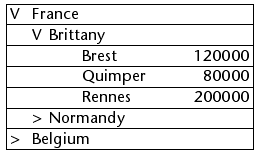

<!--REF #_command_.LISTBOX EXPAND.Syntax-->**LISTBOX EXPAND** ( {* ;} *object* {; *recursive* {; *selector* {; linha | nivel  {; *coluna*}}}} )<!-- END REF-->
<!--REF #_command_.LISTBOX EXPAND.Params-->
| Parâmetro | Tipo |  | Descrição |
| --- | --- | --- | --- |
| * | Operador | &#8594;  | If specified, object is an object name (string)<br/>If omitted, object is a variable |
| object | any | &#8594;  | Object name (if * is specified) or <br/>Variable (if * is omitted) |
| recursive | Boolean | &#8594;  | True = expand sublevels<br/>False = do not expand sublevels |
| selector | Integer | &#8594;  | Part of list box to expand |
| linha &#124; nivel | Inteiro longo | &#8594;  | Number of break row to expand or <br/>Number of list box level to expand |
| coluna | Integer | &#8594;  | Number of break column to expand |

<!-- END REF-->

*Esse comando não é seguro para thread e não pode ser usado em código adequado.*


#### Descrição 

<!--REF #_command_.LISTBOX EXPAND.Summary-->O comando LISTBOX EXPAND é utilizado para expandir as linhas de quebra do objeto list box designado pelos parâmetros objeto e \*.<!-- END REF-->  
  
Se passa o parâmetro opcional *\**, indica que o parâmetro *objeto* é um nome de objeto (string). Se omitir este parâmetro, indica que o parâmetro *objeto* é uma variável. Nesse caso, não passa uma string, mas uma referência de variável.  
  
Se a list box não estiver configurada em modo hierárquico, o comando não faz nada. Para mais informações sobre list box hierárquicas, consulte *List box hierárquicas*.  
  
O parâmetro opcional *recursivo* é utilizado para configurar a expansão dos subníveis hierárquicos do list box. Passe Verdadeiro ou omita este parâmetro para que o comando provoque a expansão de todos os níveis e subníveis. Se passa Falso, só o primeiro nível especificado será exibido.   
  
O parâmetro opcional *selector* é utilizado para especificar o alcance do comando. Pode passar neste parâmetro uma das seguintes constantes do tema *List box*:  
  
| Constante    | Tipo          | Valor | Comentário                                                                                                                                                                                                                                                                                                               |
| ------------ | ------------- | ----- | ------------------------------------------------------------------------------------------------------------------------------------------------------------------------------------------------------------------------------------------------------------------------------------------------------------------------ |
| lk all       | Inteiro longo | 0     | O comando afeta todos os subníveis (valor por defeito, utilizado se o parâmetro for omitido).                                                                                                                                                                                                                            |
| lk selection | Inteiro longo | 1     | O comando afeta os subníveis selecionados.                                                                                                                                                                                                                                                                               |
| lk break row | Inteiro longo | 2     | O comando afeta o subnível ao qual pertence a "célula" designada pelos parâmetros *linha* e *coluna*. Note que estes parâmetros representam os números de linha e de coluna na list box de modo padrão e não na sua presentação hierárquica. Se os parâmetros *linha* e *coluna* forem omitidos, o comando não faz nada. |
| lk level     | Inteiro longo | 3     | O comando afeta todas as quebras de linhas correspondentes à coluna *nivel*. Este parâmetro designa um número de coluna na list box no modo padrão e não na sua representação hierárquica. Se o parâmetro *nivel* for omitido, o comando não faz nada.                                                                   |
  
  
O comando não seleciona linhas de quebra.  
  
Se a seleção ou o list box não conterem uma linha de quebra ou se todas as linhas de quebra já estão expandidas, o comando não faz nada.

#### Exemplo 

Este ejemplo ilustra diferentes modos de utilizar el comando. Dados los siguientes arrays representados en un list box:


```4d
  //Desplegar todas las líneas y sublíneas de ruptura del list box
 LISTBOX EXPAND(*;"MiListbox")
```


```4d
  //Desplegar el primer nivel de líneas de ruptura de la selección
 LISTBOX EXPAND(*;"MiListbox";False;lk selection)
  //Si la línea "Belgium" no fue seleccionada
```


```4d
  //Desplegar la línea de ruptura Brittany sin recursividad
 LISTBOX EXPAND(*;"MiListbox";False;lk break row;1;2)
```



```4d
  //Desplegar todas las primeras columnas (países) sin recursividad
 LISTBOX EXPAND(*;"MiListbox";False;lk level;1)
```


#### Ver também 

[LISTBOX COLLAPSE](listbox-collapse.md)  