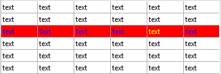

<!--REF #_command_.LISTBOX Get row color as number.Syntax-->**LISTBOX Get row color as number** ( {* ;} *objeto* ; *fila* {; *tipoCor*} )  : Integer<!-- END REF-->
<!--REF #_command_.LISTBOX Get row color as number.Params-->
| Parâmetro | Tipo |  | Descrição |
| --- | --- | --- | --- |
| * | Operador | &#8594;  | Se especificado, objeto é um nome de objeto (string). Se omitido, objeto é uma variável |
| objeto | any | &#8594;  | Nome de objeto (se * for especificado) ou variável (se * for omitido) |
| fila | Integer | &#8594;  | Número da linha |
| tipoCor | Integer | &#8594;  | cor de fonte listbox (normal) ou cor de fundo de list box |
| Resultado | Integer | &#8592; | Valor da cor |

<!-- END REF-->

#### Descrição 

<!--REF #_command_.LISTBOX Get row color as number.Summary-->**Nota:** este comando só funciona com os list box de tipo array.<!-- END REF-->

O comando **LISTBOX Get row color as number** devolve a cor de uma fila ou de uma célula de list box designado pelos parâmetros *objeto* e *\** como um número em formato 0x00rrggbb.

**Nota:** se quiser obter a cor como uma string CSS, deve utilizar o comando [LISTBOX Get row color](listbox-get-row-color.md). Para saber mais informação sobre os formatos de cor, consulte a descrição do comando [OBJECT SET RGB COLORS](object-set-rgb-colors.md).

Se passar o parâmetro opcional *\** indica que o parâmetro *objeto* for um nome de objeto (string). Se não passar este parâmetro, indica que o parâmetro *objeto* é uma variável. Neste caso, se passar uma referência de variável ao invés de uma string. Pode designar um list box ou uma coluna de list box como parâmetro *objeto*:

* se *objeto* designar um list box, o comando devolve a cor da fila.
* se *objeto* designar uma columna list box, o comando devolve a cor da célula.

Em *fila*, passe o número da fila cuja cor deseja obter.

**Nota:** o comando não leva em consideração o possível estado oculto/visível das filas de list box.

No parâmetro *tipoCor*, pode passar ou a constante lk background color ou lk font color (tema "*List box*" ) com o objetivo de averiguar a cor de fundo ou a cor da fonte da fila. Se omitir este parâmetro, se devolve a cor da fonte.  
  
**Advertência:** uma cor atribuída a uma fila não é mostrada necessariamente em cada célula da fila (ver o exemplo). Se os valores de cor em conflto forem definidos via as propriedades de list box ou da coluna list box, se aplica uma orden de prioridade. Para obter mais informação, consulte o manual de *Desenho*.

#### Exemplo 

Given the following list box:



```4d
 vColor:=LISTBOX Get row color(*;"Col5";3)
 vColor2:=LISTBOX Get row color(*;"List Box";3)
 vColor3:=LISTBOX Get row color(*;"List Box";lk background color)
  // vColor contains 0xFFFF00 (yellow)
  // vColor2 contains 0x00FF (blue)
  // vColor3 contains 0x00FF0000 (red)
```

#### Ver também 

*List box*  
[LISTBOX Get row color](listbox-get-row-color.md)  
[LISTBOX SET ROW COLOR](listbox-set-row-color.md)  

#### Propriedades

|  |  |
| --- | --- |
| Número do comando | 1271 |
| Thread-seguro | &cross; |


