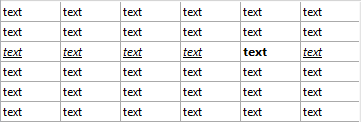

<!--REF #_command_.LISTBOX Get row font style.Syntax-->**LISTBOX Get row font style** ( {* ;} *objeto* ; *linha* ) : Integer<!-- END REF-->
<!--REF #_command_.LISTBOX Get row font style.Params-->
| Parâmetro | Tipo |  | Descrição |
| --- | --- | --- | --- |
| * | Operador | &#8594;  | Se especificado, objeto é um nome de objeto (cadeia) Se omitido, objeto é uma variável |
| objeto | any | &#8594;  | Nome do objeto(se especificado *) ou<br/>Variável (se omitido *) |
| linha | Integer | &#8594;  | Número linha |
| Resultado | Integer | &#8592; | Valor de estilo |

<!-- END REF-->

#### Descrição 

<!--REF #_command_.LISTBOX Get row font style.Summary-->**Nota:** Este comando só funciona com os list box de tipo array.<!-- END REF-->

O comando **LISTBOX Get row font style** devolve o estilo de fonte de uma linha ou de uma célula do list box designado pelos parâmetros *objeto* e *\** .

Ao passar o parâmetro opcional *\** indica que o parâmetro *objeto* é um nome de objeto (cadeia). Se não passa este parâmetro, indica que o parâmetro *objeto* é uma variável. Neste caso, se passa uma referência de variável em lugar de uma cadeia. Pode designar como parâmetro *objeto* um list box ou uma coluna de list box:

* Se *objeto* designa um list box, o comando devolve o estilo da linha.
* Se *objeto* designa uma coluna, o comando devolve o estilo da célula.

Em *linha*, passe o número da linha cujo estilo deseja obter. 

**Nota:** O comando não leva em conta os estados oculto/visível das linhas do list box.

**Atenção:** Um estilo atribuído a uma linha não se mostra necessariamente em todas as células de linha (ver o exemplo). Se definem valores de estilo contraditórios usando as propriedades do list box ou da coluna, se aplica uma ordem de prioridade. Para obter mais informação, consulte o Manual de *Desenho*.

#### Exemplo 

Dado o seguinte list box: 



```4d
 vStyle:=LISTBOX Get row font style(*;"Col5";3)
 vStyle2:=LISTBOX Get row font style(*;"List Box";3)
  // vStyle contém 1 (Bold)
  // vStyle2 contém 6 (Italic + Underline)
```

#### Ver também 

[LISTBOX SET ROW FONT STYLE](listbox-set-row-font-style.md)  

#### Propriedades

|  |  |
| --- | --- |
| Número do comando | 1269 |
| Thread-seguro | &cross; |


