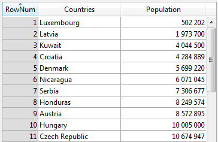
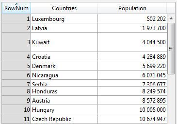

<!--REF #_command_.LISTBOX SET ROW HEIGHT.Syntax-->**LISTBOX SET ROW HEIGHT** ( {* ;} *objeto* ; *linha* ; *altura* )<!-- END REF-->
<!--REF #_command_.LISTBOX SET ROW HEIGHT.Params-->
| Parâmetro | Tipo |  | Descrição |
| --- | --- | --- | --- |
| * | Operador | &#8594;  | Se especificado, objeto é um nome de objeto (string) Se omitido, objeto é uma variável |
| objeto | any | &#8594;  | Nome de objeto (se * for omitido) ou variável (se * omitido) |
| linha | Integer | &#8594;  | Linha list box cuja altura você quer estabelecer |
| altura | Integer | &#8594;  | Altura da linha de list box |

<!-- END REF-->

## Descrição 

<!--REF #_command_.LISTBOX SET ROW HEIGHT.Summary-->O comando **LISTBOX SET ROW HEIGHT** lhe permite modificar a altura da *fila* especificada no objeto list box designado utilizando os parâmetros *objeto e* *\**.<!-- END REF-->

Se passar o parâmetro opcional *\**, indica que o parâmetro *objeto é* um nome de objeto (string). Se não passar este parâmetro, indica que o parâmetro *objeto* for uma variável. Neste caso, se passar uma referência variável ao invés de uma string. Para mais informação sobre nomes de objetos, consulte *Propriedades dos objetos*.

Se a *fila* especificada não existir no list box, o comando não faz nada.

A unidade utilizada para a *altura* especificada corresponde a definida globalmente para as filas de list box, seja na lista de propriedades ou por uma chamada anterior ao comando [LISTBOX SET ROWS HEIGHT](listbox-set-rows-height.md).

**Nota**: para mais informação sobre o cálculo da altura das filas, consulte o Manual de *Desenho*.

Se não houver um array de altura de fila associado ao list box, este comando cria um dinâmico; do contrário, se utilizar o array existente especificado na propriedade **Array de altura de fila**. O uso deste comando para estabelecer a altura de fila individual produz o mesmo resultado visual que a associação de um array de altura de fila; Entretanto, preencher um array com valores de altura da fila for muito mais rápido que chamar a este comando em um loop para ajustar a altura das filas de uma em uma para o list box.

**Nota importante:** se o comando [LISTBOX SET ROWS HEIGHT](listbox-set-rows-height.md) for chamado posteriormente com uma unidade diferente a que se definiu previamente, este valor predeterminado substituirá e reinicializará o array de altura das filas existentes definidas utilizando **LISTBOX SET ROW HEIGHT** (ver o exemplo).

## Exemplo 1 

Se quiser mudar a altura de umas poucas linhas no list box abaixo:



Se executar este código:

```4d
  //a unidade atual é píxels
 LISTBOX SET ROW HEIGHT(*;"listboxname";3;40) //Kuwait
 LISTBOX SET ROW HEIGHT(*;"listboxname";7;14) //Sérbia
```

... obterá o seguinte resultado:



## Exemplo 2 

Se definir uma altura de fila predeterminada e depois definir vários valores de altura de fila individuais utilizando o comando **LISTBOX SET ROW HEIGHT**:

```4d
 LISTBOX SET ROWS HEIGHT(*;"listboxname";25;lk pixels) // altura global definida em píxels
 
 LISTBOX SET ROW HEIGHT(*;"listboxname";1;30) // linhaa 1: 30 píxels
 LISTBOX SET ROW HEIGHT(*;"listboxname";5;40) // linha 5: 40 píxels
 LISTBOX SET ROW HEIGHT(*;"listboxname";11;50) // linha 11: 50 píxels
```

Mais tarde, se for executado o código abaixo...

```4d
 LISTBOX SET ROWS HEIGHT(*;"listboxname";18;lk pixels)
```

... Então a altura global de fila se estabelece em 18 píxels; Entretanto, já que a unidade não mudou, as filas 1, 5 e 11 manterão seus valores de altura específicos, ou seja, 30, 40 e 50 píxels como foi definido anteriormente pelo comando **LISTBOX SET ROW HEIGHT**.  
  
Por outro lado, se o código abaixo for executado posteriormente...

```4d
 LISTBOX SET ROWS HEIGHT(*;"listboxname";2;lk lines)
```

... Então as filas 1, 5 e 11 voltam para a altura global de fila predeterminada estabelecida por [LISTBOX SET ROWS HEIGHT](listbox-set-rows-height.md) (ou seja, 2 linhas) já que a unidade mudou de píxels a linhas. Já que não há conversão automática aplicada, a mudança de unidades sempre resulta em altura de fila reinicializada no novo valor como padrão definido.

## Ver também 

  
[LISTBOX Get row height ](listbox-get-row-height.md)  
[LISTBOX SET AUTO ROW HEIGHT](listbox-set-auto-row-height.md)  
[LISTBOX SET ROWS HEIGHT](listbox-set-rows-height.md)  

## Propriedades

|  |  |
| --- | --- |
| Número do comando | 1409 |
| Thread-seguro | &cross; |


