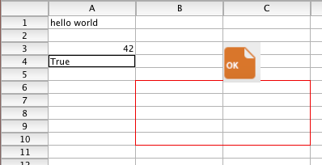

<!--REF #_command_.Load 4D View document.Syntax-->**Load 4D View document** ( *4DViewDocumento* ) : Object<!-- END REF-->
<!--REF #_command_.Load 4D View document.Params-->
| Parâmetro | Tipo |  | Descrição |
| --- | --- | --- | --- |
| 4DViewDocumento | Blob | &#8594;  | Documento 4D View |
| Resultado | Object | &#8592; | Representação de objeto no documento 4D View |

<!-- END REF-->

#### Descrição 

<!--REF #_command_.Load 4D View document.Summary-->O comando **Load 4D View document** permite converter um documento 4D View é um objeto 4D.<!-- END REF--> 

Nem uma licença válida 4D View, nem uma instância do plug-in 4D View herdado em seu ambiente são necessários para este comando.

Passe no parâmetro *4DViewDocument* uma variável BLOB ou campo que contenha o documento 4D View a converter. O comando retorna um [objeto](# "Estruturas de dados como objetos 4D nativos") 4D que descreve toda a informação armazenada originalmente no documento 4D View, incluindo:

* estrutura do documento (número de filas e colunas), tipo e informação (versão, título...)
* atributos de célula (tipo de célula, valor, fórmula, nome, estilo, segurança...)
* atributos de coluna (largura, estilo, tipo, segurança, visibilidade, ruptura...)
* atributos de fila (altura, estilo, tipo, segurança, visibilidade, ruptura...)
* estilos, bordas e painéis

Utilizando este comando, pode recuperar toda informação armazenada em seus documentos 4D View e manejá-los em um formato aberto. 

**Nota**: se necessitar converter documentos de 4D View a 4D View Pro, se recomenda utilizar o comando dedicado  que realiza uma conversão direta e transparente.

#### Exemplo 

Se quiser carregar e converter um documento 4D View armazenado no disco:

```4d
 var $blob : Blob
 var $object : Object
 DOCUMENT TO BLOB("document.4PV";$blob)
 $object:=Load 4D View document($blob)
 ALERT("Document title is "+$object.title)
```

Por exemplo, se converter o documento abaixo:



Obterá o resultado abaixo (objeto stringified):

```json
{
    "version": 9,
    "title": "4D View test",
    "subject": "",
    "author": "",
    "company": "",
    "note": "",
    "creationDate": "2017-06-13",
    "creationTime": 63230,
    "modificationDate": "2017-06-13",
    "modificationTime": 63295,
    "columnCount": 2048,
    "rowCount": 65535,
    "columnHeaderHeight": 380,
    "rowHeaderWidth": 1180,
    "columnWidth": 2160,
    "rowHeight": 320,
    "noExternalCall": false,
    "columns": [],
    "rows": [],
    "cells": [
        {
            "kind": "value",
            "value": "hello world",
            "valueType": "string",
            "column": 1,
            "row": 1
        },
        {
            "kind": "value",
            "value": 42,
            "valueType": "real",
            "column": 1,
            "row": 3
        },
        {
            "kind": "value",
            "value": true,
            "valueType": "bool",
            "column": 1,
            "row": 4
        }
    ],
    "cellNames": [],
    "customFormats": [],
    "rowEdges": [
        {
            "style": 13,
            "color": 15597568,
            "left": 2,
            "top": 6,
            "right": 3,
            "bottom": 6
        },
        {
            "style": 13,
            "color": 15597568,
            "left": 2,
            "top": 11,
            "right": 3,
            "bottom": 11
        }
    ],
    "columnEdges": [
        {
            "style": 13,
            "color": 15597568,
            "left": 2,
            "top": 6,
            "right": 2,
            "bottom": 10
        },
        {
            "style": 13,
            "color": 15597568,
            "left": 4,
            "top": 6,
            "right": 4,
            "bottom": 10
        }
    ],
    "defaultStyle": {
        "locked": false,
        "hidden": false,
        "gridHidden": false,
        "spellCheck": false,
        "pictHeights": false,
        "inputFilter": 0,
        "backColorEven": 16777215,
        "backColorOdd": 16777215,
        "fontID": 2,
        "fontSize": 11,
        "fontBold": false,
        "fontItalic": false,
        "fontUnderline": false,
        "fontOutline": false,
        "fontShadow": false,
        "fontCondensed": false,
        "fontExtended": false,
        "normalColorEven": 0,
        "normalColorOdd": 0,
        "zeroColorEven": 255,
        "zeroColorOdd": 255,
        "minusColorEven": 16711680,
        "minusColorOdd": 16711680,
        "hAlign": 0,
        "vAlign": 0,
        "rotation": 0,
        "wordWrap": false,
        "forceTextFormat": false,
        "numericFormat": 0,
        "stringFormat": 0,
        "booleanFormat": 0,
        "dateTimeFormat": 0,
        "pictureFormat": 0
    },
    "exportRanges": [],
    "fontNames": [
        {
            "id": 2,
            "name": "Lucida Grande" 
        }
    ],
    "inputFilters": [],
    "pictures": [
        {
            "column": 3,
            "row": 3,
            "width": 920,
            "height": 1000,
            "drawingMode": 5,
            "behind": false,
            "fixedSize": false,
            "locked": false,
            "hOffset": 0,
            "vOffset": 0,
            "picture": "[object Picture]" 
        }
    ]
}
```

**Nota:** para mais informação sobre o formato do [objeto](# "Estruturas de dados como objetos 4D nativos"), devolvido, contacte os serviços técnicos de 4D.


#### Propriedades

|  |  |
| --- | --- |
| Número do comando | 1528 |
| Thread-seguro | &check; |


