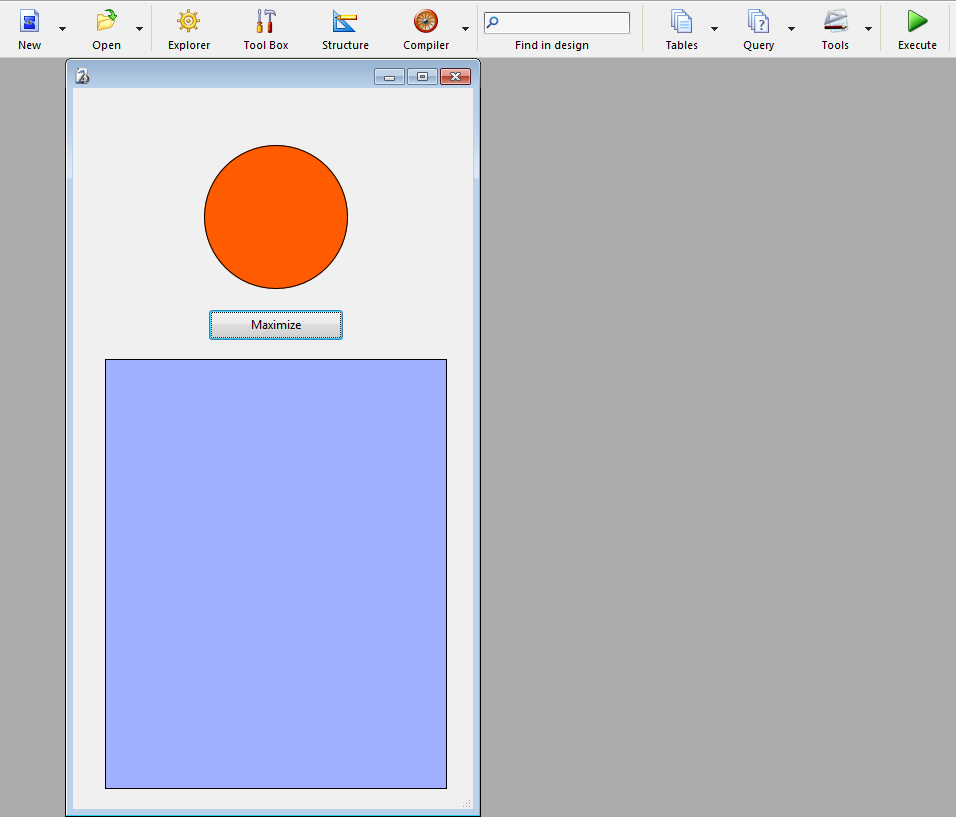

<!--REF #_command_.MAXIMIZE WINDOW.Syntax-->**MAXIMIZE WINDOW** {( *janela* )}<!-- END REF-->
<!--REF #_command_.MAXIMIZE WINDOW.Params-->
| Parâmetro | Tipo |  | Descrição |
| --- | --- | --- | --- |
| janela | Integer | &#8594;  | Número de referência da janela ou se for omitido, todos os processos atuais de janela de primeiro plano; ou processo atual da janela de primeiro plano (Mac OS) |

<!-- END REF-->

#### Descrição 

<!--REF #_command_.MAXIMIZE WINDOW.Summary-->O comando MAXIMIZE WINDOW provoca a expansão da janela cujo número de referência se passa em *janela*.<!-- END REF--> Se for omitido este parâmetro, o efeito é o mesmo mas é aplicado a todas as janelas da aplicação (Windows) ou a janela do primeiro plano do processo atual (Mac OS).  

Este comando tem o mesmo efeito que um clique no zoom de uma janela da aplicação 4D. Em Windows, a janela que deseja maximizar deve ter um quadro de zoom. Se o tipo de *janela* não têm um quadro de zoom, o comando não faz nada (para mais informação sobre este ponto, consulte a seção *Tipos de Janelas*).

Um clique posterior no quadro de zoom ou a chamada ao comando [MINIMIZE WINDOW](minimize-window.md) reduz a janela a seu tamanho inicial. Em Windows, uma chamada a \[#cmd id="454"/\] sem parâmetros faz com que todas as janelas da aplicação retornem a seu tamanho inicial.

Se *janela* já está maximizada, o comando não faz nada.

##### On Windows 

A janela é aumentada e se adapta ao tamanho atual da janela da aplicação. A janela maximizada passa ao primeiro plano. Se não passar o parâmetro *janela*, o comando se aplica a todas as janelas da aplicação.  
 

Zoom (botão para aumentar) em Windows

Em casos em que se aplica o comando a uma janela cujo tamanho está sujeito a restrições (por exemplo, uma janela formulário): 

* Se nenhuma restrição de tamanho está em conflito com o tamanho objetivo, a janela se "maximiza" (ou seja, se restaura do tamanho da janela MDI ("Multiple Document Interface"); sua barra de título e seus bordes estão ocultos e seu botões de controle - minimizar, restaurar e fechar - se localizam a direita da barra de menu da aplicação).
* Se pelo menos uma restrição de tamanho está em conflito (por exemplo, se o comprimento da janela MDI é 100 e a largura máxima da janela de formulário é 80), a janela não se "maximiza", só se restaura a seu tamanho máximo permitido. Este tamanho se define seja pela janela MDI, ou pela restrição. Desta maneira, a interface continua sendo coerente quando se redimensionam janelas com restrições.

##### On Mac OS 

A janela é aumentada de maneira que possa mostrar a totalidade de seu conteúdo. Se não passa o parâmetro *janela*, o comando se aplica a janela do primeiro plano do processo atual.


 Zoom em Mac OS  
* O zoom é baseado no conteúdo da janela; de maneira, que o comando deve ser chamado em um contexto onde o conteúdo da janela está definido, por exemplo em um método de formulário. Caso contrário, o comando não faz nada.
* A janela está dimensionada em seu tamanho "máximo". Se a janela é um formulário cujo tamanho se define nas Propriedades do formulário, o tamanho da janela se estabelece nesses valores.

#### Exemplo 1 

Imagine que deseja seu formulário se aberto em uma janela "aberta totalmente". Para fazer isso, você coloca o código abaixo no método de formulário:

```4d
  // Método de formulário
 MAXIMIZE WINDOW
```

#### Exemplo 2 

Este exemplo ilustra como as restrições de tamanho se manipulam em Windows. O seguinte formulário têm uma restrição de tamanho (largura máxima=400):


O método do botão contém unicamente:

```4d
 MAXIMIZE WINDOW(Current form window)
```

Neste contexto, se o usuário fizer clique no botão:


... a janela não se "maximiza"; só aumenta a altura:



#### Ver também 

[Is window maximized](is-window-maximized.md)  
[MINIMIZE WINDOW](minimize-window.md)  
[REDUCE RESTORE WINDOW](reduce-restore-window.md)  

#### Propriedades
|  |  |
| --- | --- |
| Número do comando | 453 |
| Thread-seguro | &check; |
| Proibido no servidor ||


