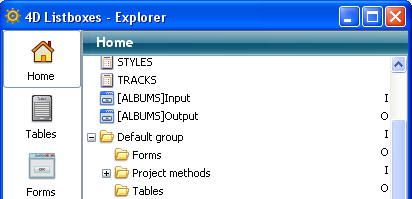

<!--REF #_command_.METHOD GET FOLDERS.Syntax-->**METHOD GET FOLDERS** ( *arrayNoms* {; *filtro*}{; *} )<!-- END REF-->
<!--REF #_command_.METHOD GET FOLDERS.Params-->
| Parâmetro | Tipo |  | Descrição |
| --- | --- | --- | --- |
| arrayNoms | Text array | &#8592; | Array de nomes de pastas da página de início |
| filtro | Text | &#8594;  | Filtro de nomes |
| * | Operador | &#8594;  | Se passado = o comando se aplica à base local quando se executa desde um componente (parâmetro ignorado fora deste contexto) |

<!-- END REF-->

*Esse comando não é seguro para thread e não pode ser usado em código adequado.*

#### Descrição 

<!--REF #_command_.METHOD GET FOLDERS.Summary-->O comando **METHOD GET FOLDERS** devolve no array *arrayNoms*, os nomes das pastas criadas na página Início do Explorador de 4D:  
  
  
Como os nomes das pastas devem ser únicos, a hierarquia não é devolvida neste array.<!-- END REF-->   
  
Pode limitar a lista de pastas passando uma cadeia de comparação no parâmetro *filtro*, neste caso, somente são devolvidas as pastas cujos nomes coincidam com o filtro. Pode utilizar o caracter @ para definir os filtros de tipo "começa por", "termina em" o "contém". Se passado uma cadeia vazia, o parâmetro *filtro* se ignora.   
  
Se executado este comando desde um componente, devolve por defeito os caminhos dos métodos do componente. Se passado o parâmetro *\**, o array conterá os caminhos dos métodos da base local.

#### Ver também 

[METHOD GET PATHS](method-get-paths.md)  