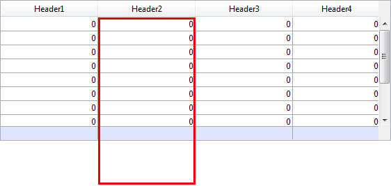

<!--REF #_command_.OBJECT GET COORDINATES.Syntax-->**OBJECT GET COORDINATES** ( {* ;} *objeto* ; *esquerda* ; *superior* ; *direita* ; *inferior* )<!-- END REF-->
<!--REF #_command_.OBJECT GET COORDINATES.Params-->
| Parâmetro | Tipo |  | Descrição |
| --- | --- | --- | --- |
| * | Operador | &#8594;  | se especificado, objeto é um nome de objeto (string), se omitido, objeto é um  uma variável |
| objeto | any | &#8594;  | Nome de objeto (se* é especificado) ou Campo ou Variável (se * é omitido) |
| esquerda | Integer | &#8592; | Coordenadas da esquerda do objeto |
| superior | Integer | &#8592; | Coordenadas superiores do objeto |
| direita | Integer | &#8592; | Coordenada direita do objeto |
| inferior | Integer | &#8592; | Coordenadas inferiores do objeto |

<!-- END REF-->

#### Descrição 

<!--REF #_command_.OBJECT GET COORDINATES.Summary-->O comando **OBJECT GET COORDINATES** devolve as coordenadas *esquerda*, *superior*, *direita* e *inferior* (em pontos) nas variáveis ou campos dos objetos do formulário atual definido pelos parâmetros *\** e *objeto*.<!-- END REF-->

Se passa o parâmetro opcional *\**, indica que o parâmetro *objeto* é um nome de objeto (uma string de caracteres). Se não passa o parâmetro opcional \*, indica que *objeto* é um campo ou uma variável. Neste caso, não é passada uma string mas uma referência de um campo ou de uma variável (campo ou variável de tipo objeto unicamente).

Se passa um nome de objeto no parâmetro objeto e utiliza o caractere arroba (“@”) para selecionar mais de um objeto, as coordenadas devolvidas serão as do retângulo formado por todos os objetos envolvidos. 

**Nota:** desde a versão 6.5, é possível definir o modo de interpretação do caractere arroba (“@”), quando se inclui em uma string de caracteres. Esta opção tem um impacto nos comandos “Propriedades dos objetos”. Por favor consulte o Manual de Desenho.

Se o objeto não existe ou se não se chama o comando no contexto de um formulário, as coordenadas retornadas são (0;0;0;0).

No contexto dos list box, o comando **OBJECT GET COORDINATES** pode devolver as coordenadas de partes específicas do listbox, ou seja, colunas, cabeçalhos, rodapés de página, e não só os do objeto listbox pai. Nas versões anteriores a v14 R5, este comando sempre devolve as coordenadas do listbox pai, independentemente da área passada como parâmetro. A partir de agora, quando o *objet*o referenciado é um cabeçalho, uma coluna ou um rodapé de listbox, as coordenadas devolvidas são os do sub-objeto listbox atribuído. Pode utilizar esta nova funcionalidade, por exemplo, para mostrar um pequeno ícone na célula de cabeçalho de um listbox quando se passa sobre ele, lhe indicando ao usuário que pode fazer clique para mostrar um menu contextual.  
Para manter a coerência, o marco de referência utilizado é o mesmo quando o objeto é um sub-objeto list box ou um objeto list box: a origem é a esquina superior esquerda do formulário que contém o objeto. Para os sub-objetos de listbox, as coordenadas devolvidas são teóricas; tem em conta o estado de deslocamento do list box antes de que ocorra um clipping (ou seja, o corte de acordo com as coordenadas do list box pai). Como resultado, o sub-objeto pode que não seja visível (ou só parcialmente) em seus coordenadas, e estas coordenadas podem estar fora dos limites do formulário (ou inclusive ser negativas). Para averiguar se o sub\-objeto é visível (e que parte é visível) é necessário comparar as coordenadas devolvidas com as coordenadas do listbox, enquanto tem em conta as seguintes regras:

* Todos os sub-objetos se recortam segundo as coordenadas de seu listbox pai (devolvidas por **OBJECT GET COORDINATES** no list box).
* Os sub-objetos cabeçalho e rodapé se mostram sobre o conteúdo da coluna: quando as coordenadas de uma coluna cruzam as coordenadas das linhas de cabeçalho ou rodapé de página, logo a coluna não se mostrada nesta interseção.
* Os elementos das colunas bloqueadas se mostram acima dos elementos das colunas deslocáveis: quando as coordenadas de um elemento em uma coluna deslocada cruzam as coordenadas de um elemento em uma coluna bloqueada, não é mostrada nesta interseção.

Por exemplo, considere o seguinte gráfico, onde as coordenadas da coluna *Capital* estão simbolizadas por um retângulo vermelho:


Como você pode ver na primeira imagem, a coluna é maior que o listbox, pelo que seus coordenadas vão além do limite inferior do listbox, incluindo o rodapé de página. Na segunda imagem, o listbox foi deslocado, sendo que a coluna também se moveu para "baixo" a coluna *Language* e a área de cabeçalho. Em qualquer caso, com o propósito de calcular a parte visível real (área verde), é necessário subtrair as áreas vermelhas.

#### Exemplo 1 

Assumamos que quer obter as coordenadas de um retângulo formado por todos os objetos que começam por “botão”:

```4d
 OBJECT GET COORDINATES(*;"botão@";esquerda;superior;direita;inferior)
```

#### Exemplo 2 

Para as necessidades de sua interface, você deseja rodear a área na que o usuário fez clique com um retângulo vermelho:


No método objeto do listbox, pode escrever:

```4d
 OBJECT SET VISIBLE(*;"rectangleInfo";False) //inicializar um retângulo vermelho
 $ptr:=OBJECT Get pointer(Object current)
 OBJECT GET COORDINATES($ptr->;$x1;$y1;$x2;$y2)
 OBJECT SET VISIBLE(*;"RedRect";True)
 OBJECT SET COORDINATES(*;"RedRect";$x1;$y1;$x2;$y2)
 
 OBJECT GET COORDINATES(*;"LB1";$lbx1;$lby1;$lbx2;$lby2)
 If($lby1>$y1)|($lby2<$y2)&NBSP; // se a área na que é faz clique está fora do listbox
    OBJECT SET VISIBLE(*;"Alert";True)&NBSP; // mostrar um alerta
 Else
    OBJECT SET VISIBLE(*;"Alert";False)
 End if
```

O método devolve as coordenadas teóricas. Se o listbox é redimensionado, pode necessitar calcular o recorte para saber que parte é visível:



#### Ver também 

[CONVERT COORDINATES](convert-coordinates.md)  
[LISTBOX GET CELL COORDINATES](listbox-get-cell-coordinates.md)  
[OBJECT MOVE](object-move.md)  
[OBJECT SET COORDINATES](object-set-coordinates.md)  

#### Propriedades

|  |  |
| --- | --- |
| Número do comando | 663 |
| Thread-seguro | &cross; |


