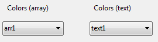

<!--REF #_command_.OBJECT SET LIST BY REFERENCE.Syntax-->**OBJECT SET LIST BY REFERENCE** ( {* ;} *objeto* {; *tipoLista*}; *lista* )<!-- END REF-->
<!--REF #_command_.OBJECT SET LIST BY REFERENCE.Params-->
| Parâmetro | Tipo |  | Descrição |
| --- | --- | --- | --- |
| * | Operador | &#8594;  | Se especificado, objeto é um nome de objeto (cadeia) Se omitido, objeto é um campo ou uma variável |
| objeto | any | &#8594;  | Nome de objeto (se * for especificado) ou<br/>Campo ou variável (se * for omitido) |
| tipoLista | Integer | &#8594;  | Tipo de lista: Lista de valores, Lista de obrigatórios ou Lista de excluídos |
| lista | Integer | &#8594;  | Número de referência de lista |

<!-- END REF-->

*Esse comando não é seguro para thread e não pode ser usado em código adequado.*


#### Descrição 

<!--REF #_command_.OBJECT SET LIST BY REFERENCE.Summary-->O comando **OBJECT SET LIST BY REFERENCE** define ou substitui a lista associada com o objeto ou objetos definidos pelos parâmetros *objeto* e *\**, com a lista hierárquica definida no parâmetro *lista*.<!-- END REF-->

Se passar o parâmetro opcional *\** indica que o parâmetro *objeto* é um nome de objeto (cadeia). Se não passar este parâmetro, indica que o parâmetro objeto é um campo ou uma variável. Neste caso, se passar uma referência de campo ou variável no lugar de uma cadeia (campo ou variável objeto unicamente).  
  
Por padrão, se omitido o parâmetro *tipoLista*, o comando define uma lista de seleção fonte (seleção de valores) para o objeto. Pode designar qualquier tipo de lista no parâmetro *tipoLista*. Para isso, só tem que passar uma das seguintes constantes do tema "*Propriedades dos objetos* ":

| Constante     | Tipo          | Valor | Comentário                                                                                |
| ------------- | ------------- | ----- | ----------------------------------------------------------------------------------------- |
| Choice list   | Inteiro longo | 0     | Lista simples de seleção de valores (opção "Lista" na Lista de Propriedades) (por padrão) |
| Excluded list | Inteiro longo | 2     | Lista de valores não aceitos para a entrada (Opção "Exclusões" na lista de propriedades)  |
| Required list | Inteiro longo | 1     | Lista só os valores aceitos para a entrada (Opção "Obrigatória" na Lista de Propriedades) |

Em *lista*, passe o número de referência da lista hierárquica que deseja associar ao objeto. Esta lista deve ter sido gerada utilizando o comando [Copy list](copy-list.md), [Load list](load-list.md) ou [New list](new-list.md).  
  
Para finalizar a associação de uma *lista* com um *objeto*, só passe 0 no parâmetro *lista* para o tipo de lista relativa. Eliminar uma associação de lista, não elimina a referência de lista em memoria. Lembre de chamar o comando [CLEAR LIST](clear-list.md) quando já não necessite a lista.

Lista de valores existentes são substituidas dependendo de como a lista é associada ao objeto formulário:

* usar uma lista de escolha: a lista mesmo é substituída.
* usar um array: a lista é copiada em elementos array.
* usar um objeto (não compativel em bancos de dados binários): a lista é copiada como elementos de coleção na propriedade valores do objeto.

  
Este comando é especialmente interessante no contexto de um pop-up ou combo box associado a uma variável ou um campo (ver o Manual de *Desenho*). Neste caso, a associação é dinâmica e qualquer mudança na lista é copiada no formulário. Quando o objeto está associado a um array, a lista é copiada no array e qualquer mudança na lista não está disponível de forma automática (ver o exemplo 5).

#### Exemplo 1 

Associar uma lista de opções simples (tipo de lista pré determinado) a um campo de texto:

```4d
 vCountriesList:=New list
 APPEND TO LIST(vCountriesList;"Spain";1)
 APPEND TO LIST(vCountriesList;"Portugal";2)
 APPEND TO LIST(vCountriesList;"Greece";3)
 OBJECT SET LIST BY REFERENCE([Contact]Country;vCountriesList)
```

#### Exemplo 2 

Associar a lista "vColor" como uma lista de seleção simples com o pop-up/lista deslocável "DoorColor":

```4d
 vColor:=New list
 APPEND TO LIST(vColor;"Blue";1)
 APPEND TO LIST(vColor;"Green";2)
 APPEND TO LIST(vColor;"Red";3)
 APPEND TO LIST(vColor;"Yellow";4)
 OBJECT SET LIST BY REFERENCE(*;"DoorColor";Choice list;vColor)
```

#### Exemplo 3 

Agora deseja associar a lista "vColor" com um combo box denominado "WallColor". Como este combo box é editável, você quer ter a certeza de que certas cores, como "preto", "roxo", etc, não podem ser utilizados. Estas cores são colocadas na lista "vReject":

```4d
 OBJECT SET LIST BY REFERENCE(*;"WallColor";Choice list;vColor)
 vReject:=New list
 APPEND TO LIST(vReject;"Black";1)
 APPEND TO LIST(vReject;"Gray";2)
 APPEND TO LIST(vReject;"Purple";3)
 OBJECT SET LIST BY REFERENCE(*;"WallColor";Excluded list;vReject)
```

#### Exemplo 4 

Você deseja eliminar as associações de listas:

```4d
 OBJECT SET LIST BY REFERENCE(*;"WallColor";Choice list;0)
 OBJECT SET LIST BY REFERENCE(*;"WallColor";Required list;0)
 OBJECT SET LIST BY REFERENCE(*;"WallColor";Excluded list;0)
```

#### Exemplo 5 

Este exemplo ilustra a diferença na forma em que funciona o comando quando se aplica a um menu pop-up associado a um array texto ou a uma variável texto. Há dois menus pop-up em um formulário:



O conteúdo destes menus emergentes se define utilizando a lista *<>vColor* (que contém os valores de cores). Se executa o seguinte código quando se carrega o formulário:

```4d
 ARRAY TEXT(arr1;0) //arr1 pop up
 var text1 : Text //text1 pop up
 OBJECT SET LIST BY REFERENCE(*;"arr1";<>vColor)
 OBJECT SET LIST BY REFERENCE(*;"text1";<>vColor)
```

Durante a execução, ambos menus propõem os mesmos valores::

  
(*Montagem que mostra o conteúdo dos menus de forma simultânea*)

Logo execute o seguinte código, por exemplo, por meio de um botão:

```4d
 APPEND TO LIST(<>vColor;"White";5)
 APPEND TO LIST(<>vColor;"Black";6)
```

Só o menu associado ao campo texto se atualiza (por meio da referência dinâmica):  
  
  
  
Com o propósito de atualizar a lista associada ao pop-up gerenciado por array, é necessário chamar de novo ao comando **OBJECT SET LIST BY REFERENCE** para copiar o conteúdo da lista.

#### Ver também 

[OBJECT Get list reference](object-get-list-reference.md)  
[OBJECT SET LIST BY NAME](object-set-list-by-name.md)  