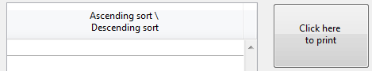

<!--REF #_command_.OBJECT SET TITLE.Syntax-->**OBJECT SET TITLE** ( {* ;} *objeto* ; *titulo* )<!-- END REF-->
<!--REF #_command_.OBJECT SET TITLE.Params-->
| Parâmetro | Tipo |  | Descrição |
| --- | --- | --- | --- |
| * | Operador | &#8594;  | Se especificado, objeto é um nome de objeto (string). Se omitido, objeto é uma variável |
| objeto | any | &#8594;  | Nome de objeto (se* é especificado) ou Variável (se * é omitido) |
| titulo | Text | &#8594;  | Novo título do objeto |

<!-- END REF-->

*Esse comando não é seguro para thread e não pode ser usado em código adequado.*


#### Descrição 

O comando OBJECT SET TITLE modifica o título dos objetos especificados por *objeto* e o substitui pelo valor passado em *titulo.*  

Se especifica o parâmetro opcional *\**, indica que o parâmetro *objeto* é um nome de objeto (uma cadeia). Se omite o parâmetro opcional \*, indica que o parâmetro *objeto* é uma variável. Neste caso, especifica uma referência de um campo ou de uma variável (variável tipo objeto unicamente) ao invés de uma cadeia. Para maior informação sobre nomes de objetos, consulte a seção *Propriedades dos objetos*. 

OBJECT SET TITLE é aplicado para objetos simples que contenham uma etiqueta: 

* botões e botões 3D,
* caixas de seleção e caixas de seleção 3D,
* botões rádio e botões rádio 3D,
* cabeçalhos de listbox,
* textos estáticos
* áreas de grupo.

Geralmente, este comando é aplicado a um objeto por vez. A área de título do objeto deve ser suficientemente grande para acomodar o texto; se não for, o texto é truncado.   
Não utilize retornos de carro em *título*.

#### Exemplo 1 

O exemplo a seguir é o método de objeto de um botão de pesquisa localizado na área de rodapé de um formulário de saída mostrado pelo comando [MODIFY SELECTION](modify-selection.md "MODIFY SELECTION"). O método procura uma tabela; dependendo dos resultados de pesquisa, ativa ou desativa um botão *bEliminar* e muda seu título:

```4d
 QUERY([Personas];[Pessoas]Nome=vNome)
 Case of
    :(Records in selection([Pessoas])=0) // Não foram encontradas pessoas
       OBJECT SET TITLE(bEliminar;" Eliminar")
       DISABLE BUTTON(bEliminar)
    :(Records in selection([Pessoas])=1) // Uma pessoa foi encontrada
       OBJECT SET TITLE(bDelete;"Apagar a pessoa")
       ENABLE BUTTON(bEliminar)
    :(Records in selection([Pessoas])>1) // Múltiplas pessoas encontradas
       OBJECT SET TITLE(bEliminar;"Apagar as personas")
       ENABLE BUTTON(bEliminar)
 End case
```

#### Exemplo 2 

Você quer inserir os títulos em duas linhas:

```4d
 OBJECT SET TITLE(*;"header1";"Ascending sort \\\ \\Descending sort")
 OBJECT SET TITLE(*;"button1";"Click here \\to print")
```



#### Ver também 

[OBJECT Get title](object-get-title.md)  