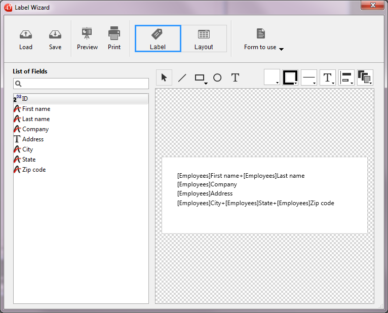

<!--REF #_command_.PRINT LABEL.Syntax-->**PRINT LABEL** ( {*tabela* }{;}{ *documento* {; *|>}} )<!-- END REF-->
<!--REF #_command_.PRINT LABEL.Params-->
| Parâmetro | Tipo |  | Descrição |
| --- | --- | --- | --- |
| tabela | Table | &#8594;  | Tabela a imprimir, ou tabela padrão, se omitido |
| documento | Text | &#8594;  | Nome do documento de etiquetas do disco |
| *&#124;> | &#8594;  | * para apagar as caixas de diálogo de impressão, ou > para não reiniciar os parâmetros de impressão |

<!-- END REF-->

*Esse comando não é seguro para thread e não pode ser usado em código adequado.*


#### Descrição 

<!--REF #_command_.PRINT LABEL.Summary-->PRINT LABEL permite imprimir etiquetas com los datos de la seleção de *tabela*.<!-- END REF-->

Se não especifica o parâmetro *documento*, PRINT LABEL imprime a seleção atual de *tabela* como etiquetas, utilizando o formulário de saída atual. Não pode utilizar este comando para imprimir sub-formulários. Para maior informação sobre a criação de formulários para etiquetas, consulte o Manual de Desenho.

Se especifica o parâmetro *documento*, PRINT LABEL lhe permite ter acesso ao Assistente de etiquetas (mostrado a continuação) ou imprimir um documento de etiquetas existente armazenado no disco. Ver o exemplo a continuação.



Como padrão, PRINT LABEL mostra a caixa de diálogo de impressão antes de imprimir. Se o usuário cancela uma das caixas de diálogo de impressão, o comando se cancela e as etiquetas não se imprimem.  
Pode eliminar estas caixas de diálogo utilizando o parâmetro opcional asterisco (*\**) ou o parâmetro opcional “maior que” (*\>*):   
• O parâmetro \* causa una impressão com os parâmetros de impressão atuais.  
• Além disso, o parâmetro > provoca um trabalho de impressão sem reiniciar os parâmetros de impressão atuais. Este parâmetro é útil para executar várias chamadas sucessivas a PRINT LABEL (por exemplo ao interior de um loop) enquanto mantém os parâmetros de impressão personalizados previamente definidos. Para ver um exemplo sobre o uso deste parâmetro, consulte a descrição do comando [PRINT RECORD](print-record.md) .  
Note que este parâmetro não tem efeito se utilizar o assistente de criação de etiquetas.

Se não utilizar o assistente de criação de etiquetas, a variável sistema OK toma o valor 1 se todas as etiquetas se imprimem; do contrário, toma o valor 0 (zero) (por exemplo, se o usuário clicou no botão **Cancelar** nas caixas de diálogo de impressão).

Se especifica o parâmetro *documento*, as etiquetas se imprimem com os parâmetros definidos em *documento*. Se *documento* for uma cadeia vazia (""), PRINT LABEL apresentará uma caixa de diálogo padrão de abertura de documentos, permitindo ao usuário selecionar o arquivo de etiquetas a utilizar. Se *documento* for o nome de um documento que não existe (por exemplo, se passa *char(1)* em *documento)*, o assistente de criação de etiquetas aparece, permitindo ao usuário definir seu formato de etiquetas.

**Nota:**se a *tabela* foi declarada “invisível” no ambiente Desenho, não será mostrada o assistente de etiquetas.

**4D Server:** este comando pode ser executado em 4D Server no marco de um procedimento armazenado. Neste contexto:

* Tenha certeza de que nenhuma caixa de diálogo apareça na máquina servidor (exceto por uma necessidade específica). Para fazer isso, é necessário chamar ao comando com o parâmetro *\** ou *\>* .
* A sintaxe que faz com que o editor de etiquetas apareça não funciona com 4D Server; neste caso, a variável sistema OK toma o valor 0.
* No caso de um problema relacionado de impressora (sem papel, impressora desconectada, etc.), não é gerado uma mensagem de erro.

#### Exemplo 1 

O exemplo a seguir imprime as etiquetas utilizando o formulário de saída de uma tabela. O exemplo utiliza dois métodos. O primeiro é um método de projeto que designa o formulário de saída a utilizar e depois imprime as etiquetas: 

```4d
 ALL RECORDS([Endereços]) // Seleção de todos os registros
 FORM SET OUTPUT([Endereços];"Imprimir Etiqueta") // Seleção do formulário de saída
 PRINT LABEL([Endereços]) // Impressão de etiquetas
 FORM SET OUTPUT([Endereços];"Saída") // Restabelecimento do formulário de saída padrão
```

O segundo método é o método de formulário do formulário *"Imprimir Etiqueta"*. O formulário contém uma variável chamada *vEtiq*, que se utiliza para manter os campos concatenados. Se o segundo campo de endereços (End2) estiver vazio, é eliminado pelo método. Note que esta operação for realizada automaticamente pelo assistente de criação de etiquetas. O método de formulário cria a etiqueta para cada registro:

```4d
  //Método de formulário [Endereços]; "Etiqueta saída"
 Case of
    :(FORM Event=On Load)
       vEtiq:=[Endereços]Nom1+" "+[Endereços]Nom2+Char(13)+[Endereços]Dir1+Char(13)
       If([Endereços]Dir2#"")
          vEtiq:=vLabel+[Endereços]Dir2+Char(13)
       End if
       vEtiq:=vEtiq+[Endereços]Cidade+", "+[Endereços]Estado+" "+[Endereços]CodigoPostal
 End case
```

#### Exemplo 2 

O exemplo a seguir permite ao usuário realizar uma pesquisa na tabela \[Pessoas\], e depois imprime automaticamente as etiquetas “Minhas etiquetas”: 

```4d
 QUERY([Pessoas])
 If(OK=1)
    PRINT LABEL([Pessoas];"Minhas etiquetas";*)
 End if
```

#### Exemplo 3 

O exemplo a seguir lhe permite ao usuário efetuar uma pesquisa na tabela \[Pessoas\], e depois lhe permite ao usuário escolher as etiquetas a imprimir: 

```4d
 QUERY([Pessoas])
 If(OK=1)
    PRINT LABEL([Pessoas];"")
 End if
```

#### Exemplo 4 

O exemplo a seguir lhe permite ao usuário efetuar uma pesquisa na tabela \[Pessoas\] e depois mostra o Assistente de etiquetas de modo a que o usuário possa criar, salvar, carregar e imprimir todo tipo de etiquetas: 

```4d
 QUERY([Pessoas])
 If(OK=1)
    PRINT LABEL([Pessoas];Char(1))
 End if
```

#### Ver também 

[PRINT SELECTION](print-selection.md)  
[QR REPORT](qr-report.md)  