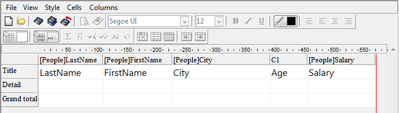

<!--REF #_command_.QR MOVE COLUMN.Syntax-->**QR MOVE COLUMN** ( *area* ; *numColuna* ; *novaPosição* )<!-- END REF-->
<!--REF #_command_.QR MOVE COLUMN.Params-->
| Parâmetro | Tipo |  | Descrição |
| --- | --- | --- | --- |
| area | Integer | &#8594;  | Referência da área |
| numColuna | Integer | &#8594;  | Número de coluna |
| novaPosição | Integer | &#8594;  | Nova posição para a coluna |

<!-- END REF-->

#### Descrição 

<!--REF #_command_.QR MOVE COLUMN.Summary-->O comando **QR MOVE COLUMN** move a coluna que se encontra atualmente na posição *numColuna* para a posição *novaPosição*.<!-- END REF-->

Tanto os parâmetros *numColuna* e *novaPosição* devem ser números válidos de coluna (entre 1 e o número total de colunas no relatório); do contrario, se devolve o erro -9852.

**Nota:** este comando pode ser usado apenas com os relatórios em lista.

#### Exemplo 

Se tivesse criado o relatório abaixo:


Se executar:

```4d
 QR MOVE COLUMN(area;3;4)
```

O resultado será:




#### Propriedades
|  |  |
| --- | --- |
| Número do comando | 1325 |
| Thread-seguro | &check; |
| Proibido no servidor ||


