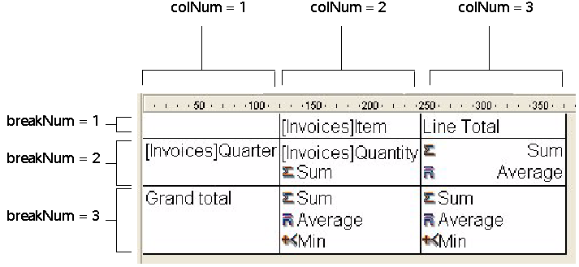

<!--REF #_command_.QR SET TOTALS DATA.Syntax-->**QR SET TOTALS DATA** ( *area* ; *numColuna* ; *numQuebra* ; operador | valor )<!-- END REF-->
<!--REF #_command_.QR SET TOTALS DATA.Params-->
| Parâmetro | Tipo |  | Descrição |
| --- | --- | --- | --- |
| area | Integer | &#8594;  | Referência da área |
| numColuna | Integer | &#8594;  | Nº da coluna |
| numQuebra | Integer | &#8594;  | Número de quebra |
| operador &#124; valor | Inteiro longo, String | &#8594;  | Operador para a célula ou conteúdo da célula |

<!-- END REF-->

#### Descrição 

<!--REF #_command_.QR SET TOTALS DATA.Summary-->**Nota:** este comando não pode criar um subtotal.<!-- END REF-->

##### List Mode 

O comando QR SET TOTALS DATA permite definir o conteúdo de una linha de quebra específica (total ou subtotal).  
  
*area* é a referência da área do relatório rápido.  
  
*numColuna* é o número de coluna da célula que queira definir.  
  
*numQuebra* é o número da linha de quebra a modificar (subtotal ou total general). Para uma linha de subtotal, *numQuebra* corresponde ao número da ordem da quebra. Para o total geral, *numQuebra* é igual a -3 ou a constante *qr grand total*.  
  
*operador* é o valor acumulado de todos os operadores presentes na célula. Utilize as constantes do tema *QR Operadores* para definir este parâmetro:  
  
**ConstanteValor**  
  
*qr sum* *1*  
*qr average* *2*  
*qr min* *4*  
*qr max* *8*  
*qr count* *16*  
*qr standard deviation* *32*  

Se *operador* é igual a 0, não há operador.  
  
*valor* é o texto a localizar na célula.  
  
**Nota**: operador/valor são mutuamente exclusivos, de maneira que pode definir um operador ou um texto.  

Pode passar os seguintes valores:  

\- # para o valor que provocou a quebra ou o subtotal.  
\- ##S será substituído pela soma.  
\- ##A será substituído pela média.  
\- ##C será substituído pelo número  
\- ##X será substituído pelo máximo.  
\- ##N será substituído pelo mínimo.  
\- ##D será substituído pelo desvio padrão.  
\- ##xx, onde xx é um número de coluna. Este código será substituído pelo valor da coluna, utilizando seu próprio formato. Se esta coluna não existir, então não será substituído.

##### Modo tabela cruzada 

O comando QR SET TOTALS DATA permite definir o conteúdo de una célula específica.  
  
*area* é a referência do área do relatório rápido.  
  
*numColuna* é o número de coluna da célula que vai ser definida.  
  
*numQuebra* é o número da linha da célula que vai ser definida.

*operador* contém o valor acumulado de todos os operadores presentes na célula. Pode utilizar as constantes do tema *QR Operadores* para definir este parâmetro (ver o parágrafo anterior).  

*valor* é o texto a localizar na célula.  
  
A seguinte imagem mostra como os parâmetros *numColuna* e *numQuebra* são combinados em modo tabela cruzada:  
  

##### Tipos de Dados Compatíveis 

Pode passar dois tipos de dados:  
  
* Título

> Um título se passa através do parâmetro valor. Este valor é uma cadeia e pode ser passado unicamente com as seguintes células: *colNum=3 breakNum=1* e *colNum=1 breakNum=3.*

* Operador  
 Um operador ou uma combinação de operadores (como se descreveu anteriormente) pode ser passado pelas seguintes células:  
*numColuna*\=2, *numRuptura*\=2  
*numColuna*\=3, *numRuptura*\=2  
*numColuna*\=2, *numRuptura*\=3
Note que estes dois últimos valores afetam igualmente a célula (Coluna 3; Linha 3). Se por exemplo um cálculo será realizado na célula (Coluna 2; Linha 3), o conteúdo da célula (Coluna 3; Linha 3) será modificado em conseqüência.  

Se passa um número de *area* inválido, se gera o erro -9850.  
Se o parâmetro *numColuna* for incorreto, se gera o erro -9852.  
Se o parâmetro *numQuebra* for incorreto, se gera o erro -9853.

#### Ver também 

[QR GET TOTALS DATA](qr-get-totals-data.md)  

#### Propriedades
|  |  |
| --- | --- |
| Número do comando | 767 |
| Thread-seguro | &check; |
| Modificar variáveis | error |
| Proibido no servidor ||

