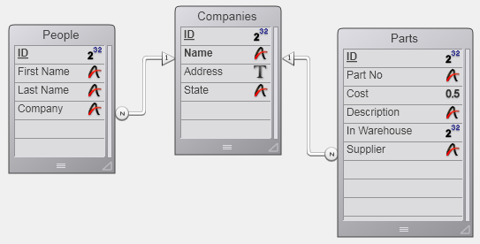
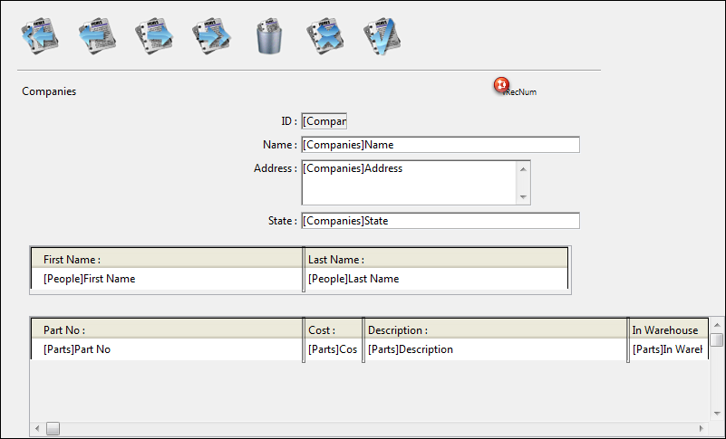

<!--REF #_command_.RELATE MANY.Syntax-->**RELATE MANY** ( tabela1 | campo1 )<!-- END REF-->
<!--REF #_command_.RELATE MANY.Params-->
| Parâmetro | Tipo |  | Descrição |
| --- | --- | --- | --- |
| tabela1 &#124; campo1 | Tabela, Campo | &#8594;  | Tabela para estabelecer todas as relações Um a Muitos, ou campo UM |

<!-- END REF-->

#### Descrição 

<!--REF #_command_.RELATE MANY.Summary-->RELATE MANY tem duas sintaxes.<!-- END REF-->   

A primeira sintaxe, RELATE MANY(tabela1), estabelece todas as relações Um a Muitos para *tabela1*. Muda a seleção atual para cada tabela que tenha uma relação Um a Muitos com *tabela1*. As seleções atuais nas tabelas Muitos dependem do valor atual de cada campo relacionado na tabela Um. Cada vez que este comando for executado, as seleções atuais das tabelas Muitos são modificadas.  
  
A segunda sintaxe, RELATE MANY(campo1), estabelece a relação Um a Muitos para *campo1*. Modifica a seleção atual para cada tabela que tenha uma relação com *campo1*. Isto significa que os registros relacionados se torna seleção atual da tabela Muitos.  
  
**Nota**: Se a seleção atual da tabela Um está vazia no momento da execução de RELATE MANY, o comando não faz nada

##### 

**Nota:** Este comando não é compatível com campos tipo Objeto

#### Exemplo 

No seguinte exemplo, três tabelas estão relacionadas com relações automáticas. As duas tabelas \[Pessoas\] e \[Partes\] tem uma relação Muitos a Um com a tabela \[Empresas\].  
  


Este é o formulário para a tabela \[Empresas\] que mostrará os registros relacionados das tabelas \[Pessoas\] e \[Partes\].  
  


Quando são mostrados os formulários para Pessoas e Partes, os registros relacionados para as tabelas \[Pessoas\] e \[Partes\] se carregam e se transformam as seleções atuais destas tabelas.  
  
Por outra parte, os registros relacionados não são carregados se um registro da tabela \[Empresas\] for selecionado por programação. Neste caso, deve utilizar o comando RELATE MANY  
  
  
**Notas:** 
* Quando o comando RELATE MANY é aplicado a uma seleção vazia, o comando não é executado e a seleção para a tabela Muitos não muda.
* Para que o comando funcione, os campos chave estrangeira (campos Muitos) devem estar indexados.
  
Por exemplo, o método a seguir realiza um loop para cada registro da tabela \[Empresas\]. Para cada empresa, aparece uma caixa de alerta. A caixa de alerta mostra o número de pessoas na empresa (o número de registros relacionados na tabela \[Pessoas\]), e o número de partes que fornecem (o número de registros na tabela \[Partes\] que estão relacionados). No exemplo, o argumento para o comando [ALERT](alert.md) é impresso em varias linhas por claridade.  
  
Note que é necessário o comando RELATE MANY, mesmo que as relações sejam automáticas.   

```4d
 ALL RECORDS([Empresas]) // Selecionar todos os registros na tabela
 ORDER BY([Empresas];[Empresas]Nome) // Ordenar os registros em ordem alfabética
 For($i;1;Records in table([Empresas])) // Loop uma vez para cada registro
    RELATE MANY([Empresas]Nome) // Selecionar os registros relacionados
    ALERT("Company: "+[Empresas]Nome+Char(13)+"Pessoas na empresa: "
    +String(Records in selection([Personas]))+Char(13)+
    "Número de partes que são fornecidas: "+String(Records in selection([Partes])))
    NEXT RECORD([Empresas]) // Ir ao seguinte registro
 End for
```

#### Ver também 

[OLD RELATED MANY](old-related-many.md)  
[RELATE ONE](relate-one.md)  

#### Propriedades
|  |  |
| --- | --- |
| Número do comando | 262 |
| Thread-seguro | &check; |
| Modificar a seleção atual ||
| Proibido no servidor ||


