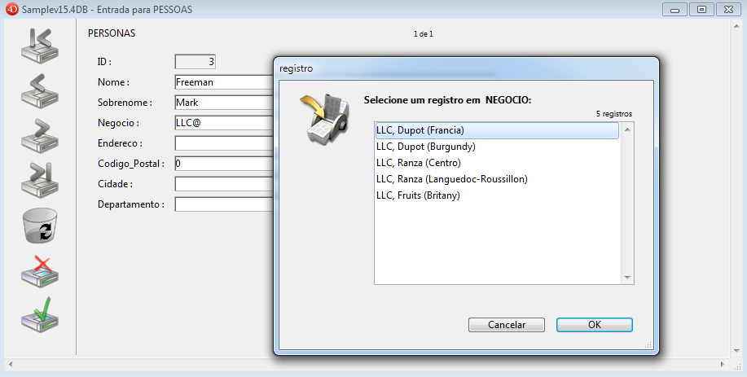
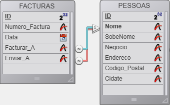
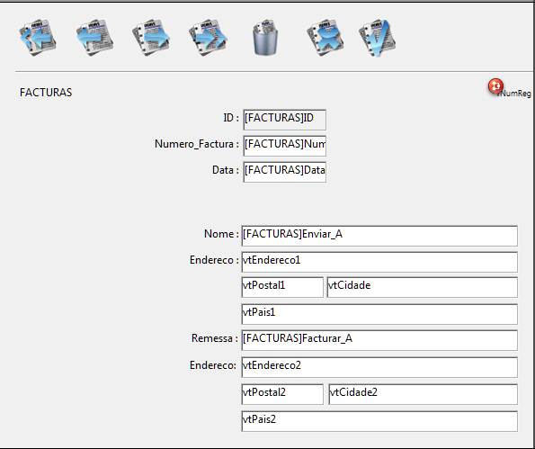

<!--REF #_command_.RELATE ONE.Syntax-->**RELATE ONE** ( tabelasN | campoN {; *discriminante* } )<!-- END REF-->
<!--REF #_command_.RELATE ONE.Params-->
| Parâmetro | Tipo |  | Descrição |
| --- | --- | --- | --- |
| tabelasN &#124; campoN | Tabela, Campo | &#8594;  | Tabela para a qual estabelecer todas as relações automáticas, ou  Campo com as relações manuais para tabela Um |
| discriminante | Field | &#8594;  | Campo discriminante da tabela 1 |

<!-- END REF-->

#### Descrição 

<!--REF #_command_.RELATE ONE.Summary-->RELATE ONE aceita duas sintaxes.<!-- END REF-->  
  
A primeira sintaxe do comando, RELATE ONE(tabelaN), ativa todas as relações Muitos a Um automáticas para a tabela *tabelaN* no processo atual. Isso significa que para cada campo da tabela *tabelaN* que tenha uma relação Muitos a Um automática, o comando selecionará o registro relacionado em cada tabela relacionada. Isso muda o registro atual na(s) tabela(s) relacionadas para o processo.  
  
A segunda sintaxe, RELATE ONE(campoN{;discriminante}), busca o registro relacionado com *campoN*. Não é necessário que a relação seja automática. Se existir, RELATE ONE carrega em memória o registro relacionado, dolo o registro e a seleção atual da tabela.  
  
O parâmetro opcional *discriminante* deve ser um campo da tabela relacionada. Pode ser unicamente de tipo Alfa, Texto, numérico, Data, Hora ou Booleano. Em particular, não pode ser tipo Imagem ou BLOB.  
  
Se *campoN* é especificado e se mais de um registro é encontrado na tabela relacionada, RELATE ONE mostra uma lista de registros que correspondem ao valor de *campoN*, permitindo ao usuário selecionar um registro. Nessa lista, a coluna da esquerda mostra os valores dos campos relacionados, e a coluna da direita os valores de *discriminante*.  
  
Seria possível encontrar mais de um registro se *campoN* termina com o caractere arroba (@). Se só houver uma coincidência, não aparece a lista. Especificar um campo em *discriminante* é o mesmo que definir um campo discriminante na caixa de diálogo de definição das propriedades de uma relação no ambiente Desenho. Para maior informação sobre a definição de um campo discriminante, consulte o Manual de Desenho de 4D.  
  
Na tela abaixo, um registro é digitado e uma lista de seleção é exibida. 



O comando abaixo é usado para fazer a lista seleção aparecer: 

```4d
 RELATE ONE([Personnel]Company;[Companies]Region)
```

Um usuário pode digitar LLC@ para ver uma lista de empresas cujos nomes começam com LLC, assim como suas regiões.

Especificar *choiceField* é o mesmo que especificar uma escolha coringa quando estabeleça uma relação tabela. Para mais informação sobre especificar uma escolha coringa, veja o manual de Design 4D. 

##### 

**Nota:** Este comando não é compatível com campos tipo Objeto

#### Exemplo 

No exemplo a seguir, a tabela *\[Faturas\]* está relacionada a tabela *\[Clientes\]* por duas relações manuais. Uma relação parte do campo *\[Faturas\]Cobrar de* ao campo *\[Clientes\]ID*, e a outra relação vai de *\[Faturas\]Enviar* a \[*Clientes\]ID*. #note\] \\\\srv-ftp-private.private.4d.fr\\FTP-PRIVATE\\International\\Filiales\\For\_All\\4Dv15DatabasesForDoc\[#/note\]  
  
  
  
Aqui é o formulário para a tabela \[Faturas\] exibindo a informação "Bill to" e "Send to" : 



 Como as duas relações apontam a mesma tabela, *\[Clientes\]*, não é possível obter a informação de faturação e envio ao mesmo tempo. Portanto, a informação deve ser mostrada utilizando variáveis e chamadas a **RELATE ONE**. Se o formulário contiver os campos *\[Clientes\]*, só se mostrarão os valores resultantes da segunda relação.  
  
Os seguintes métodos são os métodos de objeto dos campos *\[Faturas\]Cobrar de* e *\[Faturas\]Enviar a*. Estes métodos são executados quando são introduzidos campos.  
  
  
Este é o método de objeto para o campo *\[Faturas\]Cobrar de:*  
  
```4d
 RELATE ONE([Faturas]Cobrar de
 vDireccion1:=[Clientes]Direção
 vCiudad1:=[Clientes]Cidade
 vEstado1:=[Clientes]Estado
 vCodigo1:=[Clientes]CodigoPostal
```

Este é o método de objeto para o campo *\[Faturas\]Enviar a:*

```4d
 RELATE ONE([Faturas]Enviar a)
 vDireccion2:=[Clientes]Direção
 vCiudad2:=[Clientes]Cidade
 vEstado2:=[Clientes]Estado
 vCodigo2:=[Clientes]CodigoPostal
```

#### Variáveis e conjuntos do sistema 

Se o comando for executado corretamente e se os registros relacionados forem carregados, a variável sistema OK toma o valor 1\. Se o usuário clicar em **Cancelar** na caixa de diálogo de selecção do registro (que aparece quando o registro relacionado tiver sido modificado), a variável ***OK*** toma o valor 0\. 

#### Ver também 

[OLD RELATED ONE](old-related-one.md)  
[RELATE MANY](relate-many.md)  

#### Propriedades
|  |  |
| --- | --- |
| Número do comando | 42 |
| Thread-seguro | &check; |
| Modificar variáveis | OK |
| Modificar o registro atual ||
| Modificar a seleção atual ||
| Proibido no servidor ||


