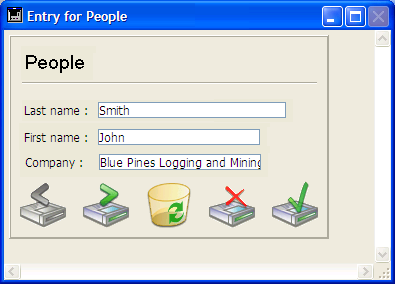
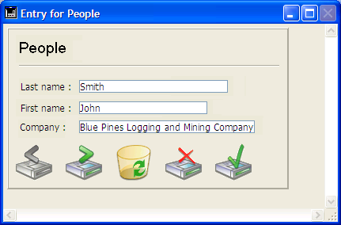

<!--REF #_command_.RESIZE FORM WINDOW.Syntax-->**RESIZE FORM WINDOW** ( *largura* ; *altura* )<!-- END REF-->
<!--REF #_command_.RESIZE FORM WINDOW.Params-->
| Parâmetro | Tipo |  | Descrição |
| --- | --- | --- | --- |
| largura | Integer | &#8594;  | Pixels a adicionar ou remover da largura da janela do formulário atual |
| altura | Integer | &#8594;  | Pixels a adicionar ou remover da altura da janela do formulário atual |

<!-- END REF-->

*Esse comando não é seguro para thread e não pode ser usado em código adequado.*


#### Descrição 

<!--REF #_command_.RESIZE FORM WINDOW.Summary-->O comando RESIZE FORM WINDOW permite modificar o tamanho da janela do formulário atual.<!-- END REF-->  

Passe o número de píxels que desejar adicionar ao tamanho da janela atual nos parâmetros *largura e altura*. Passe 0 no parâmetro que não queira modificar. Para reduzir o tamanho, passe um valor negativo nos parâmetros largura e altura.  
  
Este comando produce exactamente o mesmo resultado que um redimensionamento manual utilizando a casilla de redimensionamento (se o tipo de janela lo permite). Por conseguinte, o comando considera as propriedades de redimensionamento dos objetos e as limitações de tamanho definidas nas propriedades do formulário. Se, por exemplo, o comando redimensiona a janela a um tamanho superior ao máximo do formulário, o comando não tem efeito.  
  
Por favor note que este comportamento é diferente do comportamento do comando [SET WINDOW RECT](set-window-rect.md), o qual não considera as propriedades do formulário nem seu conteúdo quando redimensionar a janela. Igualmente, note que este comando não necessariamente modifica o tamanho do formulário. Para modificar o tamanho de um formulário por programação, por favor consulte a descrição do comando [FORM SET SIZE](form-set-size.md)

#### Exemplo 

Dada a janela abaixo (os campos e o marco tem a propriedade de dimensionamento horizontal “Aumentar”): 



Depois da execução desta linha:

```4d
 RESIZE FORM WINDOW(25;0)
```

... a janela aparece assim:



#### Ver também 

[FORM GET PROPERTIES](form-get-properties.md)  
[FORM SET SIZE](form-set-size.md)  
[SET WINDOW RECT](set-window-rect.md)  