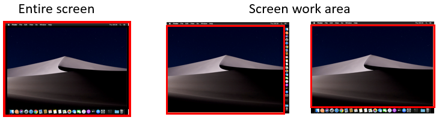

<!--REF #_command_.SCREEN COORDINATES.Syntax-->**SCREEN COORDINATES** ( *esquerda* ; *superior* ; *direita* ; *inferior*  {; *tela* {; *areaTela*}} )<!-- END REF-->
<!--REF #_command_.SCREEN COORDINATES.Params-->
| Parâmetro | Tipo |  | Descrição |
| --- | --- | --- | --- |
| esquerda | Integer | &#8592; | Coordenada esquerda da área da tela |
| superior | Integer | &#8592; | Coordenada superior da área da tela |
| direita | Integer | &#8592; | Coordenada direita da área da tela |
| inferior | Integer | &#8592; | Coordenada inferior da área da tela |
| tela | Integer | &#8594;  | Número da tela, ou tela principal se omitida |
| areaTela | Integer | &#8594;  | Tela inteira (padrão)ou então área de trabalho |

<!-- END REF-->

#### Descrição 

<!--REF #_command_.SCREEN COORDINATES.Summary-->O comando SCREEN COORDINATES devolve nos parâmetros *esquerda*, *acima*, *direita,* e *abaixo* as coordenadas da tela especificada por *IDtela*.<!-- END REF-->

Se omitir o parâmetro *IDtela*, o comando devolve as coordenadas da tela principal.

O parâmetro opcional *areaTela* lhe permite especificar se deseja as coordenadas para toda a área da tela (predeterminado) ou apenas para a área utilizável disponível. Há dois seletores disponíveis:

| Constante        | Valor | Comentário                                                                                                                                                           |
| ---------------- | ----- | -------------------------------------------------------------------------------------------------------------------------------------------------------------------- |
| Screen size      | 0     | As coordenadas de toda a tela. (valor padrão)                                                                                                                        |
| Screen work area | 1     | As coordenadas da área de tela disponível que podem ser usadas (ou seja, não estão ocupadas pela barra de tarefas de Windows ou a barra de menus e o dock de masOS). |

As imagens abaixo demostram as diferenças entre o tamanho da tela e a área de trabalho:

 

**Notas**:

* Se a barra de tarefas ou o dock se ocultarem automaticamente, **SCREEN COORDINATES** sempre devolverá o tamanho completo da tela.
* Se oferecer um valor não válido em *IDtela*, se devolve um zero para todas as coordenadas.

#### Ver também 

[Count screens](count-screens.md)  
[Menu bar screen](menu-bar-screen.md)  
[SCREEN DEPTH](screen-depth.md)  

#### Propriedades

|  |  |
| --- | --- |
| Número do comando | 438 |
| Thread-seguro | &cross; |

