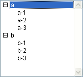

<!--REF #_command_.SELECT LIST ITEMS BY POSITION.Syntax-->**SELECT LIST ITEMS BY POSITION** ( {* ;} *lista* ; *posiçaoElem*  {; *posiçaoArray*} )<!-- END REF-->
<!--REF #_command_.SELECT LIST ITEMS BY POSITION.Params-->
| Parâmetro | Tipo |  | Descrição |
| --- | --- | --- | --- |
| * | Operador | &#8594;  | Se especificada, lista é um nome de objeto (cadeia) Se omitida, lista é um número de referência de lista |
| lista | Integer, Text | &#8594;  | Número de referência de lista (se omitida *) ou Nome do objeto de tipo lista (se passada *) |
| posiçaoElem | Integer | &#8594;  | Posição do elemento na(s) lista(s) expandida(s) /contraída(s) |
| posiçaoArray | Integer array | &#8594;  | Array de posições na(s) lista(s) expandida(s) /contraída(s) |

<!-- END REF-->

#### Descrição 

<!--REF #_command_.SELECT LIST ITEMS BY POSITION.Summary-->O comando SELECT LIST ITEMS BY POSITION seleciona os elementos cuja posição se passa em *posiçaoElem* e opcionalmente em *posiçao* *Array* na lista cujo número de referência ou nome de objeto é passada em *lista*.<!-- END REF-->

Se passa o primeiro parâmetro opcional \*, indica que o parâmetro *lista* é um nome de objeto (cadeia) correspondente a uma representação de lista no formulário. Se não passa este parâmetro, indica que o parâmetro *lista* é uma referência de lista hierárquica (*RefLista*). Se utiliza só uma representação de lista, pode utilizar indiferentemente uma ou outra sintaxe. Pelo contrário, se utiliza várias representações de uma mesma lista, a lista baseada no nome do objeto é necessária já que cada representação pode ter sua própria configuração expandida/contraída.  

**Nota:** se utilizar o caractere @ no nome da lista e o formulário contém várias listas que respondem a este nome, o comando SELECT LIST ITEMS BY POSITION só aplicará ao primeiro objeto cujo nome corresponde. 

A posição dos elementos sempre é expressa utilizando o estado expandido/contraído da lista e suas sub-listas. Você passa um valor de posição entre 1 e o valor retornado por [Count list items](count-list-items.md "Count list items"). Se passar um valor fora dessa faixa, não é selecionado nenhum elemento.

Se não passar o parâmetro *posiçao* *Array*, o parâmetro *posiçao* *Elem* representa a posição do elemento a selecionar.

O parâmetro opcional *posiçao* *Array* lhe permite selecionar vários elementos simultaneamente da *lista*. Em *posicionArray*, deve passar um array onde cada linha indique a posição de um elemento a selecionar.  
  
Quando passa este parâmetro, o elemento designado pelo parâmetro *posiçao* *Elem* designa o novo elemento atual da lista na seleção resultante, o qual pode pertencer ou não ao conjunto de elementos definido pelo array. O elemento atual é, mais particularmente, o que passa a modo edição se for utilizado o comando [EDIT ITEM](edit-item.md "EDIT ITEM").

**Nota:** para que vários elementos possam ser selecionados simultaneamente em uma lista hierárquica (manualmente ou por programação), a propriedade *multi-selecionavel* deve ter sido ativada para a lista. Esta propriedade se define utilizando o comando [SET LIST PROPERTIES](set-list-properties.md "SET LIST PROPERTIES").

#### Exemplo 

Dada a lista hierárquica chamada *hList,* mostrada no ambiente Aplicação:



Depois da execução deste código:

```4d
 SELECT LIST ITEMS BY POSITION(hList;Count list items(hList))
```

O último elemento visível da lista é selecionado:


Depois da execução das seguintes linhas de código:

```4d
 SET LIST PROPERTIES(hList;0;0;18;0;1)
  //É imperativo passar 1 como último parâmetro para permitir as seleções múltiplas
 ARRAY LONGINT($arr;3)
 $arr{1}:=2
 $arr{2}:=3
 $arr{3}:=5
 SELECT LIST ITEMS BY POSITION(hList;3;$arr)
  //O terceiro elemento é designado como elemento atual
```

São selecionados os elementos segundo, terceiro e quinto da lista hierárquica


#### Ver também 

[EDIT ITEM](edit-item.md)  
[SELECT LIST ITEMS BY REFERENCE](select-list-items-by-reference.md)  
[Selected list items](selected-list-items.md)  

#### Propriedades

|  |  |
| --- | --- |
| Número do comando | 381 |
| Thread-seguro | &cross; |


