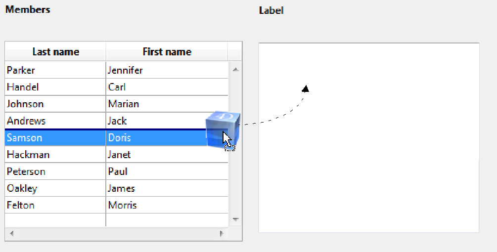

<!--REF #_command_.SET DRAG ICON.Syntax-->**SET DRAG ICON** ( *icone* {; *deslH* {; *deslV*}} )<!-- END REF-->
<!--REF #_command_.SET DRAG ICON.Params-->
| Parâmetro | Tipo |  | Descrição |
| --- | --- | --- | --- |
| icone | Picture | &#8594;  | Ícone a utilizar durante arrastar |
| deslH | Integer | &#8594;  | Deslocamento horizontal do borde esquerdo da imagem com respeito a posição do cursor (> = 0, a esquerda, <0 = a direita) |
| deslV | Integer | &#8594;  | Deslocamento vertical do borde superior da imagem com respeito a posição do cursor (> 0 = para cima, <0 = para baixo) |

<!-- END REF-->

*Esse comando não é seguro para thread e não pode ser usado em código adequado.*


#### Descrição 

<!--REF #_command_.SET DRAG ICON.Summary-->O comando **SET DRAG ICON** associa a imagem de ícone ao cursor durante as operações de arrastar e soltar que se manipulam por programação.<!-- END REF-->

Este comando só pode chamar no contexto do evento formulário On Begin Drag Over (ver o comando [Form event code](form-event-code.md)).  
  
No parâmetro *icone*, passe a imagem que deseja utilizar. Seu tamanho máximo é de 256x256 pixels. Se uma de suas dimensões excede os 256 pixels, se redimensiona automaticamente.  
  
Em *deslH* e *deslV*, pode passar valores de deslocamento em pixels:

* passe em *deslH*, o deslocamento horizontal do borde esquerdo do ícone com respeito a posição do cursor. Passe um valor positivo para aplicar este deslocamento para esquerda ou para um valor negativo para aplicar ele a direita.
* passe em *deslV*, o deslocamento vertical desde o borde superior do ícone com respeito a posição do cursor. Passe um valor positivo para aplicar este deslocamento para cima ou para um valor negativo aplicando ele para baixo.

Se omitido este parâmetro, o cursor é colocado no centro do ícone.

#### Exemplo 

Em um formulário, um usuário pode gerar uma etiqueta por arrastar e soltar uma fila. No método objeto do lista box, pode escrever:

```4d
 If(Form event code=On Begin Drag Over)
    READ PICTURE FILE(Get 4D folder(Current resources folder)+"splash.png";vpict)
    CREATE THUMBNAIL(vpict;vpict;48;48)
    SET DRAG ICON(vpict)
 End if
```

Ao arrastar uma fila, a imagem aparecerá como é mostrado aqui:



Note que pode modificar a posição do cursor com respeito a imagem:

```4d
 SET DRAG ICON(vpict;0;0)
```


#### Ver também 

[Form event code](form-event-code.md)  