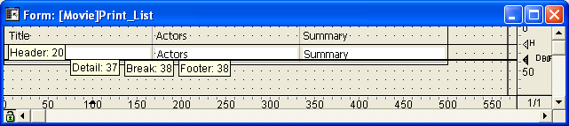

<!--REF #_command_.SET PRINT MARKER.Syntax-->**SET PRINT MARKER** ( *markNum* ; *posiçao* {; *} )<!-- END REF-->
<!--REF #_command_.SET PRINT MARKER.Params-->
| Parâmetro | Tipo |  | Descrição |
| --- | --- | --- | --- |
| markNum | Integer | &#8594;  | Número do marcador |
| posiçao | Integer | &#8594;  | Nova posição do marcador |
| * | Operador | &#8594;  | Se passado = mover marcadores seguintes; se omitido = não move os marcadores seguintes |

<!-- END REF-->

#### Descrição 

<!--REF #_command_.SET PRINT MARKER.Summary-->O comando SET PRINT MARKER permite definir a posição de um marcador durante a impressão.<!-- END REF--> Combinado com os comandos [Get print marker](get-print-marker.md "Get print marker"), OBJECT MOVE ou [Print form](print-form.md "Print form"), este comando lhe permite ajustar o tamanho das áreas de impressão.  
  
SET PRINT MARKER pode ser utilizado em dois contextos:  
* durante o evento de formulário On header, no contexto de os comandos [PRINT SELECTION](print-selection.md "PRINT SELECTION") e [PRINT RECORD](print-record.md "PRINT RECORD").
* durante o evento de formulário On Printing Detail, no contexto do comando [Print form](print-form.md "Print form").. Esta operação facilita a impressão de informes personalizados (ver exemplo).
* O efeito do comando está limitado à impressão; nenhuma modificação aparece na tela. As modificações realizadas os formulários não são guardados.

 Passe no parâmetro *markNum* una das constantes do tema :  
  
| Constante     | Tipo          | Valor |
| ------------- | ------------- | ----- |
| Form break0   | Inteiro longo | 300   |
| Form break1   | Inteiro longo | 301   |
| Form break2   | Inteiro longo | 302   |
| Form break3   | Inteiro longo | 303   |
| Form break4   | Inteiro longo | 304   |
| Form break5   | Inteiro longo | 305   |
| Form break6   | Inteiro longo | 306   |
| Form break7   | Inteiro longo | 307   |
| Form break8   | Inteiro longo | 308   |
| Form break9   | Inteiro longo | 309   |
| Form detail   | Inteiro longo | 0     |
| Form footer   | Inteiro longo | 100   |
| Form header   | Inteiro longo | 200   |
| Form header1  | Inteiro longo | 201   |
| Form header10 | Inteiro longo | 210   |
| Form header2  | Inteiro longo | 202   |
| Form header3  | Inteiro longo | 203   |
| Form header4  | Inteiro longo | 204   |
| Form header5  | Inteiro longo | 205   |
| Form header6  | Inteiro longo | 206   |
| Form header7  | Inteiro longo | 207   |
| Form header8  | Inteiro longo | 208   |
| Form header9  | Inteiro longo | 209   |

 Em *posição*, passe a nova posição desejada, expressada em píxels.  
  
 Se passa o parâmetro opcional \*, todos os marcadores localizados em baixo do marcador especificado por *markNum* se moverão o mesmo número de píxels e na mesma direção que este marcador quando se executa o comando.   **Advertência**: neste caso, os objetos presentes nas áreas situadas abaixo do marcador também se movem.  
  
 Quando o parâmetro \* se utiliza, é possível posicionar o marcador markNum alem da posição inicial dos marcadores que o seguem, estes últimos marcadores serão movidos simultaneamente.  
  
  
  
**Notas:**  
  
 • Este comando modifica só a posição de os marcadores existentes. Não permite a adição de marcadores. Se atribuir um marcador que não existe no formulário, o comando não fará nada.  
 • O funcionamento dos marcadores de impressão em modo Desenho se conserva: um marcador não pode ir mais acima do que o antecede, nem mais abaixo do que o que segue (quando o parâmetro \* não se utiliza).

#### Exemplo 

Este exemplo completo permite gerar a impressão de um relatório de três colunas, a altura de cada linha se calcula de acordo com os conteúdos dos campos.  

  
O formulário de saída utilizado para a impressão é o seguinte:  
  
  
  
O evento de formulário On Printing Detail foi selecionado para o formulário (recorde que sem importar em que área se imprima, o comando [Print form](print-form.md "Print form") só gera este tipo de evento de formulário).  
Para cada registro, a altura da linha deve estar adaptada de acordo aos conteúdos da coluna "Atores" ou "Resumo" (coluna tem a maioria do conteúdo). Este é o resultado desejado:  
  
  
  
O método de projeto de impressão é o seguinte:  

```4d
 var vLaltura_imp;$vLaltura;vLaltura_impresso : Integer
 C_STRING(31;vSprint_area)
 PAGE SETUP([Filmes];"List_Imp3")
 GET PRINTABLE AREA(vLaltura_imp)
 vLaltura_impreso:=0
```

```4d
 ALL RECORDS([Filmes])
```

```4d
 vSprint_area:="Cabeçalho" //Impressão da área de cabeçalho
 $vLaltura:=Print form([Filmes];"List_Imp3";Form header)
 $vLaltura:=21&NBSP;&NBSP; //Altura fixa
 vLaltura_impreso:=vLaltura_impresso+$vLaltura
 
 While(Not(End selection([Filmes])))
    vSprint_area:="Detalhe" //Impressão da área de detalhe
    $vLaltura:=Print form([Filmes];"List_Imp3";Form detail)
  //El cálculo del detalle se lleva a cabo en el método de formulario
    vLaltura_impreso:=vLaltura_impreso+$vLaltura
    If(OK=0) //CANCEL ha sido ejecutado en el método de formulario
       PAGE BREAK
       vLaltura_impreso:=0
       vSprint_area:="Encabezado" //Reimpresión del área de encabezado
       $vLaltura:=Print form([Peliculas];"List_Imp3";Form header)
       $vLaltura:=21
       vLaltura_impreso:=vLaltura_impreso+$vLaltura
       vSprint_area:="Detalle"
       $vLaltura:=Print form([Peliculas];"List_Imp3";Form detail)
       vLaltura_impreso:=vLaltura_impreso+$vLaltura
    End if
    NEXT RECORD([Peliculas])
 End while
 PAGE BREAK //Asegúrese de que la última página se imprima
```

El método de formulario List\_Imp3 es el siguiente:

```4d
 var $l;$t;$r;$b;$fixed_wdth;$exact_hght;$l1;$t1;$r1;$b1 : Integer
 var $final_pos;$i : Integer
 var $detalle_pos;$encabezado_pos;$altura_a_imprimir;$altura_restante : Integer
 
 Case of
    :(vSprint_area="Detalle") //Impresión del detalle en proceso
       OBJECT GET COORDINATES([Peliculas]Actores;$l;$t;$r;$b)
       $largo_fijo:=$r-$l  //Cálculo del tamaño del campo tipo texto Actores
       $altura_exact:=$b-$t
       OBJECT GET BEST SIZE([Peliculas]Actores;$largo;$alto;$largo_fijo)
  //Tamaño óptimo del campo de acuerdo a su contenido
       $movimiento:=$alto-$altura_exact
 
       OBJECT GET COORDINATES([Peliculas]Resumen;$l1;$t1;$r1;$b1)
       $largo_fijo:=$r1-$l1  //Cálculo del tamaño del campo tipo texto Resumen
       $altura_exact1:=$b1-$t1
       OBJECT GET BEST SIZE([Peliculas]Resumen;$largo1;$alto1;$largo_fijo)
  //Tamaño óptimo del campo de acuerdo a su contenido
       $movimiento1:=$alto1-$altura_exact1
       If($movimiento1>$movimiento)
  //Determinamos el campo más alto
          $movimiento:=$movimiento1
       End if
 
       If($movement>0)
          $posicion:=Get print marker(Form detail)
          $final_pos:=$posicion+$movimiento
  //Nos movemos al marcador Detalle y a los que siguen
          SET PRINT MARKER(Form detail;$final_pos;*)
  //Redimensionamiento de las áreas de texto
          OBJECT MOVE([Peliculas]Actores;$l;$t;$r;$hght+$t;*)
          OBJECT MOVE([Peliculas]Resumen;$l1;$t1;$r1;$alto1+$t1;*)
 
  //Redimensionamiento de las líneas de división
          OBJECT GET COORDINATES(*;"H1Linea";$l;$t;$r;$b)
          OBJECT MOVE(*;"H1Line";$l;$final_pos-1;$r;$final_pos;*)
          For($i;1;4;1)
             GET OBJECT RECT(*;"VLinea"+Cadena($i);$l;$t;$r;$b)
             MOVE OBJECT(*;"VLinea"+Cadena($i);$l;$t;$r;$final_pos;*)
          End for
       End if
 
  //Cálculo del espacio disponible
       $detalle_pos:=Get print marker(Form detail)
       $encabezado_pos:=Get print marker(Form header)
       $altura_a_imprimir:=$detalle_pos-$encabezado_pos
       $altura_restante:=altura_impreso-vLaltura_impreso
       If($altura_restante<$altura_a_imprimir) //Altura insuficiente
          CANCEL //Pasar la línea a la siguiente página
       End if
 End case
```

#### Ver também 

[Get print marker](get-print-marker.md)  
[OBJECT GET BEST SIZE](object-get-best-size.md)  
[OBJECT GET COORDINATES](object-get-coordinates.md)  
[OBJECT MOVE](object-move.md)  
[PAGE BREAK](page-break.md)  
[Print form](print-form.md)  
[PRINT RECORD](print-record.md)  
[PRINT SELECTION](print-selection.md)  

#### Propriedades
|  |  |
| --- | --- |
| Número do comando | 709 |
| Thread-seguro | &check; |
| Proibido no servidor ||


