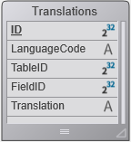

<!--REF #_command_.SET TABLE TITLES.Syntax-->**SET TABLE TITLES** {( *titulosTabela* ; *numTabelas* {; *})}<!-- END REF-->
<!--REF #_command_.SET TABLE TITLES.Params-->
| Parâmetro | Tipo |  | Descrição |
| --- | --- | --- | --- |
| titulosTabela | Text array | &#8594;  | Nomes de tabela da maneira que aparecem na caixa de diálogo |
| numTabelas | Integer array | &#8594;  | Número atual de tabela |
| * | Operador | &#8594;  | Use os nomes personalizados no editor de fórmulas |

<!-- END REF-->

#### Descrição 

<!--REF #_command_.SET TABLE TITLES.Summary-->SET TABLE TITLES permite ocultar, renomear e reordenar as tabelas de seu banco quando aparecem nos editores padrão de 4D em modo Aplicação (quando os editores se chamam via os comandos da linguagem 4D).<!-- END REF--> Por exemplo, este comando pode modificar a visualização de tabelas e no editor pesquisas em modo Aplicação.  
  
A utilização deste comando, também permite renomear rapidamente as etiquetas das tabelas em seus formulários, se usar os nomes dinâmicos. Para maior informação sobre a inserção de etiquetas de tabelas e de campos dinâmicos em formulários, consulte a seção *Usar referências em texto estático* no manual de Desenho de 4D.

Os arrays *titulosTabelas* e *numTabelas* devem estar sincronizados. No array *titulosTabelas*, passe os nomes das tabelas como deseja que apareçam. Se não desejar mostrar uma tabela em particular, não inclua seu nome ou novo título no array. As tabelas aparecerão na ordem que especificou neste array. Em cada elemento do array *numTabelas*, passe o número da tabela que corresponde ao nome, novo ou antigo, da tabela, passado no mesmo número de elemento no array *titulosTabelas*.  
  
Por exemplo, se tiver um banco de dados composto pelas tabelas A, B, e C, criadas nesta ordem, e quiser que estas tabelas apareçam como X, Y, e Z. Além disso, se não quiser mostrar a tabela B. Por último, deseja mostrar Z e X, nesta ordem. Para fazer isso, passe Z e X no parâmetro titulosTabelas array de dois elementos *titulosTabelas*, Z e X, e passe no parâmetro numTabelas um array de dois elementos, 3 e 1.

O parâmetro opcional \* lhe permite indicar se os nomes personalizados (estruturas "virtuais") definidos com a ajuda deste comando podem ser utilizados ou não nas fórmulas de 4D. Por padrão, quando se omitir este parâmetro, as fórmulas executadas em 4D não podem utilizar esses nomes personalizados; é necessário utilizar os nomes verdadeiros das tabelas. Deve passar este parâmetro se quiser controlar a informação oferecida aos usuários e ter certeza da consistência da interface onde são utilizadas fórmulas ou expressões, ou seja:  
  
se sua aplicação der acesso ao editor de fórmulas (por exemplo pelo editor de relatórios rápidos).  
se sua aplicação mostrar referências de expressão, como nos documentos 4D Write Pro  
  
**Nota**: quando for passado o parâmetro \*, os nomes definidos por este comando são usados nas fórmulas executadas por 4D. Tenha cuidado neste caso, os nomes personalizados não devem conter caracteres "proibidos" pelo intérprete da linguagem 4D, como -?\*%! Por exemplo, o nombre "Rate\_in\_%" não pode ser utilizado em uma fórmula (para saber mais veja *Convenções*).  
  
SET TABLE TITLES NÃO muda a estrutura atual de seu banco. Só afeta os usos posteriores dos editores padrão de 4D e formulários que utilizam nomes dinâmicos quando são usados no ambiente Aplicação. O alcance do comando SET TABLE TITLES é a sessão de trabalho. Uma vantagem em cliente/Servidor é que várias estações clientes 4D podem “ver” simultaneamente seu banco de diferentes formas. Pode chamar SET TABLE TITLES tantas vezes quantas forem necessárias.  
  
Utilize o comando SET TABLE TITLES para:  
  
* Tradução dinâmica de seu banco.
* Visualização das tabelas na ordem que queira, independentemente da definição atual de seu banco.
* Visualização de tabelas que dependa da identidade ou dos privilégios de um usuário.

**ATENÇÂO:**

* SET TABLE TITLES NÃO anula o efeito da propriedade invisível de uma tabela. Quando uma tabela estiver definida como invisível a nivel da estrutura de seu banco, mesmo que seja incluído em uma chamada a SET TABLE TITLES, não aparecerá em modo Aplicação.
* Os plug-ins sempre acessam a estrutura "virtual" como se especifica por este comando.

Executar SET TABLE TITLES sem parâmetros vai resetar toda a estrutura virtual do banco de dados para esta sessão (tabela personalizada e nomes de campos)

#### Exemplo 1 

Imagine que está desenvolvendo uma aplicação 4D que planeja vender internacionalmente. Portanto, você deve considerar as necessidades de tradução. Para os editores padrão de 4D que aparecem em modo Aplicação e seus formulários que utilizam nomes dinâmicos, pode utilizar uma tabela \[*Traduçoes*\] e alguns métodos de projeto para criar e utilizar as traduções para cada idioma.   
Em seu banco, crie a próxima tabela:  
  
  
  
Depois, crie o método de projeto TRADUZIR\_TABELAS\_E\_CAMPOS. Este método analisa a estrutura de seu banco na tabela *\[Traduçoes\]* e cria os registros correspondentes ao idioma passado como parâmetro.  
  
```4d
  // Método de projeto TRADUZIR_TABELAS_E_CAMPOS
  // TRADUZIR_TABELAS_E_CAMPOS (Text)
  // TRADUZIR_TABELAS_E_CAMPOS (LanguageCode)
 
 var $1 : Text //código do idioma
 var $vlTabela;$vlCampo : Integer
 var $Idioma : Text
 $Idioma:=$1
 
 For($vlTabela;1;Last table number) //Passar por cada tabela
    If($vlTabela#(Table(->[Traduçoes]))) //Não traduzir a tabela de traduções
  //Verificar se existe uma tradução de nome da tabela para o idioma especificado
       QUERY([Traduçoes];[Traduçoes]Codigo_Idioma=$Idioma;*) //idioma desejado
       QUERY([Traduçoes];&;[Traduçoes]Tabela_ID=$vlTabela;*) //Número de tabela
       QUERY([Traduçoes];&;[Traduçoes]Campo_ID=0) //número de campo = 0 significa que é um nome de tabela
       If(Is table number valid($vlTabela)) //verificar que a tabela ainda existe
          If(Records in selection([Traduçoes])=0)
  //Do contrário, criar o registro
             CREATE RECORD([Traduçoes])
             [Traduçoes]Codigo_Idioma:=$Idioma
             [Traduçoes]Tabela_ID:=$vlTabela
             [Traduçoes]Campo_ID:=0
  //O nome da tabela traduzida deverá ser introduzido
             [Traduçoes]Tradução:=Table name($vlTabela)+" em "+$Idioma
             SAVE RECORD([Traduções])
          End if
 
          For($vlCampo;1;Obter número do último campo($vlTabela))
  //Verificar se existe uma tradução para o nome do campo no idioma especificado
             QUERY([Traduçoes];[Traduçoes]Codigo_Idioma=$Idioma;*) //idioma desejado
             QUERY([Traduçoes];&;[Traduçoes]Tabela_ID=$vlTabela;*) //número de tabela
             QUERY([Traduçoes];&;[Traduçoes]Campo_ID=$vlCampo) //número de campo
             If(Is field number valid($vlTabela;$vlCampo))
                If(Records in selection([Traduçoes])=0)
  //Do contrário, criar o registro
                   CREATE RECORD([Traduçoes])
                   [Traduçoes]Codigo_Idioma:=$Idioma
                   [Traduçoes]Tabela_ID:=$vlTabela
                   [Traduçoes]Campo_ID:=$vlCampo
  //O nome do campo traduzido deve ser introduzido
                   [Traduçoes]Tradução:=Field name($vlTabela;$vlCampo)+"em "+$Idioma
                   SAVE RECORD([Traduçoes])
                End if
             Else
                If(Records in selection([Traduçoes])#0)
  // Se o campo não existir, eliminar a tradução
                   DELETE RECORD([Traduçoes])
                End if
             End if
          End for
       Else
          If(Records in selection([Traduçoes])#0)
  //Se a tabela não existir, eliminar a tradução
             DELETE RECORD([Traduçoes])
          End if
       End if
    End if
 End for
```

* Neste ponto, se executar a seguinte linha, pode criar tantos registros como necessite para a tradução ao Espanhol de suas tabelas e campos.

```4d
 TRANSLATE TABLES AND FIELDS("Espanhol")
```

* Quando essa chamada tiver sido executada, pode introduzir uma tradução no campo *\[Traduçoes\]Nome traduzido* para cada um dos novos registros.
* Por último, cada vez que queira mostrar em espanhol os editores padrão 4D ou os formulários com etiquetas dinâmicas, execute a seguinte linha:

```4d
 LOCALIZED TABLES AND FIELDS("Espanhol")
```

com o método de projeto TABELAS\_E\_CAMPOS\_LOCALIZADOS:

```4d
  //Método objeto TABELAS_E_CAMPOS_LOCALIZADOS
  // TABELAS_E_CAMPOS_LOCALIZADOS (Text)
  // TABELAS_E_CAMPOS_LOCALIZADOS (LanguageCode)
 
 var $1 : Text //Código do idioma
 var $vlTabela;$vlCampo : Integer
 var $Idioma : Text
 var $vlNumTabela;$vlNumCampo : Integer
 $Idioma:=$1
 
  //Atualização dos nomes de tabelas
 ARRAY TEXT($asNomes;0) //Inicializar os arrays para SET TABLE TITLES e SET FIELD TITLES
 ARRAY INTEGER($aiNumeros;0)
 QUERY([Traduções];[Traduçoes]Codigo_Idioma=$Idioma;*)
 QUERY([Traduções];&;[Traduçoes]Campo_ID=0) //nomes de tabelas
 SELECTION TO ARRAY([Traduçoes]Tradução;$asNomes;[Traduçoes]Tabela_ID;$aiNumeros)
 SET TABLE TITLES($asNomes;$aiNumeros)
 
  //Atualização dos nomes de campos
 $vlNumTabela:=Last table number //Obter o número de tabelas no banco
 For($vlTabela;1;$vlNumTabela) //Passar por cada tabela
    If(Is table number valid($vlTabela))
       QUERY([Traduçoes];[Traduçoes]Codigo_Idioma=$Idioma;*)
       QUERY([Traduçoes];&;[Traduçoes]Tabela_ID=$vlTabela;*)
       QUERY([Traduçoes];&;[Traduçoes]Campo_ID#0) //evite que o zero seja nome de tabela
       SELECTION TO ARRAY([Traduçoes]Tradução;$asNomes;[Traduçoes]Campo_ID;$aiNumeros)
       SET FIELD TITLES(Tabela($vlTabela)->;$asNomes;$aiNumeros)
    End if
 End for
```

  
* Note que as novas localizações possam ser adicionadas ao banco sem modificar o código a ser recompilado.

#### Exemplo 2 

Se quiser remover todos os campos personalizados e nomes de tabela definidos:

```4d
 SET TABLE TITLES //remove todos os nomes personalizados
```

#### Ver também 

[Last table number](last-table-number.md)  
[GET TABLE TITLES](get-table-titles.md)  
[Parse formula](parse-formula.md)  
[SET FIELD TITLES](set-field-titles.md)  
[Table name](table-name.md)  

#### Propriedades

|  |  |
| --- | --- |
| Número do comando | 601 |
| Thread-seguro | &cross; |


