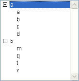
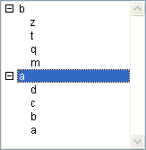

<!--REF #_command_.SORT LIST.Syntax-->**SORT LIST** ( *lista* {; > ou <} )<!-- END REF-->
<!--REF #_command_.SORT LIST.Params-->
| Parâmetro | Tipo |  | Descrição |
| --- | --- | --- | --- |
| lista | Integer | &#8594;  | Número de referência da lista |
| > ou < | Operador | &#8594;  | Critério de ordenação: > ordenar em ordem ascendente, ou < ordenar em ordem descendente |

<!-- END REF-->

*Esse comando não é seguro para thread e não pode ser usado em código adequado.*


#### Descrição 

<!--REF #_command_.SORT LIST.Summary-->O comando SORT LIST ordena a lista cujo número de referência se passa em *lista*.<!-- END REF-->

Para ordenar em ordem ascendente, passe *\>*. Para ordenar em ordem descendente, passe <. Se omitir o parâmetro de critério de ordenação, SORT LIST ordena automaticamente em ordem ascendente. 

SORT LIST ordena todos os níveis da lista; primeiro ordena os elementos da lista, depois ordena os elementos em cada sub-lista (se houver uma), etc., através de todos os níveis da lista. Esta é a razão pela qual você geralmente aplicará SORT LIST a uma lista em um formulário. A ordenação de uma sub-lista não é de muito interesse porque a ordem mudará por uma chamada a um nível superior.

SORT LIST não muda o estado atual da lista e das eventuais sub-listas expandido/contraído, nem do elemento atual. Entretanto, como o elemento atual pode ser movido pela operação de ordenação, [Selected list items](selected-list-items.md "Selected list items") poderia devolver uma posição diferente antes e depois da ordenação.

#### Exemplo 

Dada a lista chamada *hList,* mostrada aqui no ambiente Aplicação:


 Depois da execução deste código:

```4d
  // Ordenar a lista e sublistas em ordem ascendente
 SORT LIST(hList;>)
```

A lista se verá assim:



Depois da execução deste código:

```4d
  // Ordenar a lista e suas sublistas em ordem decrescente
 SORT LIST(hList;<)
 REDRAW LIST(hList) // NAO esqueça chamar REDRAW LIST do contrário a lista não é atualizada
```

A lista se verá assim:



#### Ver também 

[Selected list items](selected-list-items.md)  