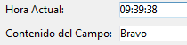

<!--REF #_command_.ST SET OPTIONS.Syntax-->**ST SET OPTIONS** ( {* ;} *objeto* ; *opcao* ; *valor* {; *opcao2* ; *valor2* ; ... ; *opcaoN* ; *valorN*} )<!-- END REF-->
<!--REF #_command_.ST SET OPTIONS.Params-->
| Parâmetro | Tipo |  | Descrição |
| --- | --- | --- | --- |
| * | Operador | &#8594;  | Se especificado, objeto é um nome de objeto (cadeia) Se omitido, objeto é um campo ou uma variável |
| objeto | any | &#8594;  | Nome do objeto (se * for especificado) ou Campo ou variável (se * for omitido) |
| opcao | Integer | &#8594;  | Opção a definir |
| valor | Integer | &#8594;  | Novo valor da opção |

<!-- END REF-->

#### Descrição 

<!--REF #_command_.ST SET OPTIONS.Summary-->O comando **ST SET OPTIONS** modifica uma ou várias opções de funcionamento do campo ou da variável de texto com estilo designada pelo parâmetro *objeto* .<!-- END REF-->  
  
Se passar o parâmetro opcional *\** indica que o parâmetro *objeto* é um nome de objeto (cadeia). Se não passar este parâmetro, indica que o parâmetro *objeto* é um campo ou uma variável. Neste caso, se passar uma referência de campo ou variável em lugar de uma cadeia (campo ou variável objeto unicamente).  
  
Passe o código da opção a modificar em opção e seu novo *valor* em *valor*. Para estes dois parâmetros, pode utilizar as seguintes constantes do tema "*Texto multi estilo*":

| Constante                   | Tipo          | Valor | Comentário                                                 |
| --------------------------- | ------------- | ----- | ---------------------------------------------------------- |
| ST Expressions display mode | Inteiro longo | 1     | O parâmetro *valor* pode conter ST Values ou ST References |
  
  
No parâmetro valor, pode passar uma das constantes abaixo:

| Constante                   | Tipo          | Valor | Comentário                                                 |
| --------------------------- | ------------- | ----- | ---------------------------------------------------------- |
| ST Expressions display mode | Inteiro longo | 1     | O parâmetro *valor* pode conter ST Values ou ST References |
| ST References               | Inteiro longo | 1     | Mostra as cadeias fonte das expressões                     |
| ST Values                   | Inteiro longo | 0     | Mostra os valores calculados das expressões                |

Visualização dos valores:



Visualização das expressões:


#### Exemplo 

O seguinte código permite mudar o modo de visualização da área:

```4d
 ST GET OPTIONS(*;"StyledText_t";ST Expressions display mode;$exprValue)
 If($exprValue=1)
    ST SET OPTIONS(*;"StyledText_t";ST Expressions display mode;ST Values)
 Else
    ST SET OPTIONS(*;"StyledText_t";ST Expressions display mode;ST References)
 End if
```

#### Ver também 

[ST GET OPTIONS](st-get-options.md)  

#### Propriedades
|  |  |
| --- | --- |
| Número do comando | 1289 |
| Thread-seguro | &check; |
| Proibido no servidor ||


