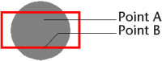

<!--REF #_command_.SVG Find element ID by coordinates.Syntax-->**SVG Find element ID by coordinates** ( {* ;} *objetoImagem* ; *X* ; *Y* ) : Text<!-- END REF-->
<!--REF #_command_.SVG Find element ID by coordinates.Params-->
| Parâmetro | Tipo |  | Descrição |
| --- | --- | --- | --- |
| * | Operador | &#8594;  | Se especificado, objetoImagem é um nome de objeto (string), se omitido, objetoImagem é um campo ou variável |
| objetoPicture | Picture | &#8594;  | Nome de objeto (Se * for especificado) ou Campo ou Variável (se * for omitido) |
| X | Integer | &#8594;  | Coordenadas X em píxels |
| Y | Integer | &#8594;  | Coordenadas Y em píxels |
| Resultado | Text | &#8592; | ID do elemento encontrado na localização X, Y |

<!-- END REF-->

#### Descrição 

<!--REF #_command_.SVG Find element ID by coordinates.Summary-->O comando SVG Find element ID by coordinates retorna a identificação ("id" ou atributo "xml:id") do elemento XML encontrado na localização definida pelas coordenadas (x,y) na imagem SVG designada pelo parâmetro *objetoImagem*.<!-- END REF--> Este comando pode ser utilizado particularmente para criar interfaces gráficas interativas utilizando objetos SVG.  
  
**Nota**: para maior informação sobre o formato SVG, por favor consulte a seção *Introdução aos comandos de XML Utilities*.

Se passa o parâmetro opcional \*, indique que o parâmetro *pictureObject* é um nome de objeto (string). Se não passa este parâmetro, indique que o parâmetro *pictureObject* é um campo ou variável. Neste caso, não passe uma string, e sim uma referencia de campo ou variável (campo ou variável objeto apenas).  
Note que não é obrigatorio que a imagem em um formulário seja mostrada. Neste caso, a sintaxe de tipo "object name" não é válida e deve passar um nome de campo ou variável.  

 As coordenadas passadas nos parâmetros *x* e *y* devem estar expressadas em píxeis relativos a esquina superior esquerda da imagem (0,0). No contexto de uma imagem mostrada em um formulário, pode utilizar os valores devolvidos pelas variáveis sistema MouseX e MouseY. Estas variáveis são atualizadas nos eventos de formulário On Clicked e On Double Clicked, assim como nos eventos de formulário On Mouse Enter e On Mouse Move.  
  
**Nota**: no sistema de coordenadas da imagem, MouseX e MouseY sempre especifica o mesmo ponto, independentemente do formato de visualização da imagem (excepto no caso do formato "Replicated"), mesmo quando a imagem for rolada ou receber um zoom.

O ponto a ser considerado é o primeiro ponto alcançado. Por exemplo, no seguinte caso, o comando devolverá a identificação do círculo se as coordenadas do ponto A forem passadas, e a do retângulo se as coordenadas do ponto B forem passadas:

Quando as coordenadas corresponderem a um objeto superposto ou composto, o comando retorna a identificação do primeiro objeto com um identificador de atributo válido, se for necessário, entre os elementos pai.  
  
O comando retorna uma string vazia se:

* a raiz é alcançada sem encontrar um atributo "id",
* o ponto de coordenadas não pertence a nenhum objeto,
* o atributo "id" é uma string vazia.

**Nota**: este comando não pode detectar objetos cujo valor de opacidade (atributo "fill-opacity") seja inferior a 0.01.  

#### Variáveis e conjuntos do sistema 

Se *objetoImagem* não contiver uma imagem SVG válida, o comando retorna uma cadeia vazia e a variável sistema OK toma o valor 0\. Do contrário, se o comando for executado corretamente, a variável sistema OK toma o valor 1\. 

#### Ver também 

[SVG Find element IDs by rect](svg-find-element-ids-by-rect.md)  

#### Propriedades

|  |  |
| --- | --- |
| Número do comando | 1054 |
| Thread-seguro | &cross; |
| Modificar variáveis | OK |

