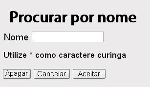

<!--REF #_command_.WEB SEND HTTP REDIRECT.Syntax-->**WEB SEND HTTP REDIRECT** ( *url* {; *} )<!-- END REF-->
<!--REF #_command_.WEB SEND HTTP REDIRECT.Params-->
| Parâmetro | Tipo |  | Descrição |
| --- | --- | --- | --- |
| url | Text | &#8594;  | Nova URL |
| * | Operador | &#8594;  | Se especificado = URL não for traduzido, se omitido = URL é traduzido |

<!-- END REF-->

#### Descrição 

<!--REF #_command_.WEB SEND HTTP REDIRECT.Summary-->O comando **WEB SEND HTTP REDIRECT** permite transformar uma URL em outra.<!-- END REF-->  

O parâmetro *url* contém a nova URL que permite redirecionar a petição. Se este parâmetro for uma url para um arquivo, deve conter a referência a este arquivo, por exemplo: **WEB SEND HTTP REDIRECT** ("/MinhaPagina.HTM").  
  
Este comando prevalece sobre os comandos de envio de dados ([WEB SEND FILE](web-send-file.md), [WEB SEND BLOB](web-send-blob.md), etc.) que possam estar no mesmo método.  
  
Este comando também permite redirecionar uma petição a outro servidor web.  
  
4D codifica automaticamente os caracteres especiais do URL. Se passar o caractere *\**, 4D não os traduzirá.

Note que o estado da petição enviada por este comando é **302: Moved Temporarily**. Se necessita um redirecionamento permanente (status 301), pode fixar o campo HTTP *X-STATUS: 301* no cabeçalho da resposta.

#### Exemplo 

Pode utilizar este comando para realizar, com a ajuda de páginas estáticas, pesquisas personalizadas em 4D. Imagine que coloca os elementos abaixo em uma página HTML estática: 



**Nota:** a ação POST “/4dcgi/rech” foi associada à área de texto e aos botões **Aceitar** e **Cancelar**.

Na parte (ou subrotina) do [QR SET DESTINATION](qr-set-destination.md), insere o código abaixo:

```4d
 [tab/]Case of
:($1="/4dcgi/rech") //Quando 4D recebe este URL
  //Se o botão Aceitar foi usando e o "nome" contiver um valor
 If((bOK="Aceitar")&(nome#""))
  //Mudar a URL para executar o código da pesquisa,
  //localizado mais abaixo no mesmo método
    WEB SEND HTTP REDIRECT("/4dcgi/rech?"+nome)
 Else
  //Se não voltarr à página de início
    WEB SEND HTTP REDIRECT("/pagina1.htm")
 End if
 ...
:($1="/4dcgi/rech?@") //Se a URL tiver sido redirigida
 ... //Coloque o código da pesquisa aqui
End case
```


#### Propriedades
|  |  |
| --- | --- |
| Número do comando | 659 |
| Thread-seguro | &check; |
| Proibido no servidor ||


