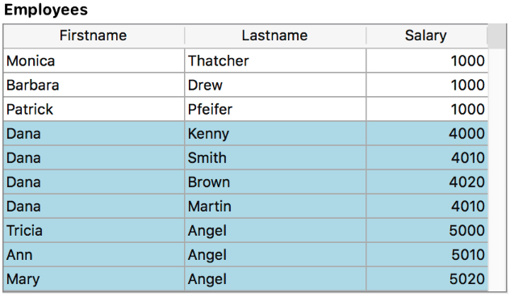

<!--REF #_command_.FORM Event.Syntax-->**FORM Event** : Object<!-- END REF-->

<!--REF #_command_.FORM Event.Params-->

| Parâmetro | Tipo   |   | Descrição      |
| --------- | ------ | - | -------------- |
| Resultado | Object | ← | Objecto evento |

<!-- END REF-->

#### Descrição

<!--REF #_command_.FORM Event.Summary-->**FORM Event** returns an object containing information about the form event that has just occurred.<!-- END REF-->O **Evento FORM** retorna um objeto contendo informações sobre o evento formulário que acabou de ocorrer. Normalmente, você usará **FORM Event** dentro de um formulário ou método objeto.

**Objeto devolvido**

Cada objeto retornado inclui as seguintes propriedades principais:

| **Propriedade** | **Tipo** | **Description**                                                                                                                                                      |
| --------------- | -------- | -------------------------------------------------------------------------------------------------------------------------------------------------------------------- |
| objectName      | text     | Nome do objeto que aciona o evento - Não incluído se o evento for acionado pelo formulário                                                                           |
| code            | integer  | Valor numérico do evento de formulário.                                                                                                              |
| description     | text     | Nome do evento do formulário (\*por exemplo, \* "On After Edit"). Veja a seção [**Eventos de Formulário**](../Events/overview.md) |

Por exemplo, no caso de um clique no botão, o objeto contém as seguintes propriedades:

```json
{"code":4,"description":"On Clicked","objectName":"Button2"}
```

O objeto de evento pode conter propriedades adicionais, dependendo do objeto para o qual o evento ocorre. Para objetos *eventObj* gerados em:

- Lista de objetos da coluna caixa de lista, veja a *documentação da caixa de lista no developer.4d.com*.
- 4D View Pro areas , consulte *No formulário VP Pronto*.

**Nota:** Se não há nenhum evento atual, **Evento FORMATO** retorna um objeto nulo.

#### Exemplo 1

Você deseja manipular o evento On Clicked em um botão:

```4d
 If(FORM Event.code=On Clicked)
    ...
 End if
```

#### Exemplo 2

Se você definir o nome do objeto de coluna com um nome de atributo real de um dataclass como este:


Você pode classificar a coluna usando o evento On Header Click:

```4d
 Form.event:=FORM Event
 Case of
    :(Form event code=On Header Click)
       if(Form.event.columnName="lastname")
          Form.employees:=Form.employees.orderBy(Form.event.columnName+", firstname")
       End if
 End case
```

#### Exemplo 3

Você deseja tratar o On Display Details em um objeto de caixa de listagem com um método definido na propriedade *Meta info expression*:


O método *setColor*:

```4d
 var $event;$0;$meta : Object
 $event:=FORM Event
 $meta:=New object
 
 Case of
    :($event.code=On Display Detail)
       If($event.isRowSelected)
          $meta.fill:="lightblue"
       End if
 End case
 $0:=$meta
```

A caixa de lista resultante quando as linhas são selecionadas:



#### Veja também

[Eventos de formulário](../Events/overview.md)
[Código de evento do formulário](../commands/form-event-code.md)

#### Propriedades

|                |                                 |
| -------------- | ------------------------------- |
| Command number | 1606                            |
| Thread safe    | &amp;check; |
