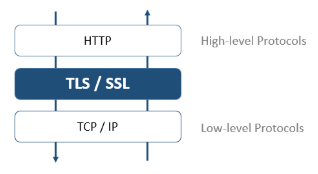

Todos os servidores 4D podem se comunicar em modo seguro através do protocolo TLS (Transport Layer Security):

- o servidor HTTP
- o servidor de aplicação (aplicações desktop cliente-servidor)
- o servidor SQL

Além disso, o cliente HTTP (comando `HTTP get` por exemplo) também é compatível com o protocolo TLS.

## Visão Geral

O protocolo TLS (sucessor de SSL) foi criado para assegurar trocas de dados entre duas aplicações - principalmente entre servidor web e um navegador. Esse protocolo é amplamente usado e é compatível com a maioria dos navegadores.

No nível de rede, o protocolo de segurança é inserido entre a capa TCP/IP (baixo nível) e o protocolo de alto nível HTTP. Foi criado principalmente para trabalhar com HTTP.

Configuração de rede usando TSL:

O protocolo TLS foi criado para autenticar o emissor e o recipiente e assim garantir a confidencialidade e integridade da troca de informações:

- **Autenticação**: As identidades do emissor e do receptor são confirmadas.
- **Confidencialidade**: O dado enviado é criptografado para que um terceiro não possa entender a mensagem.
- **Integridade**: Os dados recebidos não foram modificados, seja por acidente ou com má intenção.

TLS usa uma técnica de criptografia de chave pública baseado em duas chaves assimétricas para criptografia e descriptografia: uma chave pública e outra privada. A chave privada é usada para criptografar os dados. O emissor (o website) não dá essa chave para ninguém.

A chave pública é usada para decriptografar a informação e enviá-la para os recipientes (navegadores web) através de um **certificado**. O certificado é fornecido através de uma autoridade de certificação. O site paga ao provedor de certificados para fornecer um certificado que garanta a autenticação do servidor e contenha a chave pública que permita a troca de dados em um modo seguro.

:::note

Os navegadores web autorizam apenas os certificados emitidos por uma autoridade de certificação referenciada em suas propriedades.

:::

## Versão mínima

Como padrão, a versão mínima de um protocolo de segurança aceito pelos servidores 4D é TLS 1.3. Pode modificar esse valor usando o seletor `Min TLS version` do comando `SET DATABASE PARAMETER`.

:::note

Você pode controlar separadamente a [versão mínima do TLS](WebServer/webServerConfig.md#minimum-tls-version) para **objetos do webServer**.

:::

## Habilitando TLS com o servidor HTTP

Para poder usar o protocolo TLS com o servidor HTTP 4D, você deve:

1. Obtenha seus arquivos de certificado.
2. Instale seus arquivos de certificado no(s) local(is) apropriado(s)
3. Habilitar TLS.

### Certificados

#### Formato

Certificados TLS gerenciados por 4D devem ser no **PEM format**. Se seu fornecedor de certificado envia um certificado que está no formato binário tais como .crt, .pfx ou .p12, tem que converter para o formato PEM para poder usá-lo. Há sites em que você pode fazer essa conversão on-line.

#### Criptografia

4D fornece certificados nos formatos de criptografia abaixo:

- [**RSA**](https://en.wikipedia.org/wiki/RSA_\(cryptosystem\))
- [**ECDSA**](https://en.wikipedia.org/wiki/Elliptic_Curve_Digital_Signature_Algorithm)

:::info Compatibidade

O formato de criptografia ECDSA não é compatível com [a camada de rede legado 4D](../settings/client-server.md#network-layer).

:::

:::note

4D oferece dois comandos para ajudar a peticionar um certificado RSA, [veja o tutorial abaixo](#how-to-get-a-rsa-certificate-tutorial).

:::

### Instalação de arquivos de certificado

Os arquivos de certificado incluem:

- **key.pem**: um documento que contém a chave de criptografia privada,
- **cert.pem**: um documento que contém o certificado.

Os arquivos **key.pem** e **cert.pem** devem estar localizados:

- com 4D Server ou 4D no modo local, ao lado da [pasta do projeto](Project/architecture.md#project-folder)
- com 4D em modo remoto, na pasta do banco de dados cliente na máquina remota (para obter mais informações sobre a localização dessa pasta, consulte o comando [`Get 4D folder`](https://doc.4d.com/4dv20/help/command/en/page485.html)). Deve copiar esses arquivos manualmente na máquina remota.

### Ativar TLS

Para que as conexões TLS sejam aceitas pelo servidor HTTP, você deve ativar HTTPS. Consulte o parágrafo [**Habilitar HTTPS**](WebServer/webServerConfig.md#enable-https) para saber as diferentes maneiras de habilitar o TLS para o servidor HTTP.

:::note

O servidor 4D web é compatível com a opção HSTS para prevenir um navegador de

:::

### Perfect Forward Secrecy (PFS)

[PFS](https://en.wikipedia.org/wiki/Forward_secrecy) adiciona mais um nível de segurança para suas comunicações. Ao invés de usar chaves de troca pré-estabelecidas, PFS cria chaves de sessão cooperativamente entre as partes que se comunicam usando os algoritmos Difie-Hellman (DH). A maneira conjunta com a qual essas chaves são construídas cria um "segredo compartilhado" que impede partes externas de as comprometerem.

Quando TLS estiver ativado no servidor, PFS é ativado automaticamente. Se o arquivo *dhparams.pem* (documento que contém a chave privada DH do servidor) ainda não existir, 4D vai gerar o arquivo automaticamente com um tamanho de chave de  2048. A geração inicial deste arquivo pode levar vários minutos. O arquivo é colocado com os arquivos [*key.pem* e *cert.pem*](#instalando-arquivos-de-certificado).

Se utilizar uma [lista de cifrado personalizada](WebServer/webServerConfig.md##cipher-list) e quiser habilitar o PFS, deve comprovar que contenha entradas com algoritmos DH ou ECDH (Elliptic-curve Diffie-Hellman).

## Ativando TLS com os outros servidores

Para usar TLS com o servidor de aplicações 4D (aplicações cliente-servidor de desktop) ou o servidor SQL, você só precisa ativar comunicações TLS e o servidor automaticamente configura as conexões na inicialização.

- Com o servidor de aplicações, selecione a opção **Encriptar comunicações cliente-servidor** na página ["Opções cliente-servidor/rede" da caixa de diálogo Parâmetros](.../settings/client-server#encrypt-client-server-communications).
- Com o servidor SQL, selecione a opção **Habilitar TLS** na página ["SQL" na caixa de diálogo Parâmetros](../settings/sql#sql-server-publishing).

## Como obter o certificado RSA? (tutorial)

Um servidor trabalhando em modo seguro significa que precisa de um certificado digital de uma autoridade de certificações. Esse certificado contém várias informações tais como a ID do site assim como a chave pública usada para comunicar com o servidor. Esse certificado é transmitido aos clientes (por exemplo os navegadores Web) conectando a esse servidor. Quando o certificado tiver sido identificado e aceito, a comunicação é feita em modo seguro.

> Navegadores web autorizam apenas os certificados emitidos por autoridades de certificação referenciados em suas propriedades.

A autoridade de certificação é escolhida de acordo com vários critérios. Se a autoridade de certificação for bem reconhecida, o certificado será autorizado por vários navegadores, mas o preço pode ser caro.

Para obter um certificado digital:

1. Crie uma chave privada usando o comando `GENERATE ENCRYPTION KEYPAIR`.

> **Aviso**: por razões de segurança, a chave privada deve ser sempre mantida em segredo. Na verdade deve ser mantida sempre na máquina servidor. Para o servidor web, o arquivo Key.pem deve ser localizado na pasta Project.

2. Use o comando `GENERATE CERTIFICATE REQUEST` para emitir uma petição de certificado.

3. Envie a petição de certificado à autoridade de certificação escolhida.
   Para preencher uma petição de certificado, pode ser necessário entrar em contato com a autoridade de certificação. A autoridade checa que a informação transmitida seja correta. A petição de certificado é gerada em um BLOB usando o formato PKCS codificado em base64 (formato PEM). Esse princípio permite que copie e cole as chaves como texto e as envie via E-mail sem modificar o conteúdo da chave. Por exemplo pode salvar o BLOB que contém a petição de certificado em um documento texto (usando o comando `BLOB TO DOCUMENT`), e então abrir e copiar e colar seu conteúdo em um mail ou um formulário web a ser enviado para a autoridade de certificação.

4. Quando tiver o certificado, crie um arquivo texto chamado "cert.pem" e cole seu conteúdo do certificado dentro dele.
   Pode receber um certificado de várias maneiras (geralmente por email ou formulário HTML). 4D aceita todos os formatos de texto relacionados à plataformas para certificados (OS X, PC, Linux, etc). No entanto, o certificado deve estar no formato [PEM](#format), *ou seja,*, PKCS codificado em base64.

> Caracteres CR final de linha não são compatíveis em si; deve usar ou CRLF ou LF.

5. Coloque o arquivo “cert.pem” no [local apropriado](#installing-certificate-files).

O servidor 4D pode trabalhar em modo seguro. Um certificado é normalmente válido entre 3 meses e um ano.
