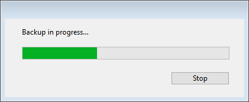

Uma cópia de segurança pode ser iniciada de três maneiras:

- Manualmente, utilizando el comando **Copia de seguridad...** del menú 4D **Archivo** o el botón **Copia de seguridad** del [Centro de mantenimiento y seguridad](MSC/backup.md).
- Automaticamente, usando o agendamento  que pode ser estabelecido em Configurações de Banco de Dados
- Por programação, utilizando o comando `BACKUP`.

> 4D Server: Um backup pode ser iniciado manualmente a partir de uma máquina remota usando um método que chama o comando `BACKUP`. O comando será executado, em todos os casos, no servidor.

## Cópia de segurança manual

1. Selecione o comando **Backup...** no menu 4D **File**.
   A janela de backup é exibida:
   
   Você pode ver o local da pasta de backup usando o menu pop-up ao lado da área "Backup destination". Essa localização é definida na página de **Backup/Configuração** das Configurações do Banco de Dados.

- Você também pode abrir o [Maintenance and Security Center] (MSC/overview.md) do 4D e exibir a [Backup page] (MSC/backup.md).

O botão **Database properties...** faz com que a página Backup/Configuration (Backup/Configuração) das Structure Settings (Configurações da estrutura) seja exibida.

2. Clique em **Backup** para iniciar o backup usando os parâmetros atuais.

## Backup automático periódico

As cópias de segurança programadas são iniciadas automaticamente. Se configuran en la página **Backup/Planificador** de las \*\* Propiedades\*\*.

As cópias de segurança são feitas automaticamente na hora definida nessa página sem nenhum tipo de intervenção do usuário. Para obter mais informações sobre como usar essa caixa de diálogo, consulte [Agendador nas configurações de backup] (settings.md#scheduler).

## Comando BACKUP

Quando o comando de linguagem 4D `BACKUP` é executado a partir de qualquer método, o backup começa a usar os parâmetros atuais conforme definido nas Configurações. Você pode usar os métodos de banco de dados `On Backup Startup` e `On Backup Shutdown` para lidar com o processo de backup (consulte o manual *4D Language Reference*).

## Gerenciar o processo de  backup

Quando iniciar o backup, 4D exibe uma caixa de diálogo com um termômetro indicando o progresso da cópia de segurança:



Esse termômetro também é mostrado na [página Backup de CSM](MSC/backup.md) se você utilizou essa caixa de diálogo.

O botão **Parar** permite que o usuário interrompa o backup a qualquer momento (consulte [Manuseio de problemas de backup](backup.md#handling-backup-issues) abaixo).

O estado da última cópia de segurança (correta ou com erro) é armazenado na área de Informações da Última Cópia de Segurança da [página de Cópias de Segurança no MSC](MSC/backup.md) ou na **página de Manutenção** do 4D Server. Também se registra no banco de dados **Backup journal.txt**.

### Acesso do banco de dados durante o backup

Durante a cópia de segurança, acesso ao banco de dados é restrito por 4D dependendo do contexto. 4D bloqueia os processos relacionados com os tipos de arquivos incluídos na cópia de segurança: se só fizer uma cópia de segurança dos arquivos do projeto, não se poderá acessar à estrutura, mas sim aos dados.

Pelo contrário, se só fizer uma cópia de segurança do arquivo de dados, o acesso à estrutura continua sendo permitido. Nesse caso, as possibilidades de acesso ao banco de dados  são as seguintes:

- Com a versão 4D monousuário, o banco de dados é trancado tanto para leitura quanto escrita, todos os processos são congelados. Nenhuma ação é realizada.
- Com 4D Server, o banco de dados está bloqueado só para escrita; as máquinas clientes podem ver os dados. Se uma máquina cliente enviar uma petição de adição, eliminação ou mudança ao servidor, uma janela aparece pedindo ao usuário que espere até o final da cópia de segurança. Quando a aplicação for salva, a janela desaparece a ação é realizada. Para cancelar a solicitação em andamento e não esperar pelo fim do backup, basta clicar no botão **Cancelar operação**. Entretanto, se a ação que espera ser executada vem de um método lançado antes da cópia de segurança, não deve cancelar a ação porque só são canceladas as operações restantes. Além disso, um método parcialmente executado pode causar inconsistências lógicas no banco de dados.

> Quando a ação que está esperando para ser executada vem de um método e o usuário clica no botão **Cancelar operação**, o 4D Server retorna o erro -9976 (Esse comando não pode ser executado porque o backup do banco de dados está em andamento).

### Gestão dos problemas das cópias de segurança

Pode acontecer que uma cópia de segurança não seja executada corretamente. Pode haver várias causas de falha na cópia de segurança: interrupção do usuário, arquivo adjunto não encontrado, problemas no disco de destino, transação incompleta, etc. 4D processa a incidência segundo a causa.

Em todos os casos tenha em mente que o status do último backup (bem sucedido ou falhado) é armazenado na última área de Informações de Backup da página de [Backup na MSC](MSC/backup. d) ou na **página de manutenção** do servidor 4D, bem como no **Backup do journal.txt**.

- \*\*Interrupção de Usuário: The Botão Parar na caixa de diálogo de progresso permite aos usuários interromper o processo de cópia de segurança a qualquer momento. Nesse caso, a cópia de elementos para sendo gerado o erro 1406. Você pode interceptar esse erro no método de banco de dados `On Backup Shutdown`.
- **Arquivo anexado não encontrado**: Quando um arquivo anexado não pode ser encontrado, 4D realiza um backup parcial (backup de arquivos de aplicação e arquivos anexados acessíveis) e retorna um erro.
- **Backup impossível** (o disco está cheio ou protegido contra gravação, falta de disco, falha de disco, transação incompleta, aplicativo não iniciado no momento do backup automático programado, etc.):
  Se esse for um erro de primeira vez, 4D fará uma segunda tentativa de realizar o backup. A espera entre as duas tentativas é definida na página **Backup/Backup & Restore** nas Configurações.
  Se a segunda tentativa falhar, um diálogo de alerta de sistema é exibido e um erro é gerado. Você pode interceptar esse erro no método de banco de dados `On Backup Shutdown`.

## Página de Backup

Para facilitar o acompanhamento e a verificação das cópias de segurança ou backups do banco de dados, o módulo de backup escreve um resumo em um arquivo especial de cada operação, similar a um diário de atividades. Da mesma forma que no manual de bordo, todas as operações (backups, restaurações, integrações de histórico) são escritas nesse arquivo, não importa se a operação foi programada ou manual. A data e hora em que essas operações acontecem também é anotada no histórico.

O histórico de cópia de segurança é chamado "Backup Journal[001].txt" e fica na pasta "Logs" do banco de dados. O histórico de cópias de segurança pode ser aberto com o editor de texto.

#### Gerenciamento do tamanho de histórico de cópias de segurança.

Em determinadas estratégias de copia de segurança (por exemplo, no caso de que se realizem copias de segurança de numerosos arquivos anexos), o histórico de cópias de segurança pode alcançar rapidamente um grande tamanho. Dois mecanismos podem ser usados para controlar este tamanho:

- **Backup automático**: Antes de cada backup, o aplicativo examina o tamanho do arquivo de diário de backup atual. Se for superior a 10 MB, se arquiva o arquivo atual e é criado um arquivo com o número [xxx] incrementado, por exemplo "Backup Journal[002].txt”. Quando o arquivo número 999 for alcançado, a numeração volta para 1 e os arquivos existentes começam a ser substituídos.
- **Possibilidade de reduzir a quantidade de informações registradas**: Para fazer isso, basta modificar o valor da chave `VerboseMode` no arquivo *Backup.4DSettings* do projeto. Como padrão, essa chave é definida como True. Se mudar o valor desta chave a False, só se armazenará no diário de copias de segurança a informação principal: data e hora de inicio da operação  e os erros encontrados. As chaves XML relativas à configuração de backup são descritas no manual *Backup das chaves XML 4D*.

## backupHistory.json

Todas as informações sobre as últimas operações de backup e restauração são armazenadas no arquivo **backupHistory.json** do aplicativo. Registra a rota de cada arquivo guardado (incluídos os anexos), assim como o número, a data, a hora, a duração e o estado de cada operação. Para limitar o tamanho do arquivo, o número de operações registradas é o mesmo que o número de backups disponíveis ("Keep only the last X backup files") definido nas configurações de backup.

O arquivo **backupHistory.json** foi criado na pasta de destino atual. Pode obter a rota para esse arquivo usando a declaração abaixo:

```4d
$backupHistory:=Get 4D file(Backup history file)
```

> **AVISO**\
> Apagar ou mover o arquivo **backupHistory.json** faz com que o próximo número de backup seja resetado.

> O arquivo **backupHistory.json** é formatado para ser usado pela aplicação 4D. Se estiver procurando por um relatório que possa ser lido por olhos humanos, o diário de Backup journal é mais preciso.
