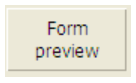

---

## Tipo

`CONFIGURAÇÃO OBRIGATÓRIA`

Esta propiedad designa el tipo del [objeto formulario activo o inactivo](formObjects_overview.md).

#### Gramática JSON

| Nome | Tipo de dados | Valores possíveis                                                                                                                                                                                                                                                                                        |
| ---- | ------------- | -------------------------------------------------------------------------------------------------------------------------------------------------------------------------------------------------------------------------------------------------------------------------------------------------------- |
| type | string        | "button", "buttonGrid", "checkbox", "combo", "dropdown", "groupBox", "input", "line", "list", "listbox", "oval", "picture", "pictureButton", "picturePopup", "plugin", "progress", "radio", "rectangle", "ruler", "spinner", "splitter", "stepper", "subform", "tab", "text", "view", "webArea", "write" |

#### Objectos suportados

[4D View Pro area](viewProArea_overview.md) - [4D Write Pro area](writeProArea_overview.md) - [Button](button_overview.md) - [Button Grid](buttonGrid_overview.md) - [Check Box](checkbox_overview.md) - [Combo Box](comboBox_overview.md) - [Drop-down List](dropdownList_Overview.md) - [Group Box](groupBox.md) - [Hierarchical List](list_overview.md) - [List Box](listbox_overview.md) - [List Box Column](listbox_overview.md#list-box-columns) - [List Box Footer](listbox_overview.md#list-box-footers) - [List Box Header](listbox_overview.md#list-box-headers) - [Picture Button](pictureButton_overview.md) - [Picture Pop-up Menu](picturePopupMenu_overview.md) - [Plug-in Area](pluginArea_overview.md) - [Progress indicator](progressIndicator.md) - [Radio Button](radio_overview.md) -[Spinner](spinner.md) - [Splitter](splitters.md) - [Static Picture](staticPicture.md) - [Stepper](stepper.md) - [Subform](subform_overview.md) - [Tab control](tabControl.md) - [Text Area](text.md) - [Web Area](webArea_overview.md)

---

## Nome de objeto

Cada objeto de formulário ativo está associado a um nome de objeto. Cada nome de objeto deve ser único.

> Os nomes dos objectos estão limitados a um tamanho de 255 bytes.

When using 4D’s language, you can refer to an active form object by its object name (see [Object (Forms) commands](../category/object-forms)).

Para obter mais informações sobre regras de nomenclatura para objetos de formulário, consulte a seção [Identificadores](Concepts/identifiers.md).

#### Gramática JSON

| Nome | Tipo de dados | Valores possíveis                                                 |
| ---- | ------------- | ----------------------------------------------------------------- |
| name | string        | Qualquer nome permitido que não pertença a um objeto já existente |

#### Objectos suportados

[4D View Pro area](viewProArea_overview.md) - [4D Write Pro area](writeProArea_overview.md) - [Button](button_overview.md) - [Button Grid](buttonGrid_overview.md) - [Check Box](checkbox_overview.md) - [Combo Box](comboBox_overview.md) - [Drop-down List](dropdownList_Overview.md) - [Group Box](groupBox.md) - [Hierarchical List](list_overview.md) - [List Box](listbox_overview.md) - [List Box Column](listbox_overview.md#list-box-columns) - [List Box Footer](listbox_overview.md#list-box-footers) - [List Box Header](listbox_overview.md#list-box-headers) - [Picture Button](pictureButton_overview.md) - [Picture Pop-up Menu](picturePopupMenu_overview.md) - [Plug-in Area](pluginArea_overview.md) - [Progress indicator](progressIndicator.md) - [Spinner](spinner.md) - [Splitter](splitters.md) - [Static Picture](staticPicture.md) - [Stepper](stepper.md) - [Radio Button](radio_overview.md) - [Subform](subform_overview.md) - [Tab control](tabControl.md) - [Text Area](text.md) - [Web Area](webArea_overview.md)

---

## Salvar valor

Esta propriedade está disponível quando a opção [Salvar Geometria](FormEditor/properties_FormProperties.md#save-geometry) está marcada para o formulário.

Essa funcionalidade só é suportada por objetos que contribuam para a geometria geral do formulário. Por exemplo, essa opção está disponível para caixas de seleção porque seu valor pode ser usado para ocultar ou exibir áreas adicionais na janela.

Eis a lista de objetos cujo valor pode ser guardado:

| Object                                     | Valor guardado                                                                                            |
| ------------------------------------------ | --------------------------------------------------------------------------------------------------------- |
| [Caixa de seleção](checkbox_overview.md)   | Valor da variável associada (0, 1, 2)                                                  |
| [Lista suspensa](dropdownList_Overview.md) | Número da linha seleccionada                                                                              |
| [Botão de rádio](radio_overview.md)        | Valor da variável associada (1, 0, True ou False para os botões, consoante o seu tipo) |
| [Controle de guias](tabControl.md)         | Número da aba selecionada                                                                                 |

#### Gramática JSON

| Nome          | Tipo de dados | Valores possíveis |
| ------------- | ------------- | ----------------- |
| memorizeValue | boolean       | true, false       |

#### Objectos suportados

[Casilla de selección](checkbox_overview.md) - [Lista desplegable](dropdownList_Overview.md) - [Botón de radio](radio_overview.md) - [Control de pestañas](tabControl.md)

---

## Variável ou expressão

> Consulte também **[Expression](properties_DataSource.md#expression)** para colunas do list box do tipo seleção e coleção.

Esta propriedade especifica a fonte dos dados. Cada objeto de formulário ativo está associado a um nome de objeto e a um nome de variável. O nome da variável pode diferir do nome do objeto. No mesmo formulário, você pode usar a mesma variável várias vezes, mas cada [nome do objeto](#object-name) deve ser exclusivo.

> O tamanho do nome da variável é limitado a 31 bytes. Consulte a seção [Identificadores](Concepts/identifiers.md) para obter mais informações sobre regras de nomenclatura.

As variáveis de objeto do formulário permitem controlar e monitorar os objetos. Por exemplo, quando um botão é clicado, sua variável é definida como 1; em todos os outros momentos, ela é 0. A expressão associada a um indicador de progresso permite que você leia e altere a configuração atual.

As variáveis ou expressões podem ser digitáveis ou não digitáveis e podem receber dados do tipo Texto, Inteiro, Numérico, Data, Hora, Imagem, Booliano ou Objeto.

#### Gramática JSON

| Nome       | Tipo de dados              | Valores possíveis                                                                                                                                                                                                                                                           |
| ---------- | -------------------------- | --------------------------------------------------------------------------------------------------------------------------------------------------------------------------------------------------------------------------------------------------------------------------- |
| dataSource | string ou array de strings | <li>Variável 4D, nome de campo ou qualquer expressão.</li><li>String vazia para [variáveis dinâmicas](#dynamic-variables).</li><li>Matriz de strings (coleção de nomes de matriz) para uma coluna [hierarchical listbox](listbox_overview.md#hierarchical-list-boxes)]</li> |

### Expressões

Você pode usar uma [expressão](Concepts/quick-tour.md#expressions) como fonte de dados para um objeto. Se permite toda expresión 4D válida: expresión simple, propiedad de objeto, fórmula, función 4D, nombre de método proyecto o campo que utilice la sintaxis estándar `[Table]Field`. A expressão é avaliada quando o formulário é executado e reavaliada para cada evento do formulário. The expression is evaluated when the form is executed and reevaluated for each form event.

> Se o valor inserido corresponder tanto a um nome de variável quanto a um nome de método, 4D considera que você está indicando o método.

### Variáveis dinâmicas

Você pode deixar a cargo de 4D a criação de variáveis associadas aos objetos do formulário (botões, variáveis inseríveis, caixas de seleção etc.) dinamicamente e de acordo com suas necessidades. Para ello, basta con dejar en blanco la propiedad "Variable o expresión" (o el campo JSON de `dataSource`).

Quando uma variável não é nomeada, quando o formulário é carregado, 4D cria uma variável para o objeto, com um nome calculado único no espaço das variáveis de processo do intérprete (o que significa que esse mecanismo pode ser usado mesmo no modo compilado). Esta variável temporária será destruída quando o formulário for fechado.
Para que este princípio funcione em modo compilado, é imperativo que as variáveis dinâmicas sejam explicitamente tipadas. Há duas formas de o fazer:

- Você pode definir o tipo usando a propriedade [Tipo de expressão](#expression-type).
- Puede utilizar un código de inicialización específico cuando se carga el formulario que utilice, por ejemplo, el comando `VARIABLE TO VARIABLE`:

```4d
 If(Form event code=On Load)
    var $init : Text
    $Ptr_object:=OBJECT Get pointer(Object named;"comments")
    $init:=""
    VARIABLE TO VARIABLE(Current process;$Ptr_object->;$init)
 End if
```

En el código 4D, se puede acceder a las variables dinámicas utilizando un puntero obtenido con el comando `OBJECT Get pointer`. Por exemplo:

```4d
  // atribuir a hora 12:00:00 à variável do objeto "tstart"
 $p :=OBJECT Get pointer(Object named;"tstart")
 $p->:=?12:00:00?
```

Este mecanismo tem duas vantagens:

- Por um lado, ele permite o desenvolvimento de componentes do tipo "subformulário" que podem ser usados várias vezes no mesmo formulário host. Tomemos como exemplo o caso de um subformulário datepicker que é inserido duas vezes em um formulário host para definir uma data inicial e uma data final. Esse subformulário usará objetos para escolher a data do mês e do ano. Será necessário que esses objetos trabalhem com variáveis diferentes para a data de início e a data de término. Permitir que 4D crie sua variável com um nome exclusivo é uma forma de resolver essa dificuldade.
- Por outro lado, pode ser utilizado para limitar a utilização da memória. De facto, os objectos formulário só funcionam com variáveis processo ou inter-processo. No entanto, no modo compilado, uma instância de cada variável de processo é criada em todos os processos, incluindo os processos do servidor. Essa instância ocupa memória, mesmo quando o formulário não é usado durante a sessão. Portanto, permitir que 4D crie variáveis dinamicamente ao carregar os formulários pode economizar memória.

### List box array

Para un list box array, la propiedad **Variable o Expresión** normalmente contiene el nombre de la variable array definida para el list box y para cada columna. However, you can use a string array (containing arrays names) as *dataSource* value for a list box column to define a [hierarchical list box](listbox_overview.md#hierarchical-list-boxes).

#### Objectos suportados

[4D View Pro area](viewProArea_overview.md) - [4D Write Pro area](writeProArea_overview.md) - [Button](button_overview.md) - [Button Grid](buttonGrid_overview.md) - [Check Box](checkbox_overview.md) - [Combo Box](comboBox_overview.md) - [Drop-down List](dropdownList_Overview.md) - [Hierarchical List](list_overview.md#overview) - [List Box](listbox_overview.md#overview) - [List Box Column](listbox_overview.md#list-box-columns) - [List Box Header](listbox_overview.md#list-box-headers) - [List Box Footer](listbox_overview.md#list-box-footers) - [Picture Pop-up Menu](picturePopupMenu_overview.md) - [Plug-in Area](pluginArea_overview.md#overview) - [Progress indicator](progressIndicator.md) - [Radio Button](radio_overview.md) - [Spinner](spinner.md) - [Splitter](splitters.md) - [Stepper](stepper.md) - [Subform](subform_overview.md#overview) - [Tab control](tabControl.md) - [Web Area](webArea_overview.md)

---

## Tipo de expressão

> Essa propriedade é chamada de [**Data Type**](properties_DataSource.md#data-type-expression-type) na Lista de propriedades para [selection](listbox_overview.md#selection-list-boxes) e [collection](listbox_overview.md#collection-or-entity-selection-list-boxes) e para colunas de caixa de listagem do tipo [Drop-down Lists](dropdownList_Overview.md) associadas a um [objeto](FormObjects/dropdownList_Overview.md#using-an-object) ou a um [array](FormObjects/dropdownList_Overview.md#using-an-array).

Especifique o tipo de dados para a expressão ou variável associada ao objeto. Observe que o principal objetivo dessa configuração é definir as opções (como formatos de exibição) disponíveis para o tipo de dados. Não digita efetivamente a variável em si. De cara a la compilación del proyecto, debe [declarar la variable](Concepts/variables.md#declaring-variables).

No entanto, essa propriedade tem uma função de digitação nos seguintes casos específicos:

- **[Variables dinámicas](#dynamic-variables)**: puede utilizar esta propiedad para declarar el tipo de variables dinámicas.
- **[Columnas List Box ](listbox_overview.md#list-box-columns)**: esta propiedad se utiliza para asociar un formato de visualización a los datos de la columna. Os formatos fornecidos dependerão do tipo de variável (caixa de lista de tipos de matriz) ou do tipo de data/campo (caixas de lista de tipos de coleção e seleção). Os formatos padrão 4D que podem ser usados são: Alfa, Numeric, Data, Hora, Imagem e Booleano. O tipo de texto não tem formatos de visualização específicos. Também estão disponíveis quaisquer formatos personalizados existentes.
- **[Variables imagen](input_overview.md)**: puede utilizar este menú para declarar las variables antes de cargar el formulario en modo interpretado. Mecanismos nativos específicos governam a exibição de variáveis de imagens em formas. Estos mecanismos exigen una mayor precisión a la hora de configurar las variables: a partir de ahora, deberán haber sido declaradas antes de cargar el formulario -es decir, incluso antes del evento de formulario `On Load` - a diferencia de otros tipos de  Estos mecanismos exigen una mayor precisión a la hora de configurar las variables: a partir de ahora, deberán haber sido declaradas antes de cargar el formulario -es decir, incluso antes del evento de formulario `On Load` - a diferencia de otros tipos de  To do this, you need either for the statement `var varName : Picture` to have been executed before loading the form (typically, in the method calling the `DIALOG` command), or for the variable to have been typed at the form level using the expression type property.
  Caso contrário, a variável de imagem não será exibida corretamente (apenas no modo de interpretação).

#### Gramática JSON

| Nome               | Tipo de dados | Valores possíveis                                                                                                                                                                                                                                                                                                                            |
| ------------------ | ------------- | -------------------------------------------------------------------------------------------------------------------------------------------------------------------------------------------------------------------------------------------------------------------------------------------------------------------------------------------- |
| dataSourceTypeHint | string        | <li>**objetos padrão:** "inteiro", "boolean", "number", "picture", "text", date", "time", "arrayText", "arrayDate", "arrayTime", "arrayNumber", "collection", "object", "undefined"</li><li>**colunas da caixa de lista:** "booleano", "number", "picture", "text", date", "time". *Array/selection list box only*: "integer", "object"</li> |

#### Objectos suportados

[Check Box](checkbox_overview.md) - [Combo Box](comboBox_overview.md) - [Drop-down List](dropdownList_Overview.md) - [Input](input_overview.md) - [List Box Column](listbox_overview.md#list-box-columns) - [List Box Footer](listbox_overview.md#list-box-footers) - [Plug-in Area](pluginArea_overview.md#overview) - [Progress indicator](progressIndicator.md) - [Radio Button](radio_overview.md) - [Ruler](ruler.md) - [Spinner](spinner.md) - [Stepper](stepper.md) - [Subform](subform_overview.md) - [Tab Control](tabControl.md)

---

## Classe CSS

Lista de palabras separadas por espacios que se utilizan como selectores de clase en los [archivos css](FormEditor/createStylesheet.md#style-sheet-files).

#### Gramática JSON

| Nome    | Tipo de dados | Valores possíveis                                                                                                         |
| ------- | ------------- | ------------------------------------------------------------------------------------------------------------------------- |
| "class" | string        | Uma cadeia de caracteres com o(s) nome(s) do CSS separados por caracteres de espaço |

#### Objectos suportados

[4D View Pro area](viewProArea_overview.md) - [4D Write Pro area](writeProArea_overview.md) - [Button](button_overview.md) - [Button Grid](buttonGrid_overview.md) - [Check Box](checkbox_overview.md) - [Combo Box](comboBox_overview.md) - [Drop-down List](dropdownList_Overview.md) - [Group Box](groupBox.md) - [Hierarchical List](list_overview.md#overview) - [List Box](listbox_overview.md#overview) - [Picture Button](pictureButton_overview.md) - [Picture Pop-up Menu](picturePopupMenu_overview.md) - [Plug-in Area](pluginArea_overview.md#overview) - [Radio Button](radio_overview.md) - [Static Picture](staticPicture.md) - [Subform](subform_overview.md#overview) - [Text Area](text.md) - [Web Area](webArea_overview.md#overview)

---

## Seleção de entidade ou coleção

Para usar elementos da coleção ou entidades para definir o conteúdo da linha da caixa de lista.

Insira uma expressão que retorne uma coleção ou uma seleção de entidades. Geralmente, você irá digitar o nome de uma variável, um elemento de coleção ou uma propriedade que contém uma coleção ou uma seleção de entidade.

A coleção ou a seleção da entidade deve estar disponível para o formulário quando for carregada. Cada elemento da coleção ou cada entidade da seleção da entidade será associada a uma linha da caixa de lista e estará disponível como um objeto através do [`This`](. /Concepts/classes.md#esta) palavra-chave:

- si ha utilizado una colección de objetos, puede llamar a **This** en la expresión de la fuente de datos para acceder a cada valor de propiedad, por ejemplo `This.<propertyPath>`.
- si ha utilizado una selección de entidades, puede llamar a **This** en la expresión de la fuente de datos para acceder a cada valor de atributo, por ejemplo `This.<attributePath>`.

> Si ha utilizado una colección de valores escalares (y no objetos), 4D le permite mostrar cada valor llamando a **This.value** en la expresión datasource. No entanto, neste caso, você não será capaz de modificar valores ou acessar o objeto atual (veja abaixo).

#### Gramática JSON

| Nome       | Tipo de dados | Valores possíveis                                                              |
| ---------- | ------------- | ------------------------------------------------------------------------------ |
| dataSource | string        | Expressão que devolve uma coleção ou uma seleção de entidades. |

#### Objectos suportados

[List Box](listbox_overview.md)

---

## Fonte de dados

Especifique o tipo de list box.


- **Arrays**(por defecto): utiliza elementos de array como líneas del list box.
- **Selección actual**: utiliza expresiones, campos o métodos cuyos valores se evaluarán para cada registro de la selección actual de una tabla.
- **Selección temporal**: utiliza expresiones, campos o métodos cuyos valores se evaluarán para cada registro de una selección temporal.
- **Colección o Selección de entidades**: utilice elementos de colección o entidades para definir el contenido de las líneas del list box. Tenga en cuenta que con este tipo de list box, debe definir la propiedad [Colección o Selección de entidades](properties_Object.md#collection-or-entity-selection).

#### Gramática JSON

| Nome        | Tipo de dados | Valores possíveis                                           |
| ----------- | ------------- | ----------------------------------------------------------- |
| listboxType | string        | "array", "currentSelection", "namedSelection", "collection" |

#### Objectos suportados

[List Box](listbox_overview.md)

---

## Tipo de plug-in

Nombre del [área externa del plug-in](pluginArea_overview.md) asociada al objeto. Nomes de área externa do plug-in são publicados no arquivo manifest.json do plugin.

#### Gramática JSON

| Nome           | Tipo de dados | Valores possíveis                                                             |
| -------------- | ------------- | ----------------------------------------------------------------------------- |
| pluginAreaKind | string        | Nome da área externa do plug-in (começa com um carácter %) |

#### Objectos suportados

[Área de Plug-in](pluginArea_overview.md)

---

## Grupo Rádio

Permite que os botões de rádio sejam usados em conjuntos coordenados: somente um botão de cada vez pode ser selecionado no conjunto.

#### Gramática JSON

| Nome       | Tipo de dados | Valores possíveis   |
| ---------- | ------------- | ------------------- |
| radioGroup | string        | Nome do grupo rádio |

#### Objectos suportados

[Botão de rádio](radio_overview.md)

---

## Título

Permite inserir uma etiqueta num objeto. O tipo de letra e o estilo desta etiqueta podem ser especificados.

Pode forçar um retorno de carro na etiqueta utilizando o carácter \ (barra invertida).



Para inserir um \ na etiqueta, introduzir "&#92;&#92;".

Por padrão, a etiqueta é colocada no centro do objeto. Quando o objeto também contém um ícone, você pode modificar a localização relativa desses dois elementos usando a propriedade [Title/Picture Position](properties_TextAndPicture.md#titlepicture-position)

Para la traducción de la aplicación, puede introducir una referencia XLIFF en el área del título de un botón (ver [Apéndice B: arquitectura XLIFF](https://doc.4d.com/4Dv17R5/4D/17-R5/Appendix-B-XLIFF-architecture.300-4163748.en.html)).

#### Gramática JSON

| Nome | Tipo de dados | Valores possíveis |
| ---- | ------------- | ----------------- |
| text | string        | qualquer texto    |

#### Objectos suportados

[Botón](button_overview.md) - [Casilla de selección](checkbox_overview.md) - [Encabezado List Box](listbox_overview.md#list-box-headers) - [Botón radio](radio_overview.md) - [ÁreaTexto](text.md)

---

## Cálculo de variáveis

Esta propiedad define el tipo de cálculo que se realizará en un área [pie de columna](listbox_overview.md#list-box-footers).

> O cálculo de rodapés também pode ser definido usando o comando [`LISTBOX SET FOOTER CALCULATION`](https://doc.4d.com/4dv19/help/command/en/page1140.html) 4D.

Existem vários tipos de cálculos disponíveis. A tabela a seguir mostra quais cálculos podem ser usados de acordo com o tipo de dados encontrados em cada coluna e indica que o tipo é automaticamente afetado por 4D para a variável de rodapé (se não for digitado pelo código):

| Cálculo                                   | Num | Text | Date | Hora | Bool | Pict | tipo var rodapé         |
| ----------------------------------------- | --- | ---- | ---- | ---- | ---- | ---- | ----------------------- |
| Mínimo                                    | X   | X    | X    | X    | X    |      | Igual ao tipo de coluna |
| Máximo                                    | X   | X    | X    | X    | X    |      | Igual ao tipo de coluna |
| Soma                                      | X   |      |      | X    | X    |      | Igual ao tipo de coluna |
| Contagem                                  | X   | X    | X    | X    | X    | X    | Integer                 |
| Média                                     | X   |      |      | X    |      |      | Real                    |
| Desvio padrão(\*)      | X   |      |      | X    |      |      | Real                    |
| Variância(\*)          | X   |      |      | X    |      |      | Real                    |
| Soma dos quadrados(\*) | X   |      |      | X    |      |      | Real                    |
| Personalizado ("none") | X   | X    | X    | X    | X    | X    | Qualquer                |

(\*) Apenas para list boxes do tipo array.

> Sólo las [variables](Concepts/variables.md) declaradas o dinámicas pueden utilizarse para mostrar los cálculos de pie de página. No se soportan otros tipos de [expresiones](Concepts/quick-tour.md#expressions) como `Form.value`.

Os cálculos automáticos ignoram o estado mostrado/oculto das linhas de list box. Se você quiser restringir um cálculo para apenas linhas visíveis, você deve usar um cálculo personalizado.

*Null* no se tienen en cuenta para ningún cálculo.

Se a coluna contiver diferentes tipos de valores (coluna baseada em coleção, por exemplo):

- Média e Soma só levam em consideração elementos numéricos (outros tipos de elementos são ignorados).
- Mínimo y Máximo devuelven un resultado según el orden habitual de las listas de tipos, tal como se define en la función [collection.sort()](API/CollectionClass.md#sort).

Usar cálculos automáticos nos rodapés das colunas com base nas expressões tem as seguintes limitações:

- es **soportado** con todos los tipos de list boxes cuando la expresión es "simple" (como `[table]field` o `this.attribute`),
- se **soporta pero no se recomienda** por razones de rendimiento con list boxes colección/selección de entidades cuando la expresión es "compleja" (distinta de `this.attribute`) y el list box contiene un gran número de líneas,
- **no se soporta** con list boxes selección actual/selección temporal cuando la expresión es "compleja". Precisa utilizar cálculos personalizados.

Cuando está configurado **Personalizado** ("none" en JSON), 4D no realiza cálculos automáticos y debe asignar el valor de la variable en esta área por programación.

#### Gramática JSON

| Nome                | Tipo de dados | Valores possíveis                                                                                     |
| ------------------- | ------------- | ----------------------------------------------------------------------------------------------------- |
| variableCalculation | string        | "none", "minimum", "maximum", "sum", "count", "average", "standardDeviation", "variance", "sumSquare" |

#### Objectos suportados

[Rodapé de Listbox](listbox_overview.md#list-box-footers)
