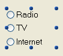
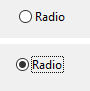
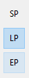
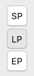

Os botões rádio são objetos que permitem que o usuário selecione um de um grupo de botões.

Um botão radio aparece na forma de um texto seguido de um círculo. Sin embargo, los botones radio pueden tener [diferentes apariencias](#button-styles).

É selecionado um botão rádio:

- quando o usuário clica nele
- cuando tiene el foco y el usuario presiona la tecla **Barra espaciadora**.

## Configuração de botões radio

Os botões rádio são usados em conjuntos coordenados: somente um botão de cada vez pode ser selecionado no conjunto. A seleção de um botão de rádio em um grupo define esse botão como 1 e todos os outros no grupo como 0.

Os botões rádio são controlados com métodos. Como todos os botões, um botão de rádio é definido como 0 quando o formulário é aberto pela primeira vez. Um método associado a um botão de rádio é executado quando o botão é selecionado. A seguir, um exemplo de um grupo de botões de rádio usados em um banco de dados de coleção de vídeos para inserir a velocidade da gravação (SP, LP ou EP):

A seleção de um botão de rádio em um grupo define esse botão como 1 e todos os outros no grupo como 0. Só pode ser selecionado um botão rádio de cada vez.

> Puede asociar [expresiones de tipo booleano](properties_Object.md#variable-or-expression) a botones radio. Nesse caso, quando um botão de opção em um grupo é selecionado, sua variável é True e as variáveis dos outros botões de opção do grupo são False.

O valor contido em um objeto de botão de opção não é salvo automaticamente (exceto se for a representação de um campo booliano); os valores dos botões de opção devem ser armazenados em suas variáveis e gerenciados com métodos.

## Estilos de botões

[Los estilos de botón](properties_TextAndPicture.md#button-style) controlan la apariencia general del botón de radio y sus propiedades disponibles. É possível aplicar diferentes estilos predefinidos aos botões rádio. No entanto, o mesmo estilo de botão deve ser aplicado a todos os botões rádio em um grupo para que eles funcionem como esperado.

4D fornece botões rádio nos seguintes estilos predefinidos:

### Clássico

El estilo de botón radio Clásico es un botón sistema estándar (\*es decir, \*, una pequeña diana con texto) que ejecuta código cuando el usuario hace clic en él.

Além de iniciar a execução do código, o estilo do botão de opção Regular muda a cor do bullsey ao passar o mouse.

### Plano

El estilo de botón radio Plano es un botón sistema estándar (\*es decir, \*, una pequeña diana con texto) que ejecuta código cuando el usuario hace clic en él.

Por padrão, o estilo Plano tem um aspeto minimalista. A natureza gráfica do estilo Plano é especialmente útil para os formulários que vão ser impressos.

### Barra de ferramentas

O estilo de botão rádio está pensado principalmente para sua integração em uma barra de ferramentas.

Por padrão, o estilo da barra de ferramentas tem um fundo transparente com um rótulo no centro. A aparência do botão pode ser diferente quando o cursor passar por cima dele, dependendo do SO:

- *Windows* - o botão é destacado.

- *macOS* - o destaque do botão nunca aparece.

### Bevel

El estilo de botón radio Bevel es similar al comportamiento del estilo [Barra de herramientas](#toolbar), excepto que tiene un fondo gris claro y un contorno gris. A aparência do botão pode ser diferente quando o cursor passar por cima dele, dependendo do SO:

- *Windows* - o botão é destacado.

- *macOS* - o destaque do botão nunca aparece.

### Bevel arredondado

O estilo de botão Bevel arredondado é quase idêntico ao estilo [Bevel](#bevel), exceto que dependendo do sistema operacional, as esquinas do botão podem ser arredondadas.

- *Windows* - el botón es idéntico al estilo [Bevel](#bevel).

- *macOS* - las esquinas del botón están redondeadas.
 

### OS X Gradient

El estilol botón OS X Gradient es casi idéntico al estilo [Bevel](#bevel), excepto que, dependiendo del sistema operativo, puede tener una apariencia de dos tonos.

- *Windows* - el botón es idéntico al estilo [Bevel](#bevel).

- *macOS* - el botón se muestra como un botón de dos tonos.

### OS X Texturizado

El estilo del botón radio OS X Textured es casi idéntico al estilo [Barra de herramientas](#toolbar) excepto que, dependiendo del sistema operativo, puede tener una apariencia diferente y no mostrar cuando el cursor pasa por encima.

Como padrão, o estilo OS X Textured aparece como:

- *Windows* -un botón en forma de barra de herramientas con una etiqueta en el centro y el fondo se muestra siempre.

- *macOS* - um botão sistema padrão que mostra uma mudança de cor cinza-claro a cinza-escuro. Sua altura está predefinida: não é possível ampliar ou reduzir.

### Office XP

El estilo de botón Office XP combina la apariencia del estilo [Clásico](#regular) (botón sistema estándar) con el comportamiento del estilo [Barra de herramientas](#toolbar).

As cores (ressaltado e fundo) de um botão com o estilo Office XP são baseadas nos sistemas de cores. A aparência do botão pode ser diferente quando o cursor passar por cima dele, dependendo do SO:

- *Windows* - seu fundo só aparece quando o mouse passa por cima.

- *macOS* - its background is always displayed.

### Contrair/expandir

Este estilo de botão pode ser utilizado para adicionar um ícone padrão contracter/déployer. Esses botões são usados nativamente em listas hierárquicas. Esses botões são usados nativamente em listas hierárquicas.

:::info

O estilo Recolher/Expandir é denominado "disclosure" na [gramática JSON de estilo de botão](properties_TextAndPicture.md#button-style).

:::

### Botão disclosure

O estilo do botão divulgação exibe o botão rádio como um botão de divulgação padrão, normalmente usado para mostrar/ocultar informações adicionais. O símbolo do botão aponta para baixo com o valor 0 e para cima com o valor 1.

:::info

O estilo Disclosure é denominado "roundedDisclosure" na [gramática JSON do estilo de botão](properties_TextAndPicture.md#button-style).

:::

### Personalizado

The Custom radio button style accepts a personalized background picture and allows managing additional parameters such as [icon offset](properties_TextAndPicture.md#icon-offset) and [margins](properties_TextAndPicture.md#horizontal-margin).

## Propriedades compatíveis

Todos os botões rádio partilham o mesmo conjunto de propriedades básicas:

[Bold](properties_Text.md#bold) - [Bottom](properties_CoordinatesAndSizing.md#bottom) - [Button Style](properties_TextAndPicture.md#button-style) - [Class](properties_Object.md#css-class) - [Expression Type](properties_Object.md#expression-type) - [Focusable](properties_Entry.md#focusable) - [Font](properties_Text.md#font) - [Font Color](properties_Text.md#font-color) - [Height](properties_CoordinatesAndSizing.md#height) - [Help Tip](properties_Help.md#help-tip) - [Horizontal Alignment](properties_Text.md#horizontal-alignment)(1) - [Horizontal Sizing](properties_ResizingOptions.md#horizontal-sizing) - [Image hugs title](properties_TextAndPicture.md#image-hugs-title)(2) - [Italic](properties_Text.md#italic) - [Left](properties_CoordinatesAndSizing.md#left) - [Number of States](properties_TextAndPicture.md#number-of-states)(2) - [Method](properties_Action.md#method) - [Object Name](properties_Object.md#object-name) - [Radio Group](properties_Object.md#radio-group) - [Picture pathname](properties_TextAndPicture.md#picture-pathname)(2) - [Right](properties_CoordinatesAndSizing.md#right) - [Save value](properties_Object.md#save-value) - [Shortcut](properties_Entry.md#shortcut) - [Title](properties_Object.md#title) - [Title/Picture Position](properties_TextAndPicture.md#titlepicture-position)(2) - [Top](properties_CoordinatesAndSizing.md#top) - [Type](properties_Object.md#type) - [Underline](properties_Text.md#underline) - [Variable or Expression](properties_Object.md#variable-or-expression) - [Vertical Sizing](properties_ResizingOptions.md#vertical-sizing) - [Visibility](properties_Display.md#visibility) - [Width](properties_CoordinatesAndSizing.md#width)

> (1) Não compatível com os estilos [Regular](#regular) e [Flat](#flat). 
> (2) Não é compatível com os estilos [Regular](#regular), [Flat](#flat), [Disclosure](#disclosure) e [Collapse/Expand](#collapseexpand).

Propiedades específicas adicionales están disponibles en función del [estilo de botón](#button-styles):

- Custom: [Background pathname](properties_TextAndPicture.md#background-pathname) - [Horizontal Margin](properties_TextAndPicture.md#horizontal-margin) - [Icon Offset](properties_TextAndPicture.md#icon-offset) - [Vertical Margin](properties_TextAndPicture.md#vertical-margin)