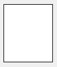

As formas são [objetos estáticos](formObjects_overview.md#active-and-static-objects) que podem ser adicionadas a formulários 4D.

As formas 4D suportam as seguintes formas básicas:

- retângulos
- linhas
- ovals

## Retângulo

Um retângulo estático é um objeto decorativo para os formulários. Os rectângulos são limitados a formas quadradas.

O desenho dos retângulos é controlado através de muitas propriedades (cor, espessura da linha, padrão, etc.). Especificamente, o [arredondamento](properties_CoordinatesAndSizing.md#corner-radius) dos seus cantos pode ser definido.



#### Exemplo JSON:

```4d
	"myRectangle": {
		"type": "rectangle",	//define o tipo de objeto
		"left": 60,				//posicao esquerda no formulário
		"top": 160,				//posicao superior no formulário
		"width": 100,			//largura do objeto
		"height": 20,			//altura do objeto
		"borderRadius": 20		//define a rodada dos cantos
                }
```

#### Propriedades compatíveis

[Bottom](properties_CoordinatesAndSizing.md#bottom) - [Class](properties_Object.md#css-class) - [Corner radius](properties_CoordinatesAndSizing.md#corner-radius) - [Dotted Line Type](properties_BackgroundAndBorder.md#dotted-line-type) - [Fill Color](properties_BackgroundAndBorder.md#background-color--fill-color) - [Height](properties_CoordinatesAndSizing.md#height) - [Horizontal Sizing](properties_ResizingOptions.md#horizontal-sizing) - [Left](properties_CoordinatesAndSizing.md#left) - [Line Color](properties_BackgroundAndBorder.md#line-color) - [Line Width](properties_BackgroundAndBorder.md#line-width) - [Object Name](properties_Object.md#object-name) - [Right](properties_CoordinatesAndSizing.md#right) - [Top](properties_CoordinatesAndSizing.md#top) - [Type](properties_Object.md#type) - [Vertical Sizing](properties_ResizingOptions.md#vertical-sizing) - [Visibility](properties_Display.md#visibility) - [Width](properties_CoordinatesAndSizing.md#width)

## Linha

Uma linha estática é um objeto decorativo para os formulários, desenhado entre duas tramas. As linhas podem ser horizontais, verticais ou de qualquer forma angular.

O desenho das linhas é controlado através de muitas propriedades (cor, espessura da linha, etc.).

### propriedade startPoint

La propiedad JSON `startPoint` define a partir de qué coordenada dibujar la línea (ver ejemplo).

> la propiedad `startPoint` no está expuesta en la lista de propiedades, donde la dirección de dibujo de la línea es visible.

#### Exemplos JSON

```
	"myLine": {
		"type": "line",	               
		"left": 20,
		"top": 40,
		"width": 100,
		"height": 80,
		"startPoint": "topLeft", //primeira direção
		"strokeDashArray": "6 2" //tracejado
		}
```

Resultado:


```
	"myLine": {
		"type": "line",	               
		"left": 20,
		"top": 40,
		"width": 100,
		"height": 80,
		"startPoint": "bottomLeft", //2nd direction
		"strokeDashArray": "6 2" //dashed
		}
```

Resultado:


#### Propriedades compatíveis

[Bottom](properties_CoordinatesAndSizing.md#bottom) - [Class](properties_Object.md#css-class) - [Dotted Line Type](properties_BackgroundAndBorder.md#dotted-line-type) - [Height](properties_CoordinatesAndSizing.md#height) - [Horizontal Sizing](properties_ResizingOptions.md#horizontal-sizing) - [Left](properties_CoordinatesAndSizing.md#left) - [Line Color](properties_BackgroundAndBorder.md#line-color) - [Line Width](properties_BackgroundAndBorder.md#line-width) - [Object Name](properties_Object.md#object-name) - [Right](properties_CoordinatesAndSizing.md#right) - [startPoint](#startpoint-property) - [Top](properties_CoordinatesAndSizing.md#top) - [Type](properties_Object.md#type) - [Vertical Sizing](properties_ResizingOptions.md#vertical-sizing) - [Visibility](properties_Display.md#visibility) - [Width](properties_CoordinatesAndSizing.md#width)

## Oval

Uma oval estática é um objeto decorativo para formas. Los objetos ovalados pueden utilizarse para dibujar formas circulares (cuando las propiedades [ancho](properties_CoordinatesAndSizing.md#width) y [alto](properties_CoordinatesAndSizing.md#height) son iguales).


#### Exemplo JSON:

```4d
	"myOval": {
		"type": "oval",		//define the type of object
		"left": 60,			//left position on the form  
		"top": 160,			//top position on the form 
		"width": 100,		//width of the object
		"height": 20,		//height of the object
		"fill": "blue"		//define the background color
                }
```

#### Propriedades compatíveis

[Bottom](properties_CoordinatesAndSizing.md#bottom) - [Class](properties_Object.md#css-class) - [Dotted Line Type](properties_BackgroundAndBorder.md#dotted-line-type) - [Fill Color](properties_BackgroundAndBorder.md#background-color--fill-color) - [Height](properties_CoordinatesAndSizing.md#height) - [Horizontal Sizing](properties_ResizingOptions.md#horizontal-sizing) - [Left](properties_CoordinatesAndSizing.md#left) - [Line Color](properties_BackgroundAndBorder.md#line-color) - [Line Width](properties_BackgroundAndBorder.md#line-width) - [Object Name](properties_Object.md#object-name) - [Right](properties_CoordinatesAndSizing.md#right) - [Top](properties_CoordinatesAndSizing.md#top) - [Type](properties_Object.md#type) - [Vertical Sizing](properties_ResizingOptions.md#vertical-sizing) - [Visibility](properties_Display.md#visibility) - [Width](properties_CoordinatesAndSizing.md#width)
