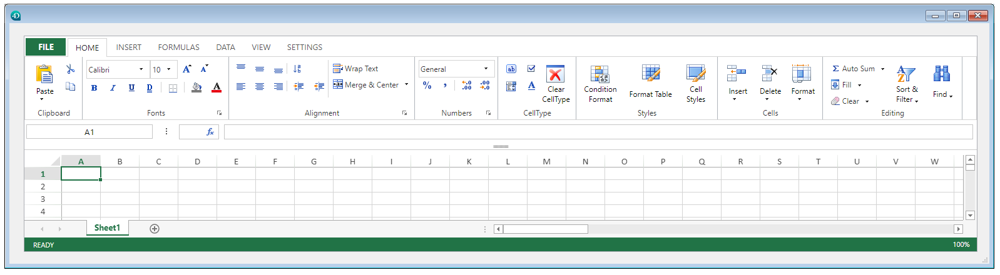

4D View Pro permite inserir e mostrar uma área de planilha nos seus formulários 4D. Uma planilha é um aplicativo que contém uma grade de células onde você pode inserir informações, executar cálculos ou exibir imagens.

Após utilizar as áreas 4D View Pro nos seus formulários, você pode importar e exportar documentos de planilhas.

## Usando as áreas 4D View Pro

As áreas 4D View Pro estão documentadas na [seção 4D View Pro](ViewPro/getting-started.md).

## Propriedades compatíveis

[Estilo de linha de borda](properties_BackgroundAndBorder.md#border-line-style) - [Inferior](properties_CoordinatesAndSizing.md#bottom) - [Clase](properties_Object.md#css-class) - [Altura](properties_CoordinatesAndSizing.md#height) - [Dimensionamento horizontal](properties_ResizingOptions.md#horizontal-sizing) - [Esquerda](properties_CoordinatesAndSizing.md#left) - [Método](properties_Action.md#method) - [Nome do objeto](properties_Object.md#object-name) - [Direita](properties_CoordinatesAndSizing.md#right) - [Mostrar Formula Bar](properties_Appearance.md#show-formula-bar) - [Tipo](properties_Object.md#type) - [Interface usuário](properties_Appearance.md#user-interface) - [Tamanho vertical](properties_ResizingOptions.md#vertical-sizing) - [Visibilidade](properties_Display.md#visibility) - [Largura](properties_CoordinatesAndSizing.md#width)
