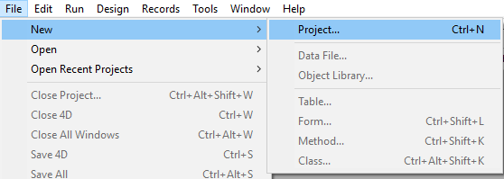

Los proyectos 4D se crean y desarrollan utilizando la aplicación **4D**, que ofrece un completo Entorno de Desarrollo Integrado (IDE). **4D Server** también puede crear nuevos proyectos vacíos.

## Criar arquivos de projeto

Se pueden crear nuevos proyectos de aplicaciones 4D desde **4D** o **4D Server**. Em qualquer caso, os ficheiros de projeto são armazenados na máquina local.

Para criar um novo projeto de banco de dados:

1. Inicie 4D ou 4D Server.

2. Faça uma das seguintes opções:
   - Selecione **Novo > Projeto...** no menu **Arquivo**: 
   - (4D only) Select **Project...** from the **New** toolbar button:

A standard **Save** dialog appears so you can choose the name and location of the 4D project's main folder.

3. Introduzca el nombre de su carpeta de proyecto y haga clic en **Guardar**. Este nome será utilizado:

   - como nome de toda a pasta do projeto,
   - como nombre del archivo .4DProject en el primer nivel de la [carpeta "Project"](../Project/architecture.md#project-folder).

Pode escolher qualquer nome permitido pelo seu sistema operacional. <em x-id="3">Atenção:</em> se seu banco projeto estiver destinado a funcionar em outros sistemas ou a ser guardada através de uma ferramenta de controle de código fonte, deve levar em consideração suas recomendações específicas de denominação.

Al validar el diálogo **Guardar**, 4D cierra el proyecto actual (si lo hay), crea una carpeta de proyecto en la ubicación indicada y coloca en ella todos los archivos necesarios para el proyecto. Para más información, consulte [Arquitectura de un proyecto 4D](Project/architecture.md).

Pode então começar a desenvolver o seu projeto.

## Abrir projeto

Lance uma aplicação 4D Developer.

1. Faça uma das seguintes opções:

   - Seleccione **Abrir/Proyecto local...** desde el menú **Archivo** o del botón**Abrir** de la barra de herramientas.
   - Seleccione **Abrir un proyecto de aplicación local** en el diálogo del Asistente de Bienvenida

Aparece a caixa de diálogo padrão Abrir.

2. Seleccione el archivo `.4dproject` del proyecto (situado dentro de la carpeta ["Project" del proyecto](../Project/architecture.md#project-folder)) y haga clic en **Abrir**.

   Por padrão, o projeto é aberto com seu arquivo de dados atual. Outros tipos de arquivo são sugeridos:

   - *Archivos de proyectos empaquetados*: extensión `.4dz` - proyectos de despliegue
   - *Archivos de acceso directo*: extensión `.4DLink` - almacenan los parámetros adicionales necesarios para abrir proyectos o aplicaciones (direcciones, identificadores, etc.)
   - *Archivos binarios*: extensión `.4db` o `.4dc` - formatos de base de datos 4D heredados

### Opções

Además de las opciones sistema estándar, la caja de diálogo *Abrir* de 4D ofrece dos menús con opciones específicas disponibles utilizando el botón **Abrir** y el menú **Archivo de datos**.

- **Abrir** - modo de apertura del proyecto:
  - **Interpretado** o **Compilado**: estas opciones están disponibles cuando el proyecto seleccionado contiene [código interpretado y compilado](Concepts/interpreted.md).
  - **[Centro de seguridad y de mantenimiento](MSC/overview.md)**: apertura en modo seguro que permite el acceso a los proyectos dañados para realizar las reparaciones necesarias.

- **Archivo de datos** - especifica el archivo de datos a utilizar con el proyecto. Por defecto, está seleccionada la opción **Archivo de datos actual**.

## Atalhos de abertura de projectos

4D oferece várias maneiras de abrir projetos diretamente e ignorar o diálogo Aberto:

- através de opções de menu:
  - *Barra de menús* - **Archivo** > **Abrir proyectos recientes / {project name}**
  - *Barra de herramientas 4D* - Seleccione el proyecto en el menú asociado al botón **Abrir**

- através das preferências:
  - Fije la preferencia general **Al inicio** en **Abrir el último proyecto utilizado**.

- utilizando un archivo `.4DLink`.

### Abrir um projeto com um ficheiro 4DLink

Você pode usar um [arquivo `.4DLink`](#about-4DLink-files) para iniciar a aplicação 4D e abrir o projeto alvo 4D. Há duas formas de o fazer:

- haga doble clic o arrastre y suelte el archivo `.4DLink` en la aplicación 4D
- vaya a **Archivo** > **Abrir los proyectos recientes** y seleccione un proyecto

Um arquivo .4DLink do tipo "projeto remoto" pode ser copiado e usado em várias máquinas.

> Também é possível selecionar um arquivo 4DLink na caixa de diálogo 4D e 4D Server de abertura (abrindo apenas projeto local).

## Sobre 4DLink Files

Los archivos con la extensión `.4DLink` son archivos XML que contienen parámetros destinados a automatizar y a simplificar la apertura de proyectos 4D locales o remotos.

Los archivos `.4DLink` pueden guardar la dirección de un proyecto 4D, así como sus identificadores de conexión y el modo de apertura, lo que permite ahorrar tiempo al abrir los proyectos.

4D genera automáticamente un archivo `.4DLink` cuando se abre un proyecto local por primera vez o cuando se conecta a un servidor por primera vez. O arquivo é armazenado na pasta de preferências locais no seguinte local:

- Windows: C:\Users\UserName\AppData\Roaming\4D\Favorites vXX\
- macOS: Users/UserName/Library/Application Support/4D/Favorites vXX/

XX representa o número da versão da aplicação. Por exemplo, "Favorites v19" para 4D v19.

Esta pasta está dividida em duas subpastas:

- la carpeta **Local** contiene los archivos `.4DLink` que pueden utilizarse para abrir proyectos locales
- la carpeta **Remote** contiene los archivos `.4DLink` de proyectos remotos recientes

Los archivos `.4DLink` también pueden crearse con un editor XML.

4D ofrece un DTD que describe las llaves XML que pueden utilizarse para crear un archivo `.4DLink`. This DTD is named database_link.dtd and is found in the `\Resources\DTD\` subfolder of the 4D application.
