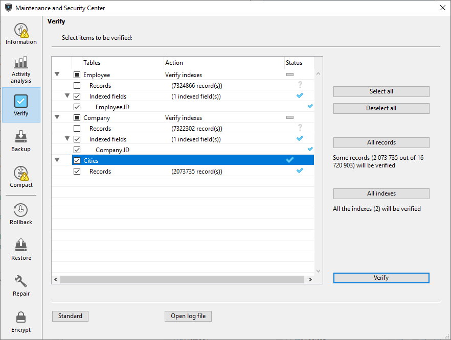

Esta página é utilizada para verificar a integridade dos dados. A verificação pode ser efetuada em registos e/ou índices.
Esta página apenas verifica a integridade dos dados. Si se encuentran errores y es necesario repararlos, se le indicará que utilice la página [Reparación](repair.md).

## Acções

A página contém botões de ação que fornecem acesso direto às funções de verificação.

> When the database is encrypted, verification includes validation of encrypted data consistency. If no valid data key has already been provided, a dialog requesting the passphrase or the data key is displayed.

- **Verificar los registros y los índices:** inicia el procedimiento de verificación total de los datos.
- **Verificar sólo los registros**: inicia el procedimiento de verificación sólo para los registros (los índices no se verifican).
- **Verificar sólo los índices**: inicia el procedimiento de verificación sólo para los índices(los registros no se verifican).

> \> > Verification of records and indexes can also be carried out in detail mode, table by table (see the Details section below).

## Abrir arquivo de registo

Independientemente de la verificación solicitada, 4D genera un archivo de historial en la carpeta `Logs` de la aplicación. This file lists all the verifications carried out and indicates any errors encountered, when applicable ([OK] is displayed when the verification is correct). It is created in XML format and is named: _ApplicationName__Verify_Log__yyyy-mm-dd hh-mm-ss_.xml where:

- _ApplicationName_ es el nombre del archivo del proyecto sin ninguna extensión, por ejemplo "Facturas",
- _yyyy-mm-dd hh-mm-ss_ es la marca de tiempo del archivo, basada en la hora del sistema local cuando se inició la operación de mantenimiento, por ejemplo "2019-02-11 15-20-45".

Al presionar el botón **Abrir archivo de historial**, 4D muestra el archivo de historial más reciente en el navegador por defecto de la máquina.

## Detalhes

El botón **Lista de tablas** muestra una página detallada que puede utilizarse para ver y seleccionar los registros e índices reales que se van a verificar:

Specifying the items to be verified lets you save time during the verification procedure.

A lista principal apresenta todas as tabelas da base de dados. Para cada tabela, é possível limitar a verificação aos registros e/ou a cada índice. Expand the contents of a table or the indexed fields and select/deselect the checkboxes as desired. Por padrão, tudo está selecionado. También puede utilizar los botones de acceso directo **Seleccionar todo**, **Deseleccionar todo**, **Todos los registros** y **Todos los índices**.

Para cada linha da tabela, a coluna "Ação" indica as operações a realizar. When the table is expanded, the "Records" and "Indexed fields" rows indicate the number of items concerned.

The "Status" column displays the verification status of each item using symbols:

|   | A verificação foi efetuada sem problema      |
| --------------------------------- | -------------------------------------------- |
|  | Verificação efectuada, problemas encontrados |
|  | Verificação parcialmente efectuada           |
|   | Verificação não efectuada                    |

Haga clic en **Verificar** para comenzar la verificación o en **Estándar** para volver a la página estándar.

El botón **Abrir archivo de historial** puede utilizarse para mostrar el archivo de historialen el navegador predeterminado de la máquina (ver [Abrir archivo de historial](#abrir-archivo-de-registro) arriba).

> The standard page will not take any modifications made on the detailed page into account: when you click on a verification button on the standard page, all the items are verified. On the other hand, the settings made on the detailed page are kept from one session to another.
