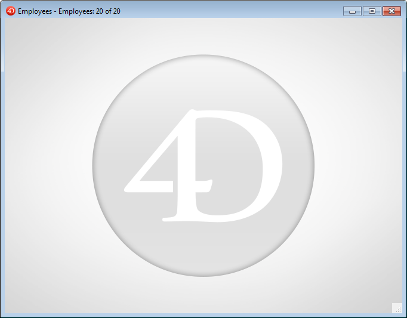

As barras de menu constituem a principal interface das aplicações personalizadas. Para cada aplicação personalizada, você deve criar pelo menos uma barra de menu com pelo menos um menu. Por padrão, a Barra de menus nº 1 é a barra de menus exibida no ambiente da aplicação. Puede cambiar la barra de menús que se muestra utilizando el comando `SET MENU BAR`.

4D permite que você associe uma imagem de tela inicial personalizada a cada barra de menu e visualize essa barra de menu a qualquer momento.

## Tela inicial

É possível aprimorar a aparência de cada barra de menu associando-lhe uma tela inicial personalizada. A janela que contém a tela inicial é exibida abaixo da barra de menus quando ela aparece. Pode conter um logótipo ou qualquer tipo de imagem. Por padrão, 4D mostra o logo 4D na tela inicial:

Uma imagem personalizada de tela de inicialização pode vir de qualquer aplicação gráfica. 4D permite que você cole uma imagem da área de transferência ou use qualquer imagem presente em seu disco duro. Qualquer formato de imagem padrão suportado por 4D pode ser usado.

A imagem da tela inicial só pode ser definida no Editor de menus: selecione a barra de menus à qual deseja associar a tela inicial personalizada. Note a área "Imagem de fundo" na parte direita da janela.
Para abrir directamente una imagen almacenada en su disco, haga clic en el botón **Abrir** o en el área "Imagen de fondo". É apresentado um menu de contexto:

- Para pegar una imagen desde el portapapeles, seleccione **Pegar**.
- Para abrir una imagen almacenada en un archivo de disco, seleccione **Abrir**.
  Se você escolher Abrir, uma caixa de diálogo Abrir padrão irá aparecer para você poder selecionar o arquivo de imagem a ser usado. Uma vez definida, a imagem é apresentada em miniatura na área. É então associado à barra de menus.

É possível visualizar o resultado testando a barra de menus (consulte a seção a seguir). No modo Aplicação, a imagem é exibida na tela inicial com o formato do tipo "Truncado (centralizado)".

> Puede elegir si desea mostrar u ocultar esta ventana mediante la opción **Mostrar la barra de herramientas** en las Propiedades.

Para eliminar la imagen personalizada y mostrar la predeterminada en su lugar, haga clic en el botón **Borrar** o seleccione **Borrar** en el menú emergente del área.

## Pré-visualização de barras de menu

O editor da barra de menus permite que você visualize os menus personalizados e a tela inicial a qualquer momento, sem fechar a janela da caixa de ferramentas.

Para ello, basta con seleccionar la barra de menús y elegir **Probar la barra de menús "Barra de menús #X"** en el menú contextual o en el menú de opciones del editor.

4D mostra uma pré-visualização da barra de menu assim como o ecrã inicial. Você pode rolar os menus e submenus para visualizar seu conteúdo. No entanto, estes menus não estão activos. Para probar el funcionamiento de los menús y la barra de herramientas, debe utilizar el comando **Probar la aplicación** en el menú **Ejecutar**.

:::info

If the **Use SDI mode on Windows** option is selected in the ["Interface" page of the Settings dialog box](../settings/interface.md#display-windows), the **Test Application** menu allows you to test your application in [SDI or MDI mode](sdi.md) on Windows:

:::
