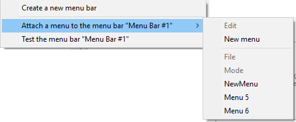

É possível criar menus e barras de menu:

- usando o editor de menus da janela da caixa de ferramentas 4D. Nesse caso, os menus e as barras de menu são armazenados na estrutura da aplicação.
- dinamicamente, utilizando os comandos de linguagem do tema "Menus". Nesse caso, os menus e as barras de menu não são armazenados, eles existem apenas na memória.

Você pode combinar os dois recursos e usar menus criados na estrutura como modelos para definir menus na memória.

## Barra de menu padrão

Uma aplicação personalizada deve conter pelo menos uma barra de menu com um menu. Por padrão, quando você cria um projeto, 4D cria automaticamente uma barra de menu padrão (Menu Bar #1) para você poder acessar a modo Aplicação. A barra de menu padrão inclui menus padrão e um comando para retornar ao modo Desenho.

Isso permite que o usuário acesse o modo Aplicação assim que o projeto é criado. La barra de menús nº 1 se llama automáticamente cuando se elige el comando **Test Application** en el menú **Ejecución**.

A barra de menus predefinida inclui três menus:

- **Archivo**: sólo incluye el comando **Salir**. La acción estándar *Salir* está asociada al comando, que hace que la aplicación salga.
- **Editar**: menú estándar y totalmente editable. As funções de edição, como copiar, colar, etc., são definidas por meio de ações padrão.
- **Modo**: contiene, por defecto, el comando **Volver al modo Diseño**, que se utiliza para salir del modo Aplicación.

> Menu items appear *in italics* because they consist of references and not hard-coded text. Consulte [Propiedad Título](properties.md#title).

Pode modificar esta barra de menu como desejar ou criar outras.

## Criar menus

### Utilizar o editor de menus

1. Select the item you want to create and click the add  button below the menu bar area.
  O
  Elija **Crear una nueva barra de menús** o **Crear un nuevo menú** en el menú contextual de la lista o en el menú de opciones situado debajo de la lista.
  Se você criou uma barra de menus, uma nova barra aparecerá na lista contendo os menus padrão (Arquivo e Edição).
2. (opcional) Clique duas vezes no nome da barra de menus/menu para alternar para o modo de edição e digitar um nome personalizado.
  OU Digite o nome personalizado na área "Título".
  Os nomes das barras de menu devem ser únicos. Podem conter até 31 caracteres. Puede introducir el nombre como "hard coded" o introducir una referencia (ver [información sobre la propiedad Title](properties.md#title)).

### Utilizar a linguagem 4D

Utilice el comando `Create menu` para crear una nueva barra de menú o referencia de menú (*MenuRef*) en la memoria.

Cuando los menús se manejan mediante referencias *MenuRef*, no hay diferencia per se entre un menú y una barra de menús. Em ambos os casos, consiste numa lista de itens. Apenas a sua utilização é diferente. No caso de uma barra de menu, cada item corresponde a um menu composto por itens.

`Create menu` puede crear menús vacíos (para llenar utilizando `APPEND MENU ITEM` o `INSERT MENU ITEM`) o por menús construidos sobre menús diseñados en el editor de menús.

## Adicionar itens

Para cada um dos menus, você deve adicionar os comandos que aparecem quando o menu é exibido. É possível inserir itens que serão associados a métodos ou ações padrão, ou anexar outros menus (submenus).

### Utilizar o editor de menus

Para adicionar um item de menu:

1. Na lista de menus de origem, selecione o menu ao qual você deseja adicionar um comando.
  Se o menu já contiver comandos, eles serão exibidos na lista central. Se você quiser inserir o novo comando, selecione o comando que deseja que apareça acima dele. Você sempre pode reorganizar o menu posteriormente, arrastando e soltando.
2. Elija **Añadir un elemento al menú "NombreDelMenú"** en el menú de opciones del editor o desde el menú contextual (clic derecho en la lista central).
  OU
  Clique no botão adicionar  localizado abaixo da lista central.
  4D adiciona um novo item com o nome padrão "Item X", onde X é o número de itens já criados.
3. Clique duas vezes no nome do comando para alternar para o modo de edição e inserir um nome personalizado.
  OU Digite o nome personalizado na área "Título". Pode conter até 31 caracteres. Você pode digitar o nome como "código duro" ou insira uma referência (veja abaixo).

### Utilizar a linguagem 4D

Utilice `INSERT MENU ITEM` o `APPEND MENU ITEM` para insertar o añadir elementos de menú en referencias de menú existentes.

## Eliminar menus e itens

### Utilizar o editor de menus

Você pode excluir uma barra de menus, um menu ou um item de menu a qualquer momento. Note que cada menu ou barra de menu tem apenas uma referência. Quando um menu é anexado a diferentes barras ou diferentes menus, qualquer modificação ou exclusão feita no menu é imediatamente executada em todas as outras ocorrências desse menu. A eliminação de um menu apenas elimina uma referência. Quando você exclui a última referência de um menu, o 4D exibe um alerta.

Para eliminar uma barra de menu, um menu ou um item de menu:

- Select the item to be deleted and click on the delete  button located beneath the list.
- o bien, utilice el comando apropiado **Eliminar...** del menú contextual o del menú de opciones del editor.

> Não é possível eliminar a barra de menus #1.

### Utilizar a linguagem 4D

Utilice `DELETE MENU ITEM` para eliminar un elemento de una referencia de menú. Utilice `RELEASE MENU` para descargar la referencia del menú de la memoria.

## Anexar os menus

Após criar um menu, você pode anexá-lo a um ou vários outros menus (submenu) ou barra(s) de menu.

Os submenus podem ser usados para agrupar funções organizadas conforme o assunto no mesmo menu. Os submenus e seus itens podem ter os mesmos atributos dos próprios menus (ações, métodos, atalhos, ícones e assim por diante). Os itens do submenu mantêm suas características e propriedades originais e o funcionamento do submenu é idêntico ao de um menu padrão.

Você pode criar submenus de submenus em uma profundidade praticamente ilimitada. Observe, no entanto, que, por motivos relacionados à ergonomia da interface, geralmente não é recomendado ir além de dois níveis de submenus.

Em tempo de execução, se um menu anexado for modificado pela programação, todas as outras instâncias do menu refletirão essas alterações.

### Utilizar o editor de menus

Um menu pode ser anexado a uma barra de menus ou a outro menu.

- To attach a menu to a menu bar: right-click on the menu bar and select **Attach a menu to the menu bar "bar name" >**, then choose the menu to be attached to the menu bar:
  
  You can also select a menu bar then click on the options button found below the list.
- To attach a menu to another menu: select the menu in the left-hand area, then right-click on the menu item and select **Attach a sub-menu to the item "item name">**, then choose the menu you want to use as sub-menu:\
  
  You can also select a menu item then click on the options button found below the list.
  O menu que está a ser anexado torna-se assim um sub-menu. O título do item é mantido (o nome original do submenu é ignorado), mas esse título pode ser modificado.

#### Desvinculação de menus

Você pode separar um menu de uma barra de menus ou um submenu de um menu a qualquer momento. O menu desvinculado não estará mais disponível na barra de menus ou no submenu, conforme o caso, mas ainda estará presente na lista de menus.

Para desvincular un menú, haga clic con el botón derecho en el menú o submenú que desee desvincular en la lista central y, a continuación, elija la opción **Desvincular el menú(...)** o **Desvincular el submenú(...)**

### Utilizar a linguagem 4D

Como no hay diferencia entre los menús y las barras de menús en el lenguaje de 4D, adjuntar menús o submenús se hace de la misma manera: utilice el parámetro *submenú* del comando `APPEND MENU ITEM` para adjuntar un menú a una barra de menús o a un menú.
