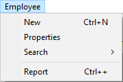

Pode definir várias propriedades para itens de menu tais como ação, estilo de fonte, linhas separadoras, atalhos de teclado ou ícones.

## Título

La propiedad **Title** contiene la etiqueta de un menú o elemento de menú tal y como se mostrará en la interfaz de la aplicación.

No editor do Menu, pode introduzir directamente a etiqueta como "hard coded". Ou, pode introduzir uma referência para uma variável ou um elemento XLIFF, o que facilitará a manutenção e tradução das aplicações. Pode utilizar os seguintes tipos de referências:

- Uma referência de recurso XLIFF do tipo :xliff:MyLabel. Para más información sobre las referencias XLIFF, consulte la sección _Arquitectura XLIFF_ en _Referencia Diseño 4D_.
- Un nombre de variable interproceso seguido de un número, por ejemplo:
  `:<>vlang,3`. A alteração do conteúdo desta variável modificará a etiqueta do menu quando esta for exibida. Neste caso, a etiqueta chamará um recurso XLIFF. El valor contenido en la variable `<>vlang` corresponde al atributo _id_ del elemento _group_. El segundo valor (3 en este ejemplo) designa el atributo _id_ del elemento _trans-unit_.

Utilizando el lenguaje 4D, se define la propiedad del título a través del parámetro _itemText_ de los comandos `APPEND MENU ITEM`, `INSERT MENU ITEM`, y `SET MENU ITEM`.

### Utilização de caracteres de controle

Pode definir algumas propriedades dos comandos do menu utilizando caracteres de controle (metacaracteres) directamente nas etiquetas dos comandos do menu. Por exemplo, pode atribuir o atalho de teclado Ctrl+G (Windows) ou Command+G (macOS) para um comando de menu, colocando os caracteres "/G" na etiqueta do item do menu.

Os caracteres de controle não aparecem nas etiquetas de comando do menu. Deve-se, portanto, evitar a sua utilização para não ter efeitos indesejáveis. Os caracteres de controle são os seguintes:

| Caracteres                  | Descrição                    | Utilização                                                                                                                          |
| --------------------------- | ---------------------------- | ----------------------------------------------------------------------------------------------------------------------------------- |
| (        | abre parênteses              | Desactivar item                                                                                                                     |
| <B | menor que B                  | fonte itálica                                                                                                                       |
| <I | maior que I                  | Itálico                                                                                                                             |
| <U | menor que U                  | fonte sublinhada                                                                                                                    |
| !+caracter                  | ponto de exclamação+caratere | Adiciona caractere como marca de verificação (macOS); adiciona marca de verificação (Windows) |
| /+caracter                  | barra+caractere              | Adicionar caractere como atalho                                                                                                     |

## Parâmetro

É possível associar um parâmetro personalizado a cada item do menu. Um parâmetro de item de menu é uma string de caracteres cujo conteúdo pode ser livremente escolhido. Puede definirse en el editor de menús, o a través del comando `SET MENU ITEM PARAMETER`.

Los parámetros de elementos de menú son útiles con la gestión programada de los menús, en particular cuando se utilizan los comandos `Dynamic pop up menu`, `Get menu item parameter` y `Get selected menu item parameter`.

## Ação

Cada comando de menu pode ter um método de projeto ou uma ação padrão anexada a ele. Quando o comando do menu é escolhido, 4D executa a ação padrão associada ou o método de projecto. Por ejemplo, un comando de menú **Informe mensual** puede llamar a un método proyecto que prepare un informe mensual a partir de una tabla que contenga datos financieros. El comando del menú **Cortar** suele llamar a la acción estándar `cut` para mover la selección al portapapeles y borrarla de la ventana en primer plano.

Se não atribuir um método ou uma ação padrão a um comando de menu, a escolha desse comando de menu faz com que 4D saia do ambiente Application e vá para o ambiente Design. Se apenas o ambiente de Aplicação estiver disponível, isto significa desistir do Ambiente de Trabalho.

Standard actions can be used to carry out various current operations linked to system functions (copy, quit, etc.) or to those of the database (add record, select all, etc.).

Pode atribuir tanto uma acção padrão como um método de projecto a um comando de menu. Neste caso, a acção padrão nunca é executada; contudo, 4D utiliza esta acção para ativar/desativar o comando do menu de acordo com o contexto actual e para associar uma operação específica com ele de acordo com a plataforma. Quando um comando de menu for desativado, o método de projecto associado não pode ser executado.

A escolha entre associar uma ação padrão ou um método de projecto a um comando de menu depende do tipo de resultado desejado. Em princípio, é preferível escolher uma acção padrão sempre que possível, uma vez que implementam mecanismos otimizados, mais particularmente ativação/desativação de acordo com o contexto.

### Associar um método de projecto ou uma acção padrão

É possível atribuir um método de projecto e/ou uma acção padrão a um comando de menu seleccionado no editor de Menu:

- **Nombre del método**: seleccione un nombre de método proyecto existente en el combo box. If the project method does not exist, enter its name in the "Method Name" combo box then click on the [...] button. 4D exibe um diálogo de criação de métodos de projecto que é utilizado para aceder ao editor de métodos.
- **Acción estándar asociada**: elija o escriba la acción que desea asignar en el combo box "Acción estándar asociada". Pode introduzir qualquer acção apoiada e (opcionalmente) parâmetro que deseje na área. Para obtener una lista completa de acciones estándar, consulte la sección **Acciones estándar** en el _Modo Diseño_.
  **Nota para macOS:** en macOS, los comandos de menús personalizados asociados a la acción _Salir_ se colocan automáticamente en el menú de la aplicación, conforme a los estándares de interfaz de la plataforma.

Utilizando el lenguaje 4D, puedes asociar un método proyecto utilizando el comando `SET MENU ITEM METHOD`, y una acción estándar utilizando el comando `SET MENU ITEM PROPERTY`.

### Iniciar um novo processo

La opción **Iniciar un nuevo proceso** está disponible para los comandos de menú asociados a los métodos. Puede definirse a través de una casilla de selección en el editor de menús, o a través del parámetro _propiedad_ del comando `SET MENU ITEM PROPERTY`.

Cuando la opción **Iniciar un nuevo proceso** está activada, se crea un nuevo proceso cuando se elige el comando de menú.
Normalmente, um método ligado a um comando de menu executa-se dentro do processo actual, a menos que chame explicitamente um novo processo no seu código. La opción **Iniciar un nuevo proceso** facilita el lanzamiento de un nuevo proceso. Quando activado, 4D irá criar um novo processo quando o comando do menu for escolhido.

Na lista de processos, 4D atribui ao novo processo um nome padrão usando o formato "ML_ProcessNumber".
Os nomes dos processos iniciados a partir de um menu são criados através da combinação do prefixo "ML_" com o número do processo.

### Executar sem validar

La opción **Ejecutar sin validar** está disponible sólo para los comandos de menú asociados a acciones estándar en el editor de menús.

Quando esta opção é verificada, 4D não activa a "validação" do campo onde se encontra o cursor antes de executar a acção associada.
Esta opción está pensada principalmente para los comandos del menú **Edición**. Por defecto, 4D procesa y "valida" el contenido de un campo antes de ejecutar una acción estándar (a través de un comando de menú o un acceso directo), que tiene el efecto de generar un evento de formulario `On Data Change`. Esto puede interrumpir el funcionamiento de los comandos de tipo copiar o pegar, ya que cuando son llamados, el evento formulario `On Data Change` se genera inesperadamente. En este caso, es útil marcar la opción **Ejecutar sin validar**.

## Privilégios de acesso remoto

Esta opção de menu editor permite definir um grupo para um comando de menu de modo a que apenas os utilizadores desse grupo possam utilizar o comando de menu de uma aplicação remota 4D (ver Utilizadores e grupos).

## Opções

### Linhas separadoras

Grupos de comandos de menu num menu podem ser divididos por uma linha separadora. Esta convenção é útil para agrupar comandos de menu associados por função.

Adiciona-se uma linha separadora através da criação de um comando de menu específico.

En el editor de menús, en lugar de introducir el texto del comando de menú en el área del título, basta con seleccionar la opción **Línea separadora**. Em vez de texto, aparece uma linha na área actual da barra de menu. Quando esta opção é verificada, as outras propriedades não têm qualquer efeito.
**Nota:** en macOS, si utiliza el guión "-" como primer caracter de un elemento de menú, aparecerá como línea de separación.

En el lenguaje 4D, se inserta una línea de separación introduciendo `-` o `(-` como itemText para los comandos `APPEND MENU ITEM`, `INSERT MENU ITEM`, o `SET MENU ITEM`.

### Atalhos do teclado

Pode adicionar atalhos de teclado a qualquer comando de menu. Se um comando de menu tiver um destes atalhos de teclado, os utilizadores irão vê-lo ao lado do comando de menu. Por ejemplo, "Ctrl+C" (Windows) o "Comando+C" (macOS) aparece junto al comando de menú **Copiar** en el menú **Edición**.

También puede añadir la tecla **Mayús**, así como la tecla **Alt** (Windows) u **Opción** (macOS) al acceso directo asociado a un comando de menú. Isto multiplica o número de atalhos que podem ser utilizados. Os seguintes tipos de atalhos de teclado podem, portanto, ser definidos:

- Em Windows:
  - Ctrl+caractere
  - Ctrl+Shift+caracter
  - Ctrl+Alt+caractere
  - Ctrl+Shift+Alt+caractere

- Em macOS:
  - Comando+caractere
  - Comando+Shift+caracter
  - Comando+Opção+característica
  - Comando+Shift+Option+character

> Recomendamos que mantenha os atalhos de teclado padrão que estão associados a acções padrão.

Puede utilizar cualquier tecla alfanumérica como atajo de teclado, excepto las teclas reservadas por los comandos de menú estándar que aparecen en los menús **Edición** y **Archivo**, y las teclas reservadas para los comandos de menú 4D.

Estas combinações chave reservadas estão listadas na tabela seguinte:

| Teclas (Windows)               | Teclas (macOS)                    | Operação      |
| ------------------------------------------------- | ---------------------------------------------------- | ------------- |
| Ctrl+C                                            | Comando+C                                            | Copiar        |
| Ctrl+Q                                            | Comando+Q                                            | Salir         |
| Ctrl+V                                            | Comando+V                                            | Colar         |
| Ctrl+X                                            | Comando+X                                            | Cortar        |
| Ctrl+Z                                            | Comando+Z                                            | Deshacer      |
| Ctrl+. (ponto) | Comando+. (ponto) | Parar a acção |

Atribuir um atalho de teclado no editor de menus:

Seleccione o item do menu ao qual pretende atribuir um atalho de teclado.
Clique no [...] button to the right of the "Shortcut" entry area. Aparece a seguinte janela:

Introduzca el carácter que desea utilizar y, a continuación (opcional), haga clic en las casillas de selección **Mayús** y/o **Alt** (**Opción**) según la combinación deseada.
También puede presionar directamente las teclas que componen la combinación deseada (no presione la tecla **Ctrl/Comando**).

> Não é possível desmarcar a tecla Ctrl/Command, que é obrigatória para atalhos de teclado para menus.
> Para volver a empezar, haga clic en **Borrar**. Haga clic en **Aceptar** para validar los cambios. O atalho definido é mostrado na área de entrada "Atalho".

Para asignar un atajo de teclado utilizando el lenguaje 4D, utilice el comando `SET ITEM SHORTCUT`.

> Um objecto activo pode também ter um atalho de teclado. Si las asignaciones de las teclas **Ctrl/Comando** entran en conflicto, el objeto activo tiene prioridad.

### Item habilitado

No editor do menu, pode especificar se um item do menu aparecerá activado ou desactivado. Um comando de menu activado pode ser escolhido pelo utilizador; um comando de menu desactivado é diminuído e não pode ser escolhido. Cuando la casilla de selección **Línea activa** está desmarcada, el comando de menú aparece atenuado, lo que indica que no se puede elegir.

A menos que especifique o contrário, 4D activa automaticamente cada item de menu que acrescenta a um menu personalizado. Puede desactivar un elemento para, por ejemplo, activarlo sólo por programación con los comandos `ENABLE MENU ITEM` y `DISABLE MENU ITEM`.

### Marca de verificação

Esta opção de menu editor pode ser usada para associar uma marca de verificação do sistema com um item de menu. A continuación, puede gestionar la visualización de la marca de verificación utilizando los comandos del lenguaje (`SET MENU ITEM MARK` y `Get menu item mark`).

As marcas de verificação são geralmente utilizadas para itens do menu de acção contínua e indicam que a acção está actualmente em curso.

### Font-style

4D permite-lhe personalizar os menus aplicando diferentes estilos de fontes aos comandos do menu. Puede personalizar sus menús con los estilos Negrita, Cursiva o Subrayado a través de las opciones del editor de menús, o utilizando el comando de lenguaje `SET MENU ITEM STYLE`.

Como regra geral, aplique estilos de fonte moderadamente aos seus menus - demasiados estilos distrairão o utilizador e darão um aspecto desorganizado à sua aplicação.

> También puede aplicar estilos insertando caracteres especiales en el título del menú (ver [Usar caracteres de control](properties.md#using-control-characters) más arriba).

### Ícone do item

Pode associar um ícone a um item do menu. Será exibido directamente no menu, ao lado do item:

Para definir el icono en el editor de menús, haga clic en el área "Icono del elemento" y seleccione **Abrir** para abrir una imagen del disco. Se selecionar um arquivo de imagem que não esteja já armazenado na pasta de recursos do banco de dados, é copiado automaticamente nessa pasta. Uma vez definido, o ícone do item aparece na área de pré-visualização:

Para eliminar el icono del elemento, elija la opción **Sin icono** del área "Icono línea".

Para definir los iconos de los elementos utilizando el lenguaje 4D, llame al comando `SET MENU ITEM ICON`.
