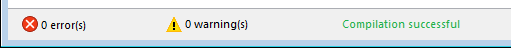

You can compile your projects, i.e., translate all of your methods into machine language. Compiling a project lets you check the consistency of the code and accelerate its execution, as well as making it possible to obfuscate the code in its entirety. Compilation is an indispensable step between the development of projects using 4D and their deployment as stand-alone applications.

## Compilar

The compilation is handled from your 4D application and is entirely automatic.

> En macOS, la compilación requiere que instale `Xcode`. Consulte [esta sección](#silicon-compiler) para obtener más información sobre este requisito.

1. Abra la ventana de compilación seleccionando el comando **Compilador...** en el menú **Diseño** o el botón **Compilador** de la barra de herramientas.

   

   

> También puede lanzar directamente la compilación seleccionando el elemento de menú **Iniciar compilación** en el menú **Diseño**.

2. Haga clic en el botón **Compilar** para lanzar la compilación utilizando los [parámetros ded compilación](#compiler-settings) actuales.

If no errors are detected, the actual compilation begins and the "Compilation successful" message is displayed at the bottom of the window when the compilation is completed:



Puede inmediatamente [ejecutar su aplicación en modo compilado](#run-compiled) y ver lo rápido que es.

If errors are detected, the process is stopped and the "Compilation failed" message is displayed. The information area of the window displays the method names and line numbers concerned in a hierarchical list:


Clique duas vezes em cada erro detectado para abrir o método ou a classe em questão diretamente no Editor de Código 4D. The line containing the error is highlighted and the type of error is displayed in the syntax area of the window.

Utilice los comandos **Error anterior** / **Error siguiente** del menú **Método** para navegar de un error a otro.

The number of errors found during your first compilations may be daunting, but do not let this put you off. You will soon discover that they often spring from the same source, i.e., non-compliance with certain project conventions. El compilador siempre ofrece un [diagnóstico preciso](#error-file) de los errores para ayudarle a corregirlos.

> A compilação requer uma licença adequada. Without this license, it is not possible to carry out a compilation (buttons are disabled). Nevertheless, it is still possible to check the syntax and generate Typing methods.

## Executar a compilação

Una vez compilado un proyecto, es posible pasar del [modo interpretado al modo compilado](Concepts/interpreted.md), y viceversa, en cualquier momento y sin tener que salir de la aplicación 4D (excepto cuando se ha eliminado el código interpretado). Para ello, utilice los comandos **Reiniciar en interpretado** y **Reiniciar en compilado** del menú **Ejecución**. La [caja de diálogo de apertura del proyecto](GettingStarted/creating.md#options) también ofrece elegir entre el modo interpretado o compilado para iniciar la base de datos.

When you switch from one mode to the other, 4D closes the current mode and opens the new one. Isto é equivalente a sair e reabrir a aplicação. Cada vez que se cambia de un modo a otro, 4D ejecuta los dos métodos base siguientes (si se especifican) en este orden: `On Exit` -> `On Startup`.

If you modify your project in interpreted mode, you must recompile it in order to have your edits taken into account in compiled mode.

## Características da janela do compilador

Além do botão [**Compilar**](#compilar), a janela Compilador oferece recursos adicionais que são úteis durante a fase de desenvolvimento do projeto.

### Verificar sintaxe

El botón **Verificar la sintaxis** lanza la ejecución de la fase de verificación de la sintaxis. At the end of the checking process, any errors detected are listed in the information area. You can double–click on an error line in order to display the corresponding method or form object.

El control sintáctico también puede lanzarse directamente con el comando **Verificar sintaxis** asociado al botón de la barra de herramientas **Compilador**. This option is the only one available if you do not have a suitable license to allow the compilation of applications.

### Gerar digitação

:::info Compatibidade

This button is only displayed in converted projects if the **All variables are typed (Direct typing)** [compilation path option](#enabling-direct-typing) is not selected. For information about this button, please refer to the [documentation of previous 4D releases](https://developer.4d.com/docs/20/Project/compiler#generate-typing).

:::

### Limpar código compilado

El botón **Borrar el código compilado** borra el código compilado del proyecto. Al hacer clic en él, se borra todo el [código generado durante la compilación](#classic-compiler), se desactiva el comando **Reiniciar compilado** del menú **Ejecutar** y la opción "Proyecto compilado" no está disponible al inicio.

### Mostrar/ocultar avisos

Você pode alternar a exibição de [warnings](#warnings) na janela do Compilador clicando no botão **Mostrar/Esconder Warnings**:


When this option is checked, the warnings (if any) are displayed in the window, after the other error types. Estas aparecem em itálico:


Um duplo clique num aviso abre o método correspondente.

## Parâmetros do compilador

The "Compiler" tab of the Settings dialog box lets you set parameters related to project compilation. Puede abrir directamente esta página desde la [ventana del compilador](#compiler-window) haciendo clic en el botón **Parámetros del compilador**:


### Opções de compilação

This area groups the generic options used during the compilation process.

#### Gerar o arquivo de símbolo

Used to generate the error file (see [error file](#symbol-file)) at the time of syntax checking. Used to generate the symbol file (see [symbol file](#symbol-file)).

#### Gerar ficheiro de erros

Se utiliza para generar el archivo de errores (ver [archivo de errores](#error-file)) en el momento del control sintáctico. El archivo de error se crea en la [carpeta Logs](Project/architecture.md#logs) del proyecto con el nombre `ProjectName_errors.xml`.

#### Objectivo de compilação

<details><summary>História</summary>

| Release | Mudanças   |
| ------- | ---------- |
| 19      | Adicionado |

</details>

This setting allows you to select the processor family for which your 4D project must be natively compiled. O compilador 4D pode criar código nativo para duas famílias de processadores:

- Los procesadores **Intel/AMD** (todas las máquinas),
- los procesadores **Apple Silicon**.

Duas opções de alvo estão disponíveis. O resultado depende do processador da máquina em que 4D está em execução.

| _Opção_                                                                   | _no Windows Intel/AMD_                                                             | _macOS Intel_                                                                                    | _no macOS Silicon_                                                                               |
| ------------------------------------------------------------------------- | ---------------------------------------------------------------------------------- | ------------------------------------------------------------------------------------------------ | ------------------------------------------------------------------------------------------------ |
| **Todos os processadores (Intel/AMD e Apple Silicon)** | Código para Intel/AMD<br/>_No es posible producir código Apple Silicon en Windows_ | Código para Apple Silicon + Código para Intel/AMD<br/>_Habrá dos códigos compilados disponibles_ | Código para Apple Silicon + Código para Intel/AMD<br/>_Habrá dos códigos compilados disponibles_ |
| **O meu processador (processador)**                    | Código para Intel/AMD                                                              | Código para Intel/AMD                                                                            | Código para Apple Silicon                                                                        |

> El objetivo de compilación Apple Silicon requiere que la aplicación **Clang** esté instalada en su máquina. Clang vem com a versão mais recente do Xcode. Ver los [requisitos del compilador Silicon](#requirements) para más información.

### Additional options (Compatibility)

In projects converted from 4D versions prior to 20 R7, additional compilation options are available:

- **Caminho de compilação**
- **Default typing**
- **Métodos Compilador para...**

These options are only maintained for compatibility with legacy code. For more information, please refer to the [documentation of previous 4D releases](https://developer.4d.com/docs/20/Project/compiler#compiler-settings).

In converted projects, it is recommended to [enable the direct typing mode](#enabling-direct-typing) and to write compliant declaration code, i.e.:

- declarar explicitamente todas as variáveis [usando palavras-chave `var`](../Concepts/variables.md#declaring-variables)
- declare explicitely all parameters in function prototypes (i.e. using the `Function` or `Class Constructor` keywords) or with `#DECLARE` keywords in methods (see [Declaring parameters](../Concepts/parameters.md#declaring-parameters).

#### Enabling direct typing

:::info

The direct typing mode is optional in converted projects only. It is natively used in projects created with 4D 20 R7 and higher.

:::

Select **All variables are typed (Direct typing)** option in the **Compilation Path** menu to enable the direct typing mode. When this option is selected, other compatibility options become useless and are no longer displayed.

Using this option is recommended since it provides flexibility and efficiency. The direct typing concept assumes that all elements are directly declared where they are defined in your code. You just have to make sure that all your variables are declared using the regular [`var` syntax](../Concepts/variables.md#declaring-variables) and that your method and function parameters are declared [in their prototypes](../Concepts/parameters.md) (the [Check Syntax](#check-syntax) feature can help you detecting missing or invalid declarations).

## Avisos

Warnings are specific messages generated by the compiler when it checks the syntax. These messages are intended to draw your attention to statements that might lead to execution errors. Não impedem a compilação.

Depending on circumstances and the programming style used, warnings may be more or less relevant. You can enable or disable warnings, in the compiler dialog, and in the code editors (4D code editor and VS Code), globally through the [warnings tab](#warnings-tab) or locally using [`//%W`](#disabling-and-enabling-warnings-locally).

### Warnings tab


This tab allows you to define which warnings should be displayed globally. From the list of all possible warnings with their types, their code and their localized label, ordered by warning code.

Para reduzir a lista, você pode pesquisar palavras por etiquetas e códigos de aviso usando a caixa de texto **Pesquisar em códigos e rótulos** ou o ícone da lupa à esquerda.

By default, all warning types are checked and enabled.

When you modify a warning display status, the information is stored in the "warnings.json" file, placed in the project Settings folder.

The **Reset to factory settings** button sets all the warning display status checkboxes to default values and deletes the "warnings.json" file.

### Desativar e ativar avisos localmente

You can control warnings in specific parts of your code by using special comments to disable or enable them.

To disable warnings, insert the following comments before and after the code section where you want to disable warnings:

```4d
// Before the selected code part use
  //%W-<warning number>

// After the selected code part use
  //%W+<warning number>
```

Para reativar os avisos em uma seção de código, use os seguintes comentários:

```4d
// Before the selected code part use
  //%W+<warning number>

// After the selected code part use
  //%W-<warning number>
```

Only warnings with numbers can be disabled or enabled. Warning numbers are specified at the end of each message in the list of compilation errors or in the list found in the warning tab.
Por exemplo, para desativar o seguinte aviso:

_1: Redefinição da variável $a (550.10)_

... you just need to write the following comments in your 4D method:

```4d
  var $a : Text
  $a:="hello world"
  
  //%W-550.10
  var $a : Text
  //%W+550.10
  
```

:::note

The special warnings comments have priority over the warnings display settings set in the warning tab.

:::

## Ferramentas de compilação

### Ficheiro Symbol

If you check the [**Generate the symbol file**](#generate-the-symbol-file) option in the compiler settings, a symbol file called `ProjectName_symbols.txt` is created in the [Logs folder](Project/architecture.md#logs) of the project during compilation. Está dividido en varias partes:

#### Lista das variáveis processo e interprocesso

Estas duas listas contêm quatro colunas:

- Names of process and interprocess variables and arrays used in your project. Estas variáveis são enumeradas por ordem alfabética.
- Tipo da variável. Types are set by compiler directive commands or are determined by the compiler based on the use of the variable. Se o tipo de uma variável não puder ser determinado, a coluna estará vazia.
- Número de dimensões se a variável for um array.
- Reference to the context in which the compiler established the type of the variable. If the variable is used in several contexts, the context mentioned is the one used by the compiler to determine its type.
  - Se a variável foi encontrada em um método de banco de dados, o nome do método de banco de dados é dado, precedido por (M)\*.
  - If the variable was found in a project method, the method is identified as it has been defined in 4D, preceded by (M).
  - If the variable was found in a trigger, the table name is given, preceded by (TM).
  - If the variable was found in a form method, the form name is given, preceded by the table name and (FM).
  - If the variable was found in an object method, the object method’s name is given, preceded by the form name, table name, and by (OM).
  - If the variable is an object in a form and does not appear in any project, form, object method, or trigger, the name of the form in which it appears is given, preceded by (F).
    At the end of each list, you can find the sizes of the process and interprocess variables in bytes.

> When compiling, the compiler cannot determine in which process a given process variable is used. Uma variável processo pode ter um valor diferente em cada processo. Consequently, all process variables are systematically duplicated as each new process is launched: it is thus advisable to watch out for the amount of memory that they will take up. Also, keep in mind that the space for process variables is not related to the stack size for the process.

#### Lista de variáveis locais

The list of local variables is sorted by database method, project method, trigger, form method, and object method, in the same order as in 4D.

Esta lista está dividida em três colunas:

- lista das variáveis locais utilizadas no método;
- tipo da variável;
- número de dimensões se a variável for um array.

#### Lista completa de métodos

Uma lista completa de seus métodos banco de dados e projeto é apresentada no final do ficheiro com:

- o seu tipo (procedimento ou função que devolve um valor)
- os tipos de dados de seus parâmetros e o resultado retornado
- o número de chamadas
- a propriedade Thread Safe ou Thread Unsafe.

Esta informação aparece da seguinte forma:

```
Procedimiento o función <Method name>(tipos de datos de los parámetros):
tipo resultado, número de llamadas, Thread Safe o Thread Unsafe
```

### Arquivo de erros

You can choose whether or not to generate an error file during compilation using the [**Generate error file**](#generate-error-file) option in the compiler settings. El archivo de errores se llama automáticamente `projectName_errors.xml` y se coloca en la carpeta [Logs](Project/architecture.md#logs) del proyecto.

Aunque se puede acceder a los errores directamente a través de la [ventana de compilación](#compile), puede ser útil disponer de un archivo de errores que se pueda transmitir de una máquina a otra. The error file is generated in XML format in order to facilitate automatic parsing of its contents. Também permite a criação de interfaces customizadas de exibição de erros.

The length of the error file depends on the number of errors and warnings issued by the compiler.

A estrutura do ficheiro de erros é a seguinte:

- At the top of the file is the list of errors and warnings, sorted by method and in their order of creation in 4D.
- En la sección _**Errores generales**_ se agrupan todas las imposibilidades de digitación y las ambigüedades de identidad. There are two cases in which the compiler reports a general error:
  - número da linha no método (0 indica erros gerais)
  - warning attribute indicating whether the detected anomaly is a warning (warning="true") or an error (warning="false")
  - diagnóstico que descreve o erro

Si su proyecto no tiene errores generales, el archivo no tendrá una sección _Errores generales_.

Um ficheiro de erros pode conter três tipos de mensagens:

- **Errores asociados a una línea específica**: estos errores se muestran en contexto -la línea en la que se encontraron y con una explicación. The compiler reports this type of error when it encounters an expression in which it sees an inconsistency related to data type or syntax. Na janela do compilador, clique duas vezes em cada erro detectado para abrir o método em questão diretamente no Editor de Código 4D, com a linha que contém o erro destacado.

- **Errores generales**: son errores que imposibilitan la compilación del proyecto. Há dois casos em que o compilador informa um erro geral:
  - Não foi possível determinar o tipo de dados de uma variável processo.
  - Dois tipos diferentes de objetos têm o mesmo nome.

General errors are so named because they cannot be linked to any specific method. In the first case, the compiler could not perform a specified typing anywhere in the project. In the second, it was unable to decide whether to associate a given name with one object rather than with another.

- **Avisos**: los avisos no son errores. They do not prevent the project from being compiled, but simply point out potential code errors. Na janela do compilador, os avisos aparecem em itálico. Clique duas vezes em cada aviso para abrir o método em questão diretamente no Editor de Código 4D, com a linha que contém o aviso destacado.

### Controlo de execução

The code generated by the 4D compiler automatically checks that every access to an array element or a character reference is done within the actual range of array elements or string characters. Os acessos fora do intervalo provocarão erros de execução em tempo de execução.

Em alguns casos, pode preferir que a verificação de intervalos não se aplique a certas partes do código consideradas fiáveis. More particularly, in the case of loops that are repeated a great number of times, and when running the compiled database on older machines, range checking can significantly slow down processing. If you are absolutely certain that the code concerned is reliable and cannot cause system errors, you can disable range checking locally.

Para ello, debe rodear el código a excluir del control de rangos con los comentarios especiales `//%R-` y `//%R+`. El comentario `//%R-` desactiva el control de rangos y `//%R+` lo reactiva:

```4d
  // %R-   to disable range checking
 
 ... //Place the code to be excluded from range checking here
 
  // %R+   to enable range checking again for the rest
```

## Sobre os compiladores

4D contém dois compiladores:

- um compilador "clássico", usado para compilar código nativo para processadores Intel/AMD;
- um compilador Silicon, para compilar código nativo para processadores Apple Silicon.

The classic compiler can be used on any platform, while the Silicon compiler can only be used on a Mac machine:

|             |    Compilar para Windows    |   Compilar para Intel Mac   |  Compilar para Silicon Mac  |
| ----------- | :-------------------------: | :-------------------------: | :-------------------------: |
| Em Windows  | &#10003 | &#10003 | &#10007 |
| Intel Mac   | &#10003 | &#10003 | &#10003 |
| Silicon Mac | &#10003 | &#10003 | &#10003 |

Ambos os compiladores estão integrados em 4D. El compilador adecuado se selecciona automáticamente en función de la opción [objetivo de compilación](#compilation-target).

### Compilador clássico

The classic compiler generates native compiled code for Intel/AMD processors on any machines. Não necessita de qualquer configuração específica.

El código compilado resultante se almacena en la carpeta [DerivedData](architecture.md#deriveddata) del proyecto.

### Compilador Silicon

El compilador Silicon genera código compilado nativo para los procesadores Apple Silicon, como _Apple M1_.

El código compilado resultante se almacena en la carpeta [Libraries](architecture.md#libraries) del proyecto.

#### Requisitos

- **Ordenador Apple**: el compilador Silicon sólo puede ejecutarse desde una máquina Apple.
- **Arquitectura proyecto de 4D**: el compilador Silicon sólo está disponible para los desarrollos 4D que utilizan la [arquitectura proyecto](architecture.md).
- **Herramientas Xcode o Developer**: el compilador Silicon llama al compilador de código abierto de macOS **Clang** para compilar el proyecto a partir de código C++ en el [segundo paso](#compilador-incremental) de la compilación. _clang_ requiere librerías Apple nativas, que son proporcionadas por el paquete **Xcode** o **Developer Tools**.
  - **Si ya tiene** Xcode o Developer Tools instalados en su ordenador, sólo tiene que asegurarse de que su versión cumple con los requisitos de 4D.
  - **Si no tiene** ninguna de estas herramientas instaladas en su ordenador, tendrá que descargar una de ellas desde el sitio web Apple Developer.

> Recomendamos instalar **Xcode**, que es bastante sencillo de instalar. Puede decidir instalar **Developer Tools** que es más compacto, sin embargo su instalación es un poco más compleja.

In any cases, the 4D Silicon compiler will warn you if your configuration does not comply with its requirements.

#### Compilador incremental

O compilador Silicon é incremental, o que significa que:

- Durante la primera compilación, se compilan **todos los métodos 4D**. Esta etapa pode demorar algum tempo. No entanto, só ocorre uma vez.
- Durante todas las compilaciones posteriores, sólo se procesan los métodos **nuevos o modificados**, lo que reduce drásticamente el tiempo de compilación.
