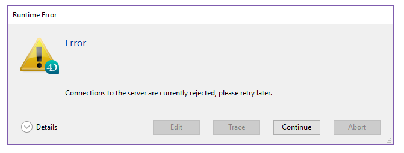

A página Application Server agrupa informações sobre a aplicação desktop publicada pelo 4D Server e pode ser usada para gerenciar essa publicação.

A parte superior da página fornece informação sobre o estado atual do servidor de aplicação 4D Server.

- **Estado**: Iniciado o Detenido.
- **Hora de inicio**: fecha y hora de inicio del servidor de aplicaciones. Esta data corresponde à abertura do projeto por 4D Server.
- **Duración de funcionamiento**: tiempo transcurrido desde la última apertura del proyecto por el servidor.

## Aceitar/Rejeitar novas ligações

Este botão alterna e pode ser utilizado para gerir o acesso de novas máquinas cliente de ambiente de trabalho ao servidor de aplicações.

Por padrão, quando o projeto for publicado:

- O botão tem o título "Rejeitar novas ligações."
- Os novos clientes desktop podem conectar-se livremente (dentro do limite das conexões permitidas pela licença).
- O nome do projeto é publicado na caixa de diálogo de ligação remota (se a opção "At Startup Publish Database Name in the Connection Dialog" estiver selecionada nas Preferências).

Si presiona el botón **Rechazar nuevas conexiones**:

- O título do botão muda para "Aceitar novas ligações."
- Nenhum novo cliente pode então ligar-se. Os clientes que tentarem ligar-se receberão a seguinte mensagem:

- O nome do projeto já não aparece na caixa de diálogo da ligação remota.
- Os clientes de ambiente de trabalho que já estão ligados não são desligados e podem continuar a trabalhar normalmente.

> Você pode executar a mesma ação com o comando [`REJECT NEW REMOTE CONNECTIONS`](https://doc.4d.com/4dv19/help/command/en/page1635.html).

- Si presiona el botón **Aceptar nuevas conexiones**, el servidor de aplicaciones vuelve a su estado por defecto.

This feature permits, for example, an administrator to carry out various maintenance operations (verification, compacting, etc.) logo após ter iniciado o servidor. Se o administrador utilizar uma ligação remota, pode ter a certeza de que é o único a modificar os dados. Também é possível utilizar esta função para preparar uma operação de manutenção que exija que não exista uma máquina cliente de secretária ligada.

## Informação

### Configuração

Esta área fornece informação sobre o projeto 4D publicado pelo servidor: nome e localização dos arquivos de dados e de estrutura e nome do arquivo de registo da base de dados. Pode clicar no nome da estrutura ou do arquivo de dados para ver o seu caminho completo.

El campo **Mode** indica el modo de ejecución actual de la aplicación: compilada o interpretada.

A parte inferior da área indica os parâmetros de configuração do servidor (lançados como serviço, porta e endereço IP) e a ativação do TLS para ligações cliente-servidor (não diz respeito a ligações SQL nem HTTP).

### Memória

Esta área indica la **memoria caché total** (parámetro definido en las preferencias de la base) y la **memoria caché utilizada** (asignación dinámica por 4D Server en función de sus necesidades).

### Ligações aplicação servidor

- **Máximo**: número máximo de conexiones cliente simultáneas permitidas para el servidor de aplicaciones. Este valor depende da licença instalada na máquina do servidor.
- **Utilizado**: número real de conexiones que se están utilizando actualmente.
