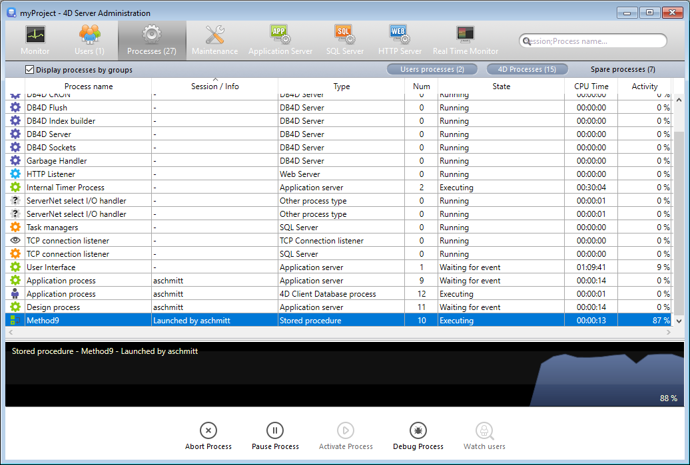

La página **Procesos** lita todos los procesos en ejecución.

El botón "Procesos" indica, entre paréntesis el número total de procesos en ejecución en el servidor (este número no tiene en cuenta los filtros de visualización aplicados a la ventana ni el estado de la opción **Mostrar los procesos por grupos**).

Pode alterar a ordem das colunas simplesmente arrastando e largando as áreas de cabeçalho das colunas. Também pode ordenar a lista de valores da coluna clicando no respetivo cabeçalho.

Al igual que la página Usuarios, esta página contiene un [área de búsqueda/filtrado](users.md#searchfiltering-area) dinámica que puede utilizarse para reducir el número de líneas mostradas en la lista a las que corresponden al texto introducido en el área A pesquisa/filtragem é efetuada nas colunas Nome da sessão e Nome do processo.

Existem também três botões de atalho que podem ser utilizados para filtrar o tipo de processo apresentado na janela:

- **Procesos usuarios**: procesos generados por y para las sesiones usuarios. Estes processos são precedidos de um ícone sob a forma de uma persona.
- **Procesos 4D**: procesos generados por el motor de 4D Server. Estes processos são precedidos de um ícone com a forma de uma roda dentada.
- **Procesos de reserva**: procesos inactivos pero que se mantienen temporalmente y que pueden reutilizarse en cualquier momento. Este mecanismo otimiza a reatividade do 4D Server. Estes processos são precedidos de um ícone com a forma de uma roda dentada.

La opción **Mostrar los procesos por grupos** le permite agrupar los procesos internos de 4D Server así como los procesos cliente, para una mejor legibilidad. Quando você marcar essa opção:

- los procesos cliente 4D "gemelos" (proceso cliente 4D principal y proceso base cliente 4D, véase [Tipo de proceso ](#process-type)) se agrupan como uno solo,
- é criado um grupo "Gestores de tarefas"; inclui os processos internos dedicados à divisão de tarefas (Equilibrador partilhado, Gestor de sessões de rede, Trabalhador do grupo exclusivo),
- é criado um grupo "Gestores de clientes", que inclui vários processos internos dos clientes.

A área inferior da janela é utilizada para apresentar a representação gráfica da atividade do(s) processo(s) selecionado(s).

> Puede seleccionar varias líneas manteniendo presionada la tecla **Mayús** para una selección adyacente o **Ctrl** (Windows) / **Comando** (macOS) para una selección no adyacente.

A atividade do processo é a percentagem de tempo que 4D Server dedicou a este processo (proporção). A janela fornece as seguintes informações para cada processo:

- Tipo de processo (ver abaixo),
- Sessão/Info:
  - Processo 4D - em branco,
  - Processo usuário - nome do usuário 4D,
  - Processo web - caminho URL,
- Nome do processo,
- Number of the process (as returned by the [`New process`](https://doc.4d.com/4dv19/help/command/en/page317.html) command for example). O número do processo é o número atribuído no servidor. No caso de um processo global, este número pode ser diferente do atribuído na máquina cliente.
- Estado atual do processo,
- Tempo de execução (em segundos) do processo desde a sua criação,
- Percentagem de tempo que 4D Server dedicou a este processo (rácio).

## Tipo de processo

Cada processo é identificado por um ícone e por um tipo. A cor e a forma do ícone indicam o tipo de processo:

| icon                                       | type                                                                                                                                                                                                                      |
| ------------------------------------------ | ------------------------------------------------------------------------------------------------------------------------------------------------------------------------------------------------------------------------- |
|   | Servidor de aplicações                                                                                                                                                                                                    |
|   | Servidor SQL                                                                                                                                                                                                              |
|   | Servidor DB4D (motor de base de dados)                                                                                                                                                                 |
|   | Servidor Web                                                                                                                                                                                                              |
|   | Servidor SOAP                                                                                                                                                                                                             |
|   | Processo de cliente 4D protegido (processo de desenvolvimento de um 4D ligado)                                                                                                                         |
|   | Proceso principal de un cliente 4D conectado o proceso creado con `New process` en un cliente 4D conectado (Proceso colaborativo, equivalente en el servidor del proceso creado en la máquina cliente) |
|   | Processo de base cliente 4D (processo paralelo a um processo cliente 4D. Processo preemptivo responsável pelo controlo do processo cliente 4D principal correspondente)                |
|   | Processo de reserva (antigo ou futuro "Processo cliente 4D banco de dados")                                                                                                                            |
|  | Worker servidor SQL                                                                                                                                                                                                       |
|  | Worker servidor HTTP                                                                                                                                                                                                      |
|  | Procedimento armazenado (processo lançado por um 4D conectado e rodando no servidor)                                                                                                                   |
|  | Método Web (lançado por uma 4DACTION, por exemplo)                                                                                                                                                     |
|  | Método Web (preemptivo)                                                                                                                                                                                |
|  | Método SOAP (acionado por um serviço Web)                                                                                                                                                              |
|  | Método SOAP (preemptivo)                                                                                                                                                                               |
|  | Logger (registrador)                                                                                                                                                                                   |
|  | Listener ligação TCP                                                                                                                                                                                                      |
|  | Gestor de sessões TCP                                                                                                                                                                                                     |
|  | Outro processo                                                                                                                                                                                                            |
|  | Processo worker (cooperativo)                                                                                                                                                                          |
|  | Processo 4D client (preemptivo)                                                                                                                                                                        |
|  | Procedimento armazenado (processo preemptivo)                                                                                                                                                          |
|  | Processo worker (apropriativo)                                                                                                                                                                         |

> Cada proceso cliente 4D principal y su proceso base 4D cliente "gemelo" se agrupan cuando se marca la opción **Mostrar los procesos por grupos**.

## Botões de administração

A página também tem cinco botões de controle que atuam nos processos selecionados. Observe que você só pode agir em processos usuários.

- **Abortar proceso**: permite abortar el proceso o los procesos seleccionados. Quando clicar neste botão, aparece uma caixa de diálogo de aviso para que se possa confirmar ou cancelar a operação.

> You can also abort the selected process(es) directly without displaying the confirmation dialog box by holding down the **Alt** key while clicking on this button, or by using the [`ABORT PROCESS BY ID`](https://doc.4d.com/4dv19/help/command/en/page1634.html) command.

- **Pause Process**: can be used to pause the selected process(es).
- **Activar proceso**: permite reactivar los procesos seleccionados. Os processos devem ter sido colocados em pausa anteriormente (utilizando o botão acima ou por programação); caso contrário, este botão não tem qualquer efeito.
- **Depurar proceso**: permite abrir en el equipo servidor una o varias ventanas de depuración para el proceso o procesos seleccionados. Quando clicar neste botão, aparece uma caixa de diálogo de aviso para que se possa confirmar ou cancelar a operação. Note que a janela do depurador só é exibida quando o código 4D for realmente executado na máquina do servidor (por exemplo, em um gatilho ou na execução de um método com o atributo "Execute on Server").

> También puede depurar un proceso directamente sin mostrar la caja de diálogo de confirmación manteniendo presionada la tecla **Alt** mientras presiona este botón.

- **Ver usuarios**: permite visualizar, en la [página Usuarios](users.md), todos los procesos del usuario o usuarios seleccionados. Este botão está ativo quando pelo menos um processo do utilizador for selecionado.
