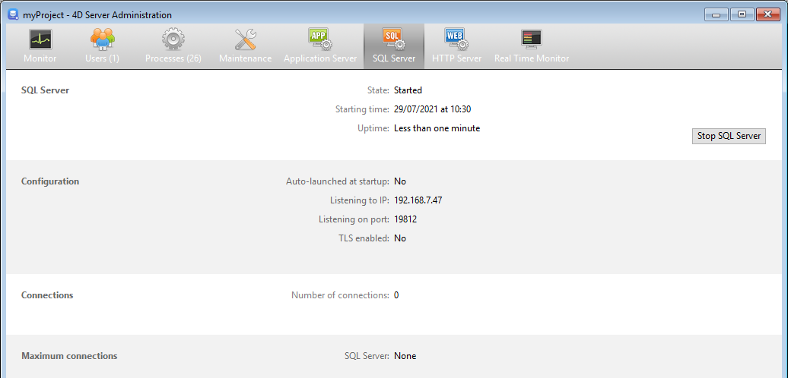

La página **Servidor SQL** agrupa información sobre el servidor SQL integrado de 4D Server. Também inclui um botão que pode ser usado para controlar a ativação do servidor.

A parte superior da página fornece informações sobre o status atual do servidor SQL de 4D Server.

- **Estado**: Iniciado o Detenido
- **Hora de inicio**: fecha y hora en que el servidor SQL se inició por última vez.
- **Duración del funcionamiento**: tiempo transcurrido desde el último arranque del servidor SQL.

## Iniciar / Parar o SQL Server

Este botão alterna e pode ser usado para controlar a ativação do servidor SQL de 4D Server.

- Cuando el estado del servidor SQL es "Iniciado", el botón se etiqueta **Detener el servidor SQL**. Se você clicar neste botão, o servidor SQL de 4D é parado imediatamente; ele não responde mais a nenhuma solicitação externa SQL recebida na porta TCP designada.
- Cuando el estado del servidor SQL es "Detenido", el botón se etiqueta **Iniciar el servidor SQL**. If you click on this button, the 4D Server SQL server is immediately started; it replies to any external SQL queries received on the designated TCP port. Note that you will need a suitable license to be able to use the 4D SQL server.

> The SQL server can also be launched automatically on application startup (option in the Settings) or by programming.

## Informação

### Configuração

This area provides information about the SQL server configuration parameters: automatic launching on startup, listening IP address, TCP port (19812 by default) and enabling of SSL for SQL connections (does not concern 4D nor HTTP connections).

Estes parâmetros podem ser modificados através das Preferências 4D.

### Conexões

Número de ligações SQL atualmente abertas no 4D Server.

### Ligações máximas

Número máximo de ligações SQL simultâneas permitidas. Este valor depende da licença instalada na máquina do servidor.
